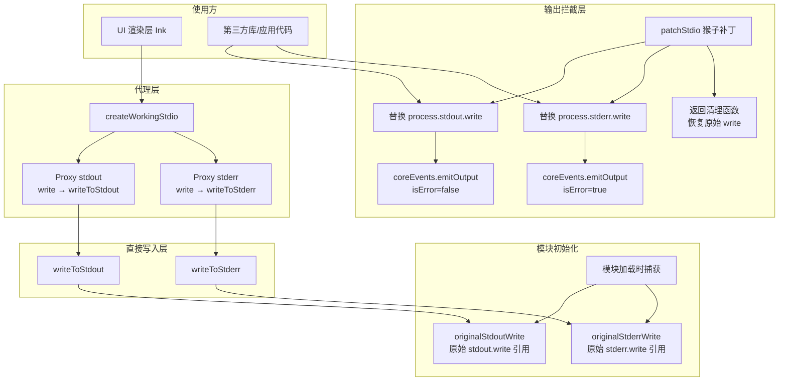

# stdio.ts

## 概述

`stdio.ts` 是 Gemini CLI 核心包中的标准输入输出（stdio）管理模块。它通过猴子补丁（Monkey Patching）和代理（Proxy）模式，拦截 `process.stdout.write` 和 `process.stderr.write`，将所有输出重定向到内部事件系统，防止第三方库或应用自身的杂散输出破坏 UI 界面。同时，它保留了对原始写入方法的引用，确保在需要时仍然能直接写入真实的 stdout/stderr。

该模块解决的核心问题是：在 CLI 工具中，UI 渲染层（如 Ink 框架）需要完全控制终端输出，但 Node.js 生态中的各种库可能会直接调用 `console.log` 或 `process.stdout.write`，导致 UI 布局被破坏。

## 架构图（Mermaid）



## 核心组件

### 1. 原始引用捕获

```typescript
const originalStdoutWrite = process.stdout.write.bind(process.stdout);
const originalStderrWrite = process.stderr.write.bind(process.stderr);
```

在模块加载的最早时机（模块顶层作用域），捕获 `process.stdout.write` 和 `process.stderr.write` 的原始引用，并通过 `.bind()` 绑定正确的 `this` 上下文。这确保即使后续发生猴子补丁，这两个引用始终指向真正的底层写入方法。

### 2. `writeToStdout(...args)`

```typescript
export function writeToStdout(
  ...args: Parameters<typeof process.stdout.write>
): boolean
```

直接调用捕获的原始 `stdout.write`，绕过任何猴子补丁。用于需要真实输出的场景（如 UI 框架的渲染输出）。

### 3. `writeToStderr(...args)`

```typescript
export function writeToStderr(
  ...args: Parameters<typeof process.stderr.write>
): boolean
```

直接调用捕获的原始 `stderr.write`，绕过任何猴子补丁。

### 4. `patchStdio()`

```typescript
export function patchStdio(): () => void
```

核心的猴子补丁函数，替换 `process.stdout.write` 和 `process.stderr.write`：

**替换后的行为：**
- 不再将数据写入终端
- 通过 `coreEvents.emitOutput(isError, chunk, encoding)` 将输出数据发送到事件系统
  - stdout 调用 `emitOutput(false, ...)`
  - stderr 调用 `emitOutput(true, ...)`
- 正确处理 `write` 方法的两种重载签名（encoding 或 callback 在第二个参数的情况）
- 如果调用方传入了回调函数，立即调用回调（不报错）
- 始终返回 `true`（表示写入成功）

**返回值：** 一个清理函数，调用后恢复 `process.stdout.write` 和 `process.stderr.write` 为补丁之前的版本。注意这里恢复的是 `previousStdoutWrite` / `previousStderrWrite`（补丁时保存的版本），而非最初的原始版本，这样支持嵌套补丁。

### 5. `isKey(key, obj)`

```typescript
function isKey<T extends object>(
  key: string | symbol | number,
  obj: T,
): key is keyof T
```

类型守卫（Type Guard），检查属性键是否存在于对象上。内部工具函数，供 Proxy handler 使用，确保类型安全地访问目标对象的属性。

### 6. `createWorkingStdio()`

```typescript
export function createWorkingStdio(): {
  stdout: typeof process.stdout;
  stderr: typeof process.stderr;
}
```

创建 `process.stdout` 和 `process.stderr` 的代理对象（Proxy），代理的行为：
- **`write` 属性**：拦截并替换为 `writeToStdout` / `writeToStderr`（即绕过补丁的真实写入）
- **其他函数属性**：绑定到原始目标对象后返回（确保 `this` 正确）
- **其他非函数属性**：直接从原始目标对象读取

这个函数的典型用途是提供给 Ink（React CLI 框架）使用，让 Ink 的输出能直接写入真实终端，而不被猴子补丁拦截。

## 依赖关系

### 内部依赖

| 模块 | 用途 |
|------|------|
| `./events.js` | `coreEvents` — 核心事件发射器，`emitOutput()` 方法用于分发被拦截的输出 |

### 外部依赖

| 包名 | 用途 |
|------|------|
| （无外部依赖） | 该模块仅依赖 Node.js 内建的 `process.stdout` 和 `process.stderr` |

## 关键实现细节

1. **模块加载时机至关重要**：原始 `write` 方法的捕获发生在模块顶层，这意味着 `stdio.ts` 应尽早被导入，以确保在任何其他代码修改 `process.stdout.write` 之前完成捕获。如果有其他模块先行修改了 `write` 方法，则 `originalStdoutWrite` 捕获到的已不再是真正的原始方法。

2. **嵌套补丁支持**：`patchStdio()` 保存的是调用时的当前 `write` 版本（`previousStdoutWrite`），而非全局的 `originalStdoutWrite`。这意味着如果多次调用 `patchStdio()`，每次返回的清理函数只会回退一层，而不会直接跳回最初状态，支持嵌套使用。

3. **Proxy 的选择原因**：`createWorkingStdio()` 使用 `Proxy` 而非简单的对象字面量，因为 `process.stdout` 是一个复杂的 `WriteStream` 对象，拥有大量属性和方法（如 `columns`、`rows`、`isTTY` 等）。Proxy 可以透明地转发所有属性访问，只拦截 `write` 方法，保证了与原始对象的完全兼容性。

4. **回调处理兼容性**：`process.stdout.write` 有多种调用签名，第二个参数可以是 `encoding`（字符串）或 `callback`（函数）。替换后的实现正确地区分了这两种情况，确保不会遗漏回调调用。

5. **返回值语义**：替换后的 `write` 方法始终返回 `true`，这在 `Writable.write()` 的语义中表示"缓冲区未满，可以继续写入"。由于实际上没有向任何流写入数据，不存在背压问题，返回 `true` 是合理的。

6. **事件驱动的输出重定向**：通过 `coreEvents.emitOutput()` 将输出转化为事件，解耦了输出的产生方和消费方。事件系统的订阅者（如 UI 渲染层）可以决定如何展示这些被拦截的输出。
