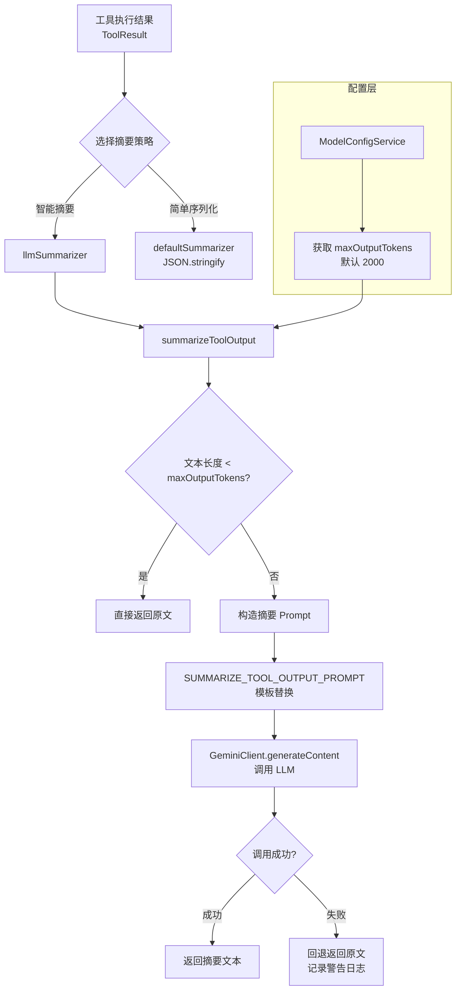

# summarizer.ts

## 概述

`summarizer.ts` 是 Gemini CLI 核心包中的工具输出摘要模块。当工具（Tool）执行后产生的输出文本过长时，该模块利用 Gemini LLM 将其压缩为简洁的摘要，以减少上下文 Token 消耗并保留关键信息。

该模块提供两种摘要策略：
1. **默认摘要器（`defaultSummarizer`）**：直接 JSON 序列化工具结果，不做 LLM 调用
2. **LLM 摘要器（`llmSummarizer`）**：调用 Gemini 模型对工具输出进行智能摘要

摘要策略的选择由上层配置决定，模块本身只暴露两种实现供外部选用。

## 架构图（Mermaid）



## 核心组件

### 1. 类型定义

#### `Summarizer`
```typescript
export type Summarizer = (
  config: Config,
  result: ToolResult,
  geminiClient: GeminiClient,
  abortSignal: AbortSignal,
) => Promise<string>;
```
摘要函数的类型签名，接收配置、工具执行结果、Gemini 客户端和中止信号，返回摘要字符串的 Promise。这是一个策略接口，允许不同的摘要实现互换使用。

### 2. `defaultSummarizer`

```typescript
export const defaultSummarizer: Summarizer = (
  _config, result, _geminiClient, _abortSignal,
) => Promise.resolve(JSON.stringify(result.llmContent));
```

默认摘要器，仅将 `result.llmContent` 进行 JSON 序列化后返回。不调用 LLM，不做任何压缩。适用于输出已经足够简洁或不需要摘要的场景。注意它忽略了 `config`、`geminiClient` 和 `abortSignal` 参数。

### 3. `llmSummarizer`

```typescript
export const llmSummarizer: Summarizer = async (
  config, result, geminiClient, abortSignal,
) => summarizeToolOutput(
  config,
  { model: 'summarizer-default' },
  partToString(result.llmContent),
  geminiClient,
  abortSignal,
);
```

LLM 摘要器，将工具结果先通过 `partToString()` 转为字符串，然后调用 `summarizeToolOutput()` 进行智能摘要。使用的模型配置键为 `{ model: 'summarizer-default' }`。

### 4. `summarizeToolOutput()`

```typescript
export async function summarizeToolOutput(
  config: Config,
  modelConfigKey: ModelConfigKey,
  textToSummarize: string,
  geminiClient: GeminiClient,
  abortSignal: AbortSignal,
): Promise<string>
```

核心摘要函数，执行流程：

1. **获取 Token 限制**：从 `config.modelConfigService` 获取指定模型配置的 `maxOutputTokens`，默认为 2000
2. **快速路径判断**：如果文本为空或长度小于 `maxOutputTokens`，直接返回原文（无需摘要）
3. **构造 Prompt**：将模板中的 `{maxOutputTokens}` 和 `{textToSummarize}` 替换为实际值
4. **调用 LLM**：使用 `geminiClient.generateContent()` 发送摘要请求，LLM 角色为 `LlmRole.UTILITY_SUMMARIZER`
5. **提取结果**：使用 `getResponseText()` 提取响应文本
6. **错误回退**：如果 LLM 调用失败，记录警告日志并返回原始文本

### 5. `SUMMARIZE_TOOL_OUTPUT_PROMPT`

摘要 Prompt 模板，定义了三种内容类型的摘要规则：

1. **结构化内容**（目录列表等）：结合对话历史理解上下文，提取所需信息
2. **纯文本内容**：进行标准文本摘要
3. **Shell 命令输出**：结合对话上下文理解，返回摘要 + 完整错误堆栈（`<error>` 标签）和警告（`<warning>` 标签）

关键要求：
- 摘要不超过 `{maxOutputTokens}` 个 Token
- 错误堆栈必须**完整不截断**
- 输出格式为：先整体摘要，后跟错误和警告的完整信息

## 依赖关系

### 内部依赖

| 模块 | 用途 |
|------|------|
| `../tools/tools.js` | `ToolResult` 类型 — 工具执行结果 |
| `../core/client.js` | `GeminiClient` 类型 — Gemini API 客户端 |
| `./partUtils.js` | `getResponseText()` — 提取 LLM 响应文本；`partToString()` — 将 Content Part 转为字符串 |
| `./debugLogger.js` | `debugLogger` — 调试日志记录（摘要失败时记录警告） |
| `../services/modelConfigService.js` | `ModelConfigKey` 类型 — 模型配置键 |
| `../config/config.js` | `Config` 类型 — 应用配置 |
| `../telemetry/llmRole.js` | `LlmRole` — LLM 角色标识，标记此次调用为 `UTILITY_SUMMARIZER` |

### 外部依赖

| 包名 | 用途 |
|------|------|
| `@google/genai` | `Content` 类型 — Gemini API 的内容格式定义 |

## 关键实现细节

1. **文本长度 vs Token 数量的近似**：`summarizeToolOutput()` 使用 `textToSummarize.length` 与 `maxOutputTokens` 进行比较来决定是否需要摘要。代码注释中明确指出这是一个粗略估计（ballpark estimation），因为字符长度和 Token 数量并非一一对应关系。在大多数英文场景下，1 个 Token 约等于 4 个字符，因此这个判断会倾向于"更多地触发摘要"，偏保守。

2. **错误回退策略**：当 LLM 摘要调用失败时（网络错误、模型错误等），函数不会抛出异常，而是返回原始文本。这保证了即使摘要功能不可用，工具执行的结果仍然能正常传递给主对话流程。

3. **模型配置灵活性**：`summarizeToolOutput()` 接受 `ModelConfigKey` 参数，允许不同的摘要场景使用不同的模型配置。`llmSummarizer` 默认使用 `'summarizer-default'` 配置，但直接调用 `summarizeToolOutput()` 可以指定其他模型。

4. **Prompt 中的错误保留策略**：Prompt 特别强调了错误堆栈必须完整保留（"The stack trace should be complete and not truncated"），这是因为在调试场景中，截断的错误堆栈几乎没有价值。同时要求错误和警告分别用 `<error>` 和 `<warning>` 标签包裹，方便后续解析。

5. **中止信号传递**：`abortSignal` 被传递到 `geminiClient.generateContent()`，允许上层在用户取消操作时中止正在进行的 LLM 摘要调用，避免不必要的等待和资源消耗。

6. **LLM 角色标记**：使用 `LlmRole.UTILITY_SUMMARIZER` 标记此次 LLM 调用，这在遥测系统中用于区分不同用途的 LLM 调用（主对话 vs 辅助摘要），有助于成本核算和性能分析。
