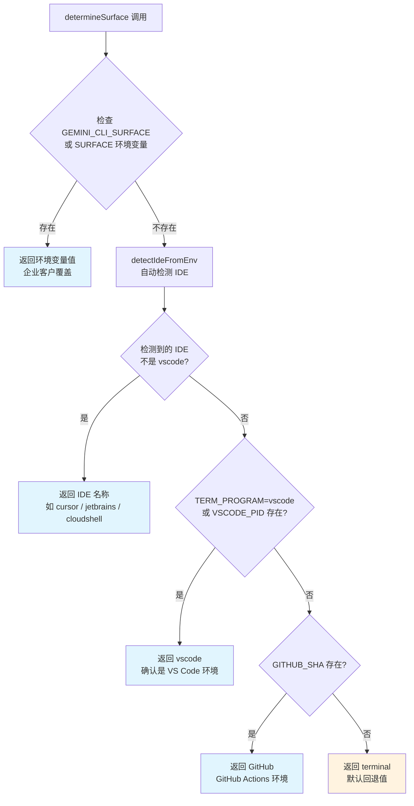

# surface.ts

## 概述

`surface.ts` 是 Gemini CLI 核心包中的运行环境/分发渠道（Surface）检测模块。它负责识别 CLI 当前运行在哪个环境中——例如 VS Code 终端、Cursor 编辑器、JetBrains IDE、Google Cloud Shell、GitHub Actions 还是普通终端。

"Surface" 这个概念在产品分析中非常重要，它帮助团队了解用户通过哪种渠道使用 CLI，用于遥测数据分类、功能适配以及企业客户的自定义标识。

检测采用多优先级策略，按以下顺序判断：
1. 环境变量显式覆盖（企业客户场景）
2. 自动检测 IDE/运行环境
3. GitHub Actions 检测
4. 回退到默认值 `'terminal'`

## 架构图（Mermaid）



## 核心组件

### 1. 常量

#### `SURFACE_NOT_SET`
```typescript
export const SURFACE_NOT_SET = 'terminal';
```
默认的 Surface 值，当未检测到任何特定 IDE 或环境时使用。表示 CLI 运行在一个普通终端中。

### 2. `determineSurface()`

```typescript
export function determineSurface(): string
```

核心检测函数，返回一个人类可读的 Surface 标识符字符串。检测逻辑按 5 个优先级层次执行：

#### 优先级 1 & 2：环境变量显式覆盖

```typescript
const customSurface =
  process.env['GEMINI_CLI_SURFACE'] || process.env['SURFACE'];
```

- `GEMINI_CLI_SURFACE`：一等公民覆盖变量，专为企业客户设计
- `SURFACE`：遗留覆盖变量，保持向后兼容

如果任一环境变量存在且非空，直接返回其值，跳过所有自动检测逻辑。

#### 优先级 3：自动检测 IDE

调用 `detectIdeFromEnv()` 进行基于环境变量的 IDE 自动检测。该函数会检查各种 IDE 特有的环境变量来判断当前运行环境。

**VS Code 的特殊处理**：`detectIdeFromEnv()` 对于无法识别的通用终端会回退到 `'vscode'`。因此需要额外验证：
- 如果检测结果不是 `'vscode'`（即检测到了 Cursor、JetBrains、Cloud Shell 等具体 IDE），直接使用
- 如果检测结果是 `'vscode'`，必须通过 `TERM_PROGRAM === 'vscode'` 或 `VSCODE_PID` 环境变量的存在来确认，防止普通终端被误识别为 VS Code
- 这个确认步骤同时覆盖了 VS Code 扩展宿主（extension host）启动的后台进程（如 a2a-server）

#### 优先级 4：GitHub Actions 检测

```typescript
if (process.env['GITHUB_SHA']) {
  return 'GitHub';
}
```

通过检查 `GITHUB_SHA` 环境变量判断是否在 GitHub Actions 中运行。此检查放在 IDE 检测之后，确保 Cloud Shell 等特定环境优先于 GitHub Actions。

#### 优先级 5：默认回退

如果以上所有检测都未匹配，返回 `SURFACE_NOT_SET`（即 `'terminal'`），表示普通终端环境。

## 依赖关系

### 内部依赖

| 模块 | 用途 |
|------|------|
| `../ide/detect-ide.js` | `detectIdeFromEnv()` — 基于环境变量的 IDE 自动检测函数 |

### 外部依赖

| 包名 | 用途 |
|------|------|
| （无外部依赖） | 该模块仅依赖 Node.js 内建的 `process.env` |

## 关键实现细节

1. **VS Code 误检测防护**：`detectIdeFromEnv()` 对通用终端会回退到 `'vscode'`，这会导致所有终端都被识别为 VS Code。`determineSurface()` 通过额外检查 `TERM_PROGRAM` 和 `VSCODE_PID` 来解决这个问题，只有真正在 VS Code 中运行时才返回 `'vscode'`。这是一个重要的防护逻辑，避免遥测数据中 VS Code 用户比例被严重夸大。

2. **优先级设计的考量**：
   - 环境变量覆盖最高优先级，因为企业客户可能有自定义的分发渠道标识需求
   - IDE 检测优先于 GitHub Actions，因为 Cloud Shell 等环境可能同时设置了 `GITHUB_SHA`（如 Cloud Shell 中运行 GitHub Actions 工作流）
   - GitHub Actions 检测使用 `GITHUB_SHA` 而非 `GITHUB_ACTIONS`，这是一个特定的选择

3. **扩展宿主进程支持**：注释中特别提到 VS Code 扩展宿主启动的后台进程（如 a2a-server），这些进程可能没有 `TERM_PROGRAM` 环境变量，但会有 `VSCODE_PID`，因此两个变量的检查都是必要的。

4. **零外部依赖设计**：该模块不引入任何外部包，完全基于环境变量检测，确保极低的开销和极高的可靠性。Surface 检测通常在应用启动早期执行，低开销非常重要。

5. **返回值的使用场景**：返回的 Surface 标识符字符串会被用于：
   - 遥测数据上报（追踪不同渠道的使用情况）
   - 功能适配（不同环境可能启用/禁用某些功能）
   - 日志和诊断（帮助排查环境相关问题）
