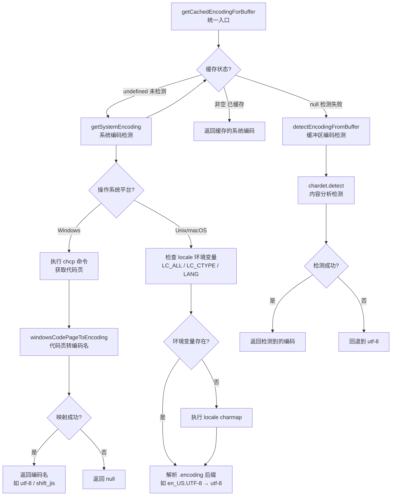

# systemEncoding.ts

## 概述

`systemEncoding.ts` 是 Gemini CLI 核心包中的系统字符编码检测模块。它负责确定当前操作系统使用的字符编码（如 UTF-8、Shift_JIS、GBK 等），以确保 CLI 能正确处理命令输出中的非 ASCII 字符。

该模块提供三层编码检测策略：
1. **系统级检测**：通过操作系统命令或环境变量获取系统编码（Windows 用 `chcp`，Unix 用 locale 环境变量）
2. **缓冲区检测**：使用 `chardet` 库从实际数据内容推断编码
3. **默认回退**：当所有检测都失败时回退到 `utf-8`

检测结果带有缓存机制，系统编码只检测一次，避免重复的系统调用开销。

## 架构图（Mermaid）



## 核心组件

### 1. 缓存机制

```typescript
let cachedSystemEncoding: string | null | undefined = undefined;
```

模块级缓存变量，使用三态设计：
- `undefined` — 尚未检测（初始状态）
- `string`（非空） — 检测成功，存储编码名称
- `null` — 检测已执行但失败

这种三态设计避免了对 `null`（失败）和"从未检测"两种状态的混淆，确保系统检测只执行一次。

### 2. `resetEncodingCache()`

```typescript
export function resetEncodingCache(): void
```

将缓存重置为 `undefined`（未检测状态）。主要用于测试场景，确保测试之间不会相互影响。

### 3. `getCachedEncodingForBuffer(buffer)`

```typescript
export function getCachedEncodingForBuffer(buffer: Buffer): string
```

统一的编码获取入口，保证始终返回一个有效的编码字符串（不返回 null）。执行流程：

1. 如果 `cachedSystemEncoding === undefined`，调用 `getSystemEncoding()` 并缓存结果
2. 如果缓存值有效（非空字符串），直接返回
3. 如果缓存为 `null`（系统检测失败），对传入的 buffer 调用 `detectEncodingFromBuffer()`
4. 如果 buffer 检测也失败，回退到 `'utf-8'`

注意：系统编码被缓存（因为是系统级别的，不会变化），但 buffer 级别的编码检测不缓存（因为不同 buffer 可能有不同编码）。

### 4. `getSystemEncoding()`

```typescript
export function getSystemEncoding(): string | null
```

平台感知的系统编码检测函数：

#### Windows 平台检测
1. 执行 `chcp` 命令获取当前活动代码页
2. 用正则 `/:\s*(\d+)/` 从输出中提取代码页数字（如 `Active code page: 65001` → `65001`）
3. 调用 `windowsCodePageToEncoding()` 将代码页数字映射为编码名称
4. 失败时记录警告日志并返回 `null`

#### Unix/macOS 平台检测
1. 按优先级检查环境变量：`LC_ALL` > `LC_CTYPE` > `LANG`
2. 如果环境变量都未设置，执行 `locale charmap` 命令
3. 用正则 `/\.(.+)/` 提取编码部分（如 `en_US.UTF-8` → `utf-8`）
4. 如果 locale 值不包含点号（如直接返回 `UTF-8`），整体作为编码名称
5. 结果统一转为小写

### 5. `windowsCodePageToEncoding(cp)`

```typescript
export function windowsCodePageToEncoding(cp: number): string | null
```

Windows 代码页到编码名称的映射函数，支持的代码页包括：

| 代码页 | 编码名称 | 说明 |
|--------|----------|------|
| 437 | cp437 | 美国英语（DOS 默认） |
| 850 | cp850 | 西欧语言（DOS） |
| 852 | cp852 | 中欧语言（DOS） |
| 866 | cp866 | 俄语（DOS） |
| 874 | windows-874 | 泰语 |
| 932 | shift_jis | 日语 |
| 936 | gb2312 | 简体中文 |
| 949 | euc-kr | 韩语 |
| 950 | big5 | 繁体中文 |
| 1200 | utf-16le | UTF-16 小端序 |
| 1201 | utf-16be | UTF-16 大端序 |
| 1250 | windows-1250 | 中欧语言（Windows） |
| 1251 | windows-1251 | 西里尔字母（Windows） |
| 1252 | windows-1252 | 西欧语言（Windows） |
| 1253 | windows-1253 | 希腊语 |
| 1254 | windows-1254 | 土耳其语 |
| 1255 | windows-1255 | 希伯来语 |
| 1256 | windows-1256 | 阿拉伯语 |
| 1257 | windows-1257 | 波罗的海语言 |
| 1258 | windows-1258 | 越南语 |
| 65001 | utf-8 | UTF-8（现代 Windows 默认） |

未匹配的代码页返回 `null` 并记录警告日志。

### 6. `detectEncodingFromBuffer(buffer)`

```typescript
export function detectEncodingFromBuffer(buffer: Buffer): string | null
```

使用 `chardet` 库对 Buffer 内容进行编码检测。`chardet` 通过统计分析字节频率和特征序列来推断编码。检测成功返回小写编码名称，失败返回 `null`。

## 依赖关系

### 内部依赖

| 模块 | 用途 |
|------|------|
| `./debugLogger.js` | `debugLogger` — 调试日志记录（检测失败时记录警告） |

### 外部依赖

| 包名 | 用途 |
|------|------|
| `node:child_process` | `execSync` — 同步执行系统命令（`chcp`、`locale charmap`） |
| `node:os` | `os.platform()` — 操作系统平台检测 |
| `chardet` | `detect()` — 基于内容的字符编码检测库 |

## 关键实现细节

1. **三态缓存设计**：使用 `undefined` / `string` / `null` 三种状态区分"未检测"、"检测成功"和"检测失败"，是一种常见的惰性初始化模式。这避免了两个问题：（a）失败后反复重试系统检测的性能浪费；（b）将"未检测"误当作"检测失败"导致跳过系统检测。

2. **缓存策略的差异化**：系统编码被缓存，因为它是系统级配置，在应用生命周期内不会改变。但 buffer 级别的编码检测不缓存，因为不同的命令输出可能使用不同的编码（例如，一个命令输出 UTF-8，另一个输出 GBK）。

3. **Windows `chcp` 输出解析**：`chcp` 命令的输出格式因语言而异（如英文 "Active code page: 65001"，中文 "活动代码页: 65001"），但正则 `/:\s*(\d+)/` 只匹配冒号后的数字，对所有语言版本通用。

4. **Unix locale 解析的多路径**：
   - 优先级链 `LC_ALL > LC_CTYPE > LANG` 遵循 POSIX 标准的 locale 解析规则
   - `locale charmap` 作为最终回退，适用于环境变量未设置的 Docker 容器等场景
   - 支持两种 locale 格式：`en_US.UTF-8`（含点号分隔）和直接的编码名 `UTF-8`

5. **编码名称一致性**：所有检测结果都统一转为小写（`toLowerCase()`），避免比较时的大小写不一致问题（如 `UTF-8` vs `utf-8`）。

6. **优雅降级策略**：整个检测流程设计了多层回退：系统命令 → 环境变量 → `locale charmap` → `chardet` 内容检测 → `utf-8` 默认值。在任何一层出错时都不会抛出异常，而是降级到下一层，确保始终能返回一个可用的编码值。

7. **`chardet` 的局限性**：基于内容的编码检测本质上是概率性的，对于短文本或只包含 ASCII 字符的 buffer，检测结果可能不准确。这也是为什么系统级检测被优先使用的原因。

8. **测试友好性**：`resetEncodingCache()` 函数专门为测试设计，允许在单元测试之间重置全局缓存状态，避免测试间的状态污染。这是一种常见的模式，用于处理模块级全局变量的可测试性问题。
