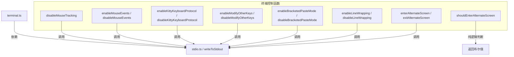

# terminal.ts

## 概述

`terminal.ts` 是一个终端控制工具模块，通过向标准输出写入 ANSI 转义序列（Escape Codes）来控制终端的各种行为。该模块提供了一组成对的 `enable/disable` 函数，用于开启和关闭终端的鼠标追踪、键盘协议、粘贴模式、行包裹和备用屏幕缓冲区等功能。

该文件隶属于 `@anthropic/core` 包的 `utils` 工具层，是 CLI 应用中与底层终端交互的关键基础设施。

## 架构图（Mermaid）

## 核心组件

### 1. `disableMouseTracking()`

一次性禁用所有常见的鼠标追踪模式，发送 5 种不同的 ANSI 转义序列：

| 转义序列 | 模式 | 说明 |
|---|---|---|
| `\x1b[?1000l` | Normal tracking | 普通鼠标追踪 |
| `\x1b[?1003l` | Any-event tracking | 任意事件追踪 |
| `\x1b[?1015l` | urxvt extended mouse mode | urxvt 扩展鼠标模式 |
| `\x1b[?1006l` | SGR-style mouse tracking | SGR 风格鼠标追踪 |
| `\x1b[?1002l` | Button-event tracking | 按钮事件追踪 |

这些序列被拼接为一个字符串后一次写入，确保原子性。

### 2. `enableMouseEvents()` / `disableMouseEvents()`

使用 SGR 格式启用/禁用鼠标事件追踪：

- `?1002h` / `?1002l`：按钮事件追踪（点击、拖拽、滚轮）
- `?1006h` / `?1006l`：SGR 扩展鼠标模式（更好的坐标处理能力）

### 3. `enableKittyKeyboardProtocol()` / `disableKittyKeyboardProtocol()`

控制 Kitty 键盘协议（Progressive Enhancement）：

- 启用：`\x1b[>1u` — 请求 Kitty 键盘协议级别 1
- 禁用：`\x1b[<u` — 退出 Kitty 键盘协议

Kitty 键盘协议可以提供更精确的按键信息，区分例如 `Ctrl+I` 与 `Tab` 等在传统终端中无法区分的按键。

### 4. `enableModifyOtherKeys()` / `disableModifyOtherKeys()`

控制 xterm 的 `modifyOtherKeys` 模式：

- 启用：`\x1b[>4;2m` — 设置 modifyOtherKeys 级别为 2（报告所有修饰键组合）
- 禁用：`\x1b[>4;0m` — 关闭 modifyOtherKeys

该模式让终端能够上报更多的按键修饰组合信息。

### 5. `enableBracketedPasteMode()` / `disableBracketedPasteMode()`

控制方括号粘贴模式：

- 启用：`\x1b[?2004h`
- 禁用：`\x1b[?2004l`

启用后，终端会在粘贴内容前后添加特殊标记序列 `\x1b[200~` 和 `\x1b[201~`，使应用程序能够区分用户输入和粘贴内容，防止粘贴攻击。

### 6. `enableLineWrapping()` / `disableLineWrapping()`

控制终端自动换行行为：

- 启用：`\x1b[?7h` — 超出终端宽度的文本自动换行
- 禁用：`\x1b[?7l` — 超出终端宽度的文本被截断

### 7. `enterAlternateScreen()` / `exitAlternateScreen()`

控制备用屏幕缓冲区：

- 进入：`\x1b[?1049h` — 切换到备用屏幕（类似 `vim`、`less` 等程序的行为）
- 退出：`\x1b[?1049l` — 返回主屏幕并恢复之前的内容

### 8. `shouldEnterAlternateScreen(useAlternateBuffer, isScreenReader)`

**唯一的纯逻辑判断函数**，不发送任何转义序列。

- **参数**：
  - `useAlternateBuffer: boolean` — 是否配置为使用备用缓冲区
  - `isScreenReader: boolean` — 是否处于屏幕阅读器模式
- **返回值**：`boolean` — 仅当 `useAlternateBuffer` 为 `true` 且 `isScreenReader` 为 `false` 时返回 `true`
- **设计意图**：屏幕阅读器无法读取备用屏幕缓冲区的内容，因此在辅助功能模式下应禁用备用屏幕。

## 依赖关系

### 内部依赖

| 模块 | 导入项 | 用途 |
|---|---|---|
| `./stdio.js` | `writeToStdout` | 所有 ANSI 转义序列的底层写入函数 |

### 外部依赖

无外部第三方依赖。该模块完全依赖 Node.js 原生能力和内部工具函数。

## 关键实现细节

1. **统一的输出通道**：所有终端控制都通过 `writeToStdout` 函数完成，而不是直接操作 `process.stdout`，这样便于在测试中进行 mock 以及统一管理输出行为。

2. **成对设计模式**：除 `disableMouseTracking` 和 `shouldEnterAlternateScreen` 外，所有功能都采用 `enable/disable` 成对设计，确保每个启用的终端特性都能被正确还原。

3. **防御性鼠标追踪禁用**：`disableMouseTracking()` 函数同时发送 5 种不同模式的禁用序列，这是一种防御性编程策略——因为不知道之前的程序启用了哪种鼠标追踪模式，所以一次性全部禁用。

4. **无障碍访问考量**：`shouldEnterAlternateScreen` 函数体现了对屏幕阅读器用户的无障碍考虑，备用屏幕在屏幕阅读器模式下会被跳过。

5. **ANSI 转义序列格式**：模块使用了两种等价的转义序列写法：
   - `\x1b[...` — 十六进制表示
   - `\u001b[...` — Unicode 表示
   两者都代表 ESC 字符（ASCII 27），功能完全相同。
