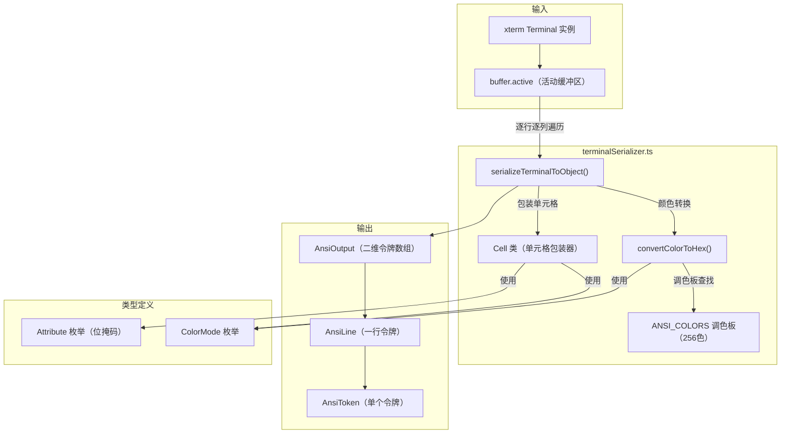

# terminalSerializer.ts

## 概述

`terminalSerializer.ts` 是一个终端缓冲区序列化模块，负责将 xterm.js 无头终端（`@xterm/headless`）的内部缓冲区状态解析并转换为结构化的 `AnsiOutput` 对象。该对象以行-令牌（Line-Token）的二维结构完整保留了每个字符的文本内容及其样式属性（粗体、斜体、下划线、颜色等），可用于后续渲染为 HTML、React 组件或其他可视化格式。

该模块是终端 UI 渲染管线中的核心环节：xterm 终端解析原始 ANSI 流 -> **本模块将缓冲区序列化为结构化对象** -> 渲染层消费该对象进行 UI 绘制。

## 架构图（Mermaid）



## 核心组件

### 1. 类型定义

#### `AnsiToken` 接口

表示一段具有相同样式属性的连续文本片段：

```typescript
interface AnsiToken {
  text: string;       // 文本内容
  bold: boolean;      // 粗体
  italic: boolean;    // 斜体
  underline: boolean; // 下划线
  dim: boolean;       // 暗淡
  inverse: boolean;   // 反色（也用于表示光标位置）
  fg: string;         // 前景色（十六进制字符串，如 "#ff0000"）
  bg: string;         // 背景色（十六进制字符串）
}
```

#### `AnsiLine` 类型

一行由多个 `AnsiToken` 组成的数组：`AnsiToken[]`

#### `AnsiOutput` 类型

整个终端输出由多行组成的二维数组：`AnsiLine[]`

### 2. `Attribute` 枚举（const enum，位掩码）

使用位掩码方式高效存储多个布尔属性：

| 属性 | 值 | 二进制 |
|---|---|---|
| `inverse` | 1 | `00001` |
| `bold` | 2 | `00010` |
| `italic` | 4 | `00100` |
| `underline` | 8 | `01000` |
| `dim` | 16 | `10000` |

通过按位与（`&`）操作可以在 O(1) 时间内检查任意属性组合。

### 3. `ColorMode` 枚举

定义三种颜色模式：

| 模式 | 值 | 说明 |
|---|---|---|
| `DEFAULT` | 0 | 使用终端默认颜色 |
| `PALETTE` | 1 | 使用 256 色调色板索引 |
| `RGB` | 2 | 使用 24 位真彩色（RGB） |

### 4. `Cell` 类

对 xterm 的 `IBufferCell` 进行包装，提供更方便的属性访问和比较能力。

#### 属性

| 属性 | 类型 | 说明 |
|---|---|---|
| `cell` | `IBufferCell \| null` | 底层 xterm 单元格 |
| `x`, `y` | `number` | 单元格在缓冲区中的坐标 |
| `cursorX`, `cursorY` | `number` | 当前光标位置 |
| `attributes` | `number` | 位掩码形式存储的样式属性 |
| `fg`, `bg` | `number` | 前景色/背景色值 |
| `fgColorMode`, `bgColorMode` | `ColorMode` | 前景色/背景色模式 |

#### 核心方法

- **`update(cell, x, y, cursorX, cursorY)`**：更新单元格状态。从 `IBufferCell` 中提取所有样式属性（inverse、bold、italic、underline、dim）并用位运算组合到 `attributes` 字段中；同时检测颜色模式（RGB/PALETTE/DEFAULT）并提取对应的颜色值。
- **`isCursor()`**：判断当前单元格是否处于光标位置。
- **`getChars()`**：获取单元格的字符内容，若为空则返回空格 `' '`。
- **`isAttribute(attribute)`**：使用位与操作检查指定属性是否存在。
- **`equals(other)`**：比较两个单元格的样式是否完全相同（不比较文本内容），用于判断是否需要创建新的 token。

### 5. `serializeTerminalToObject(terminal, startLine?, endLine?)` 函数

**核心序列化函数**。将 xterm 终端的活动缓冲区转换为 `AnsiOutput` 结构。

#### 参数

| 参数 | 类型 | 默认值 | 说明 |
|---|---|---|---|
| `terminal` | `Terminal` | - | xterm 终端实例 |
| `startLine` | `number?` | `buffer.viewportY` | 起始行号 |
| `endLine` | `number?` | `buffer.viewportY + terminal.rows` | 结束行号 |

#### 算法流程

1. 获取活动缓冲区及光标位置
2. 创建两个可复用的 `Cell` 实例（`lastCell` 和 `currentCell`）以避免频繁内存分配
3. 逐行遍历指定范围内的行（默认为当前视口）
4. 对每一行，逐列遍历所有单元格：
   - 将当前单元格数据更新到 `currentCell`
   - 如果当前单元格样式与上一个不同（`!currentCell.equals(lastCell)`），则将已累积的文本和上一个单元格的样式封装为 `AnsiToken` 并推入当前行
   - 将当前字符追加到累积文本中
   - 更新 `lastCell` 为当前状态
5. 行末将最后一段文本封装为 token
6. 返回完整的 `AnsiOutput` 二维数组

### 6. `convertColorToHex(color, colorMode, defaultColor)` 函数

将颜色值根据颜色模式转换为十六进制字符串。

| 颜色模式 | 转换逻辑 |
|---|---|
| `RGB` | 从 24 位整数中提取 R/G/B 分量，转换为 `#rrggbb` 格式 |
| `PALETTE` | 从 `ANSI_COLORS` 数组中按索引查找预定义的十六进制颜色 |
| `DEFAULT` | 直接返回传入的 `defaultColor` |

### 7. `ANSI_COLORS` 常量数组

完整的 256 色 ANSI 调色板，遵循 [Wikipedia ANSI escape code 8-bit 规范](https://en.wikipedia.org/wiki/ANSI_escape_code#8-bit)：

- 索引 0-7：标准色（黑、红、绿、黄、蓝、品红、青、浅灰）
- 索引 8-15：高亮色（暗灰、亮红、亮绿、亮黄、亮蓝、亮品红、亮青、白）
- 索引 16-231：216 色 RGB 立方体（6x6x6）
- 索引 232-255：24 级灰度（从 `#080808` 到 `#eeeeee`）

## 依赖关系

### 内部依赖

无。该模块不依赖项目中的其他内部模块。

### 外部依赖

| 模块 | 导入项 | 用途 |
|---|---|---|
| `@xterm/headless` | `IBufferCell`, `Terminal`（类型） | xterm 无头终端的类型定义，仅在 TypeScript 编译时使用（`import type`） |

## 关键实现细节

1. **对象复用优化**：`serializeTerminalToObject` 中的 `lastCell` 和 `currentCell` 在整个序列化过程中被复用，通过 `update()` 方法更新状态，而非每次循环创建新对象。这对于大型终端缓冲区的序列化性能至关重要。

2. **令牌合并策略**：相邻的具有相同样式属性的字符会被合并到同一个 `AnsiToken` 中，仅当样式发生变化时才创建新的 token。这显著减少了输出对象的数量。

3. **光标处理**：光标位置被特殊处理——光标所在的单元格会被标记为 `inverse: true`，这使得渲染层可以通过反色来显示光标位置。`Cell.equals()` 方法也会考虑光标状态，确保光标位置的变化能触发新 token 的创建。

4. **位掩码属性存储**：使用 `const enum` + 位运算代替多个独立的布尔字段来存储属性，兼顾了内存效率和比较性能。`const enum` 在编译时会被内联为常量值，不产生运行时开销。

5. **颜色处理三层策略**：颜色系统支持三种模式（默认/调色板/RGB），能够处理从最简单的默认终端色到 24 位真彩色的所有场景。RGB 模式使用位移操作高效提取颜色分量。

6. **视口范围控制**：支持通过 `startLine` 和 `endLine` 参数指定序列化范围，默认为当前视口（`viewportY` 到 `viewportY + rows`），便于实现滚动渲染或部分更新。
