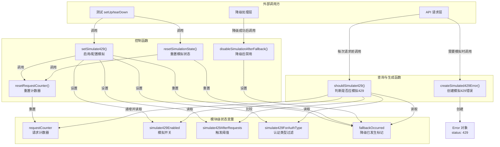

# testUtils.ts

## 概述

`testUtils.ts` 是一个测试辅助工具模块，专门用于在单元测试中模拟 HTTP 429（Too Many Requests / 速率限制）错误响应。该模块通过模块级别的状态变量维护模拟配置，提供了一套完整的 429 错误模拟控制 API，可以精确控制何时触发模拟错误、针对哪种认证类型触发、以及在多少次请求之后触发。

该模块的典型使用场景是测试应用程序在遇到 API 速率限制时的降级（fallback）和重试行为是否正确。

## 架构图（Mermaid）

## 核心组件

### 1. 模块级状态变量

该模块使用 5 个模块级（文件作用域）变量来维护模拟状态：

| 变量 | 类型 | 初始值 | 说明 |
|---|---|---|---|
| `requestCounter` | `number` | `0` | 累计请求次数计数器 |
| `simulate429Enabled` | `boolean` | `false` | 429 模拟总开关 |
| `simulate429AfterRequests` | `number` | `0` | 在多少次请求之后开始触发 429（0 表示立即触发） |
| `simulate429ForAuthType` | `string \| undefined` | `undefined` | 仅对指定认证类型触发模拟（undefined 表示对所有类型触发） |
| `fallbackOccurred` | `boolean` | `false` | 标记降级是否已发生，降级后停止继续模拟 |

### 2. `shouldSimulate429(authType?: string): boolean`

**核心判断函数**，用于在每次 API 请求前调用，决定是否应当模拟 429 错误。

判断逻辑（按优先级）：

1. 如果模拟未启用（`!simulate429Enabled`）或已发生降级（`fallbackOccurred`），直接返回 `false`
2. 如果设置了认证类型过滤（`simulate429ForAuthType`），且当前认证类型不匹配，返回 `false`
3. 递增请求计数器
4. 如果设置了触发阈值（`simulate429AfterRequests > 0`），仅当请求次数超过阈值时返回 `true`
5. 否则（阈值为 0），每次请求都返回 `true`

### 3. `createSimulated429Error(): Error`

创建并返回一个模拟的 429 错误对象：

- 错误消息为 `'Rate limit exceeded (simulated)'`
- 在标准 `Error` 对象上附加 `status: 429` 属性
- 使用 TypeScript 类型断言 `as Error & { status: number }` 来扩展类型

### 4. `setSimulate429(enabled, afterRequests?, forAuthType?)`

**模拟配置入口函数**，用于启用/禁用 429 模拟并配置相关参数。

| 参数 | 类型 | 默认值 | 说明 |
|---|---|---|---|
| `enabled` | `boolean` | - | 是否启用模拟 |
| `afterRequests` | `number` | `0` | 在多少次请求后开始触发（0 = 立即） |
| `forAuthType` | `string?` | `undefined` | 仅对指定认证类型触发 |

调用此函数时会自动重置 `fallbackOccurred` 和 `requestCounter`。

### 5. `resetSimulationState(): void`

重置模拟状态，将 `fallbackOccurred` 置为 `false` 并重置请求计数器。适用于在切换认证方法时调用。

### 6. `resetRequestCounter(): void`

仅重置请求计数器为 `0`。

### 7. `disableSimulationAfterFallback(): void`

将 `fallbackOccurred` 标记为 `true`，使后续所有对 `shouldSimulate429()` 的调用都返回 `false`。这确保降级成功后不再继续模拟错误。

## 依赖关系

### 内部依赖

无。该模块完全自包含，不依赖项目中的其他模块。

### 外部依赖

无。该模块不使用任何第三方库。

## 关键实现细节

1. **有状态的模块设计**：该模块使用模块级变量而非类实例来维护状态，这意味着整个进程中只有一份模拟状态。这种设计简化了使用方式（无需传递实例），但也意味着在并行测试时需要注意状态隔离。

2. **降级后自动停止**：通过 `fallbackOccurred` 标志实现了"模拟 -> 降级 -> 停止模拟"的完整生命周期。这模拟了真实场景中：API 限流 -> 应用降级到备用认证方式 -> 备用方式正常工作的过程。

3. **灵活的触发条件**：支持三个维度的触发控制：
   - **时间维度**：通过 `afterRequests` 控制在第 N 次请求后才开始触发
   - **类型维度**：通过 `forAuthType` 控制只对特定认证类型触发
   - **生命周期维度**：通过 `fallbackOccurred` 控制降级后停止

4. **计数器副作用**：`shouldSimulate429()` 函数有副作用——每次调用都会递增 `requestCounter`，这一点需要注意：在不需要触发模拟的分支中不应调用此函数，否则会影响计数准确性。值得注意的是，当认证类型不匹配时函数会提前返回，**不会**递增计数器。

5. **Error 对象扩展**：`createSimulated429Error()` 通过类型断言在标准 `Error` 上添加 `status` 属性，这是模拟 HTTP 错误响应的常见 Node.js 模式，与实际 HTTP 库（如 axios、fetch）抛出的错误结构兼容。
