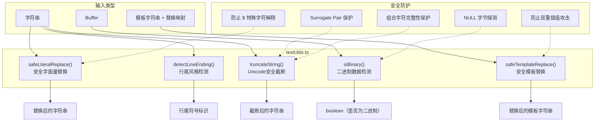

# textUtils.ts

## 概述

`textUtils.ts` 是一个通用的文本处理工具模块，提供了一组安全、健壮的字符串和数据操作函数。该模块聚焦于以下几个方面的文本处理需求：

1. **安全字符串替换** — 避免 JavaScript `String.prototype.replace` 的 `$` 特殊字符陷阱
2. **二进制检测** — 通过 NULL 字节探测判断 Buffer 是否为二进制数据
3. **行尾风格检测** — 自动识别 Windows（CRLF）和 Unix（LF）换行符
4. **Unicode 安全截断** — 正确处理 surrogate pair 和组合字符的字符串截断
5. **安全模板替换** — 防止双重插值攻击的模板字符串占位符替换

该模块的所有函数均为纯函数（无副作用），适合在项目各处安全调用。

## 架构图（Mermaid）

## 核心组件

### 1. `safeLiteralReplace(str, oldString, newString): string`

安全地将字符串中的所有 `oldString` 替换为 `newString`，避免 ECMAScript 的 `GetSubstitution` 机制导致的问题。

#### 问题背景

JavaScript 的 `String.prototype.replace` 和 `replaceAll` 方法会将替换字符串中的 `$` 视为特殊模式：

| 模式 | 含义 |
|---|---|
| `$$` | 插入一个字面 `$` |
| `$&` | 插入匹配的子串 |
| `` $` `` | 插入匹配前面的部分 |
| `$'` | 插入匹配后面的部分 |

#### 实现逻辑

1. **快速路径 1**：如果 `oldString` 为空或 `str` 中不包含 `oldString`，直接返回原字符串
2. **快速路径 2**：如果 `newString` 中不包含 `$`，直接使用 `replaceAll` 替换
3. **安全路径**：将 `newString` 中的每个 `$` 替换为 `$$$$`（即 `$$`，因为 `replaceAll` 本身也会解释 `$`），然后再执行 `replaceAll`

#### 为什么用 `$$$$`？

`replaceAll('$', '$$$$')` 实际上是把每个 `$` 替换为 `$$`。这是因为 `replaceAll` 的替换字符串中 `$$` 代表字面量 `$`，所以需要 4 个 `$` 才能产生 2 个 `$`，而 `$$` 在最终的 `replaceAll` 调用中又会被解释为一个字面量 `$`。

### 2. `isBinary(data, sampleSize?): boolean`

通过检测 NULL 字节（`0x00`）判断 Buffer 是否包含二进制数据。

#### 参数

| 参数 | 类型 | 默认值 | 说明 |
|---|---|---|---|
| `data` | `Buffer \| null \| undefined` | - | 待检测的数据缓冲区 |
| `sampleSize` | `number` | `512` | 采样字节数（从 Buffer 开头算起） |

#### 实现逻辑

1. 如果 `data` 为 `null` 或 `undefined`，返回 `false`
2. 取 Buffer 前 `sampleSize` 字节作为采样（如果 Buffer 更短则使用全部数据）
3. 逐字节扫描，发现任何 `0x00`（NULL 字节）即判定为二进制，返回 `true`
4. 未发现 NULL 字节则判定为文本，返回 `false`

#### 设计原理

NULL 字节是最可靠的二进制文件标志之一。正常的文本文件（包括各种编码的 Unicode 文本）不应包含 NULL 字节。这也是 Git 等工具用来检测二进制文件的经典方法。

### 3. `detectLineEnding(content): '\r\n' | '\n'`

检测字符串内容使用的换行符风格。

- 如果内容中包含 `\r\n`（回车+换行），判定为 Windows 风格，返回 `'\r\n'`
- 否则判定为 Unix 风格，返回 `'\n'`

这是一个简单但有效的启发式方法。

### 4. `truncateString(str, maxLength, suffix?): string`

将字符串截断到指定最大长度，并在截断时追加后缀。**关键特性：正确处理 Unicode 字符**。

#### 参数

| 参数 | 类型 | 默认值 | 说明 |
|---|---|---|---|
| `str` | `string` | - | 待截断字符串 |
| `maxLength` | `number` | - | 最大长度（以 JavaScript 字符为单位） |
| `suffix` | `string` | `'...[TRUNCATED]'` | 截断后追加的后缀 |

#### Unicode 安全截断算法

1. **快速路径**：如果字符串长度不超过 `maxLength`，直接返回
2. **字形簇（Grapheme Cluster）匹配**：使用正则表达式 `/(?:[\uD800-\uDBFF][\uDC00-\uDFFF]|.)\p{M}*/gu` 逐个匹配字形簇：
   - `[\uD800-\uDBFF][\uDC00-\uDFFF]`：匹配 surrogate pair（代理对，用于表示 U+10000 及以上的字符，如 emoji）
   - `.`：匹配单个 BMP 字符
   - `\p{M}*`：匹配后续的所有组合标记（如重音符号、变音符号等），确保基础字符和其组合标记不被拆分
3. **逐个累加**：将每个完整的字形簇追加到结果字符串中，当累加后长度超过 `maxLength` 时停止
4. **悬挂高位代理检查**：最终检查截断结果的最后一个字符是否为高位代理（`0xD800-0xDBFF`），如果是则移除，避免产生无效的 Unicode 字符串
5. 追加后缀返回

### 5. `safeTemplateReplace(template, replacements): string`

安全地将模板字符串中的 `{{key}}` 占位符替换为对应的值。

#### 参数

| 参数 | 类型 | 说明 |
|---|---|---|
| `template` | `string` | 包含 `{{key}}` 占位符的模板字符串 |
| `replacements` | `Record<string, string>` | 键值对映射，键为占位符名称 |

#### 实现逻辑

1. 使用正则表达式 `/\{\{(\w+)\}\}/g` 匹配所有 `{{key}}` 模式的占位符
2. 对每个匹配项，通过 `Object.prototype.hasOwnProperty.call` 安全检查 `replacements` 对象中是否存在对应的键
3. 如果存在，使用对应的值替换；如果不存在，保留原始占位符不变

#### 安全特性

- **单次替换**：使用 `String.prototype.replace` 的回调函数形式，确保只进行一次替换。如果替换值中也包含 `{{...}}` 模式，不会被再次解释，从而防止双重插值攻击
- **安全属性检查**：使用 `Object.prototype.hasOwnProperty.call` 而非 `in` 运算符或直接属性访问，避免原型链污染的安全问题

## 依赖关系

### 内部依赖

无。该模块完全自包含。

### 外部依赖

无。该模块仅使用 JavaScript/TypeScript 原生 API。

## 关键实现细节

1. **多层 `$` 转义的数学推导**：`safeLiteralReplace` 中使用 `'$$$$'` 看起来令人困惑，但实际上是精确的。第一次 `replaceAll('$', '$$$$')` 将 `$` 变为 `$$`；第二次在 `str.replaceAll(oldString, escapedNewString)` 中 `$$` 被解释为字面量 `$`。两层转义最终还原为原始的 `$` 字符。

2. **采样检测策略**：`isBinary` 默认只检查前 512 字节，这是性能和准确性之间的平衡。对于大多数文件格式（PDF、图片、可执行文件等），文件头部通常就包含 NULL 字节。512 字节的采样大小与 Git 的二进制检测策略类似。

3. **字形簇正则表达式的局限性**：`truncateString` 使用的正则表达式是手动构造的字形簇匹配器，能正确处理 surrogate pair + 组合标记的情况，但无法处理所有 Unicode 字形簇边界（如 ZWJ 序列组合的 emoji）。完整的字形簇分割需要使用 `Intl.Segmenter` API 或专门的 Unicode 库。

4. **悬挂代理保护**：`truncateString` 的最后安全检查防止了一种边缘情况——虽然正则表达式理论上应该总是完整匹配 surrogate pair，但额外的保护确保了即使正则匹配出现意外情况，也不会产生无效的 UTF-16 字符串。

5. **纯函数设计**：该模块的所有 5 个函数都是纯函数（无副作用、无状态），这使得它们易于测试、可以安全并发调用，并且天然适合函数式编程风格的使用场景。
