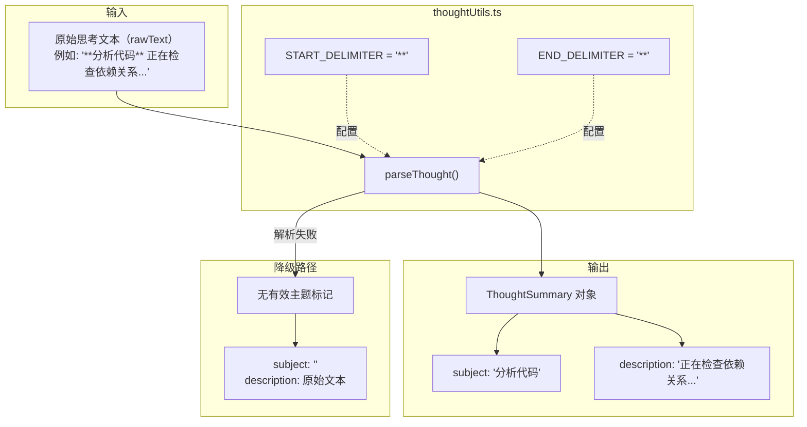

# thoughtUtils.ts

## 概述

`thoughtUtils.ts` 是一个用于解析 AI 模型"思考"（Thought）文本的工具模块。AI 模型在生成回复时可能会产生结构化的思考过程文本，该模块负责将原始的思考文本字符串解析为包含"主题"（subject）和"描述"（description）两部分的结构化对象。

该模块约定思考文本中的主题部分使用 Markdown 粗体语法（双星号 `**...**`）标记。解析器提取第一个有效的粗体标记作为主题，其余内容作为描述。

## 架构图（Mermaid）



## 核心组件

### 1. `ThoughtSummary` 类型

定义了思考摘要的结构化类型：

```typescript
type ThoughtSummary = {
  subject: string;     // 思考主题（从 **..** 中提取）
  description: string; // 思考描述（剩余文本）
};
```

### 2. 分隔符常量

| 常量 | 值 | 说明 |
|---|---|---|
| `START_DELIMITER` | `'**'` | 主题开始标记（Markdown 粗体起始） |
| `END_DELIMITER` | `'**'` | 主题结束标记（Markdown 粗体结束） |

这两个常量使用相同的值 `'**'`，对应 Markdown 的粗体语法。将其定义为常量而非硬编码，便于未来调整分隔符格式。

### 3. `parseThought(rawText: string): ThoughtSummary`

**核心解析函数**。将原始思考文本解析为 `ThoughtSummary` 结构化对象。

#### 解析流程

```
输入: "前置文本 **主题内容** 后续描述文本"
```

1. **查找起始分隔符**：在 `rawText` 中查找第一个 `**` 的位置（`startIndex`）
   - 未找到：返回 `{ subject: '', description: rawText.trim() }`（整个文本作为描述）

2. **查找结束分隔符**：从 `startIndex + 2` 位置开始查找下一个 `**`（`endIndex`）
   - 未找到：返回 `{ subject: '', description: rawText.trim() }`（无闭合标记视为无效主题）

3. **提取主题**：取 `startIndex + 2` 到 `endIndex` 之间的文本并 `trim()`

4. **拼接描述**：将起始分隔符之前的文本与结束分隔符之后的文本拼接，并 `trim()`

5. 返回 `{ subject, description }`

#### 示例

| 输入 | subject | description |
|---|---|---|
| `"**分析代码** 检查依赖"` | `"分析代码"` | `"检查依赖"` |
| `"前缀 **主题** 后缀"` | `"主题"` | `"前缀 后缀"` |
| `"无粗体标记的文本"` | `""` | `"无粗体标记的文本"` |
| `"**未闭合标记"` | `""` | `"**未闭合标记"` |
| `"**主题**"` | `"主题"` | `""` |
| `"  **  主题  **  "` | `"主题"` | `""` |

## 依赖关系

### 内部依赖

无。该模块完全自包含。

### 外部依赖

无。该模块仅使用 JavaScript/TypeScript 原生字符串操作 API。

## 关键实现细节

1. **仅解析第一个主题**：函数只查找并解析第一对 `**...**` 标记。如果文本中存在多个粗体标记（如 `"**主题1** 文本 **主题2**"`），只有第一个会被识别为主题，后续的 `**...**` 会被包含在描述文本中。

2. **优雅降级**：当输入文本不包含有效的粗体标记时（无起始标记、无结束标记），函数不会抛出异常，而是将整个文本作为描述返回，主题设为空字符串。这确保了对任意输入的健壮性。

3. **描述文本拼接**：描述不仅仅是主题标记之后的文本，而是主题标记之前和之后的文本的拼接。例如对于 `"前缀 **主题** 后缀"`，描述是 `"前缀  后缀"`（经过 `trim()` 后为 `"前缀  后缀"`，注意中间可能有多余空格）。这种设计使得主题可以出现在文本的任意位置。

4. **空白处理**：函数对提取的 `subject` 和拼接后的 `description` 都执行了 `trim()` 操作，去除首尾空白字符。但拼接描述时，如果主题前后都有文本，拼接处可能会有多余的空格，函数不做内部空格规范化处理。

5. **分隔符相同的歧义**：由于 `START_DELIMITER` 和 `END_DELIMITER` 都是 `**`，解析器通过位置顺序来区分起止标记——第一个 `**` 是开始，紧接着的下一个 `**` 是结束。如果需要在思考文本中使用字面量 `**` 而非作为主题标记，当前实现无法区分。

6. **与 Markdown 的关系**：虽然使用了 Markdown 粗体语法 `**...**`，但该解析器并非通用 Markdown 解析器。它专门针对 AI 思考文本的特定格式进行快速、轻量的提取，不支持嵌套标记、转义字符等 Markdown 完整语法。
