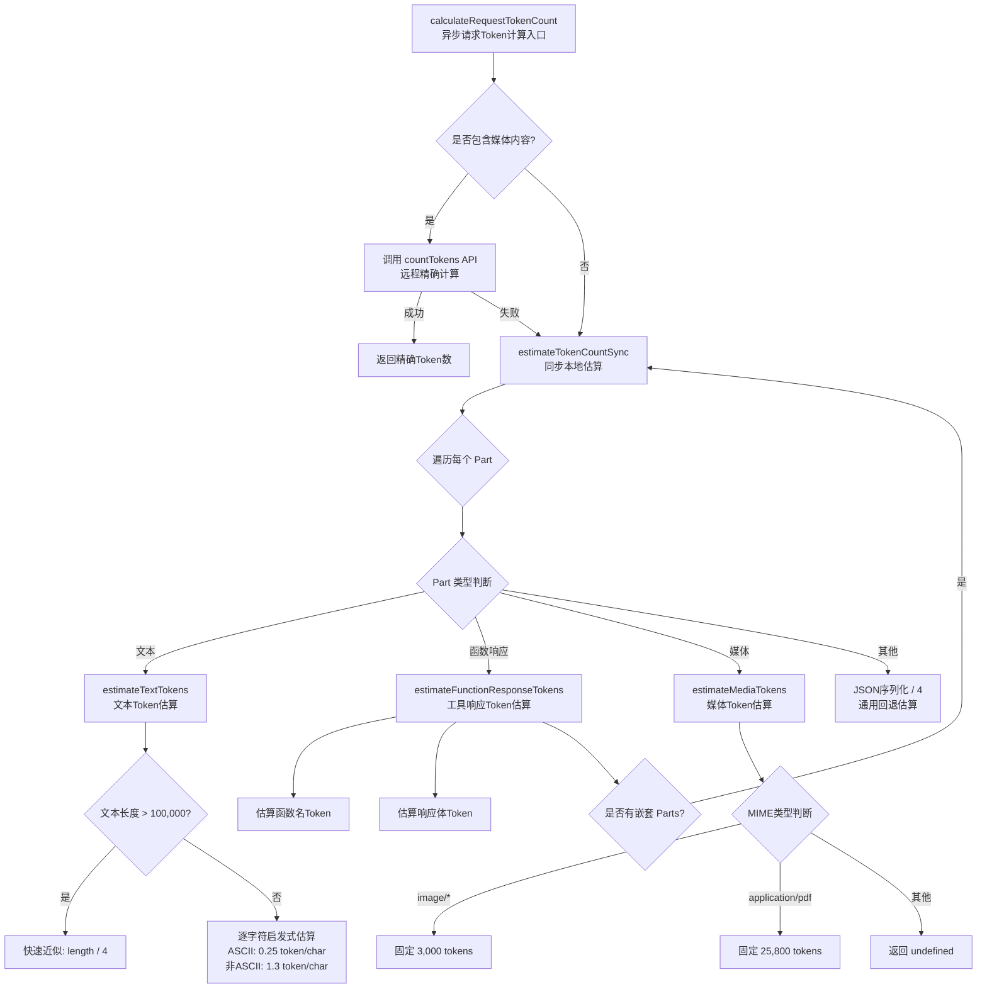

# tokenCalculation.ts

## 概述

`tokenCalculation.ts` 是 Gemini CLI 核心包中的 Token 计算工具模块。该模块提供了对各种类型内容（文本、图片、PDF、工具调用响应等）的 Token 数量估算能力。它采用**本地启发式估算**与**远程 API 精确计算**相结合的策略：对于纯文本和工具调用内容使用本地快速估算；对于包含媒体数据（图片、文件）的内容，则调用 Gemini 的 `countTokens` API 进行精确计算，并在 API 失败时回退到本地估算。

**文件路径**: `packages/core/src/utils/tokenCalculation.ts`

## 架构图（Mermaid）

## 核心组件

### 1. 常量定义

| 常量名 | 值 | 说明 |
|---|---|---|
| `ASCII_TOKENS_PER_CHAR` | `0.25` | ASCII 字符（0-127）的 Token 估算比率，约 4 个字符对应 1 个 Token |
| `NON_ASCII_TOKENS_PER_CHAR` | `1.3` | 非 ASCII 字符（含 CJK 中日韩字符）的 Token 估算比率，保守估计避免低估 |
| `IMAGE_TOKEN_ESTIMATE` | `3000` | 图片的固定 Token 估算值，覆盖到 4K 分辨率 |
| `PDF_TOKEN_ESTIMATE` | `25800` | PDF 的固定 Token 估算值，约 100 页 x 258 tokens/页 |
| `MAX_CHARS_FOR_FULL_HEURISTIC` | `100_000` | 使用完整逐字符启发式的最大字符数阈值，超过此值使用快速近似 |
| `MAX_RECURSION_DEPTH` | `3` | 递归估算的最大深度，防止恶意或错误的嵌套结构导致栈溢出 |

### 2. `estimateTextTokens(text: string): number`（内部函数）

文本 Token 启发式估算函数。

- **短文本**（<= 100,000 字符）：逐字符扫描，ASCII 字符按 0.25 token/char 计算，非 ASCII 字符按 1.3 token/char 计算。使用 `charCodeAt` 而非 `for...of` 迭代以优化大字符串的性能。
- **长文本**（> 100,000 字符）：使用快速近似公式 `length / 4`，避免性能瓶颈。

### 3. `estimateMediaTokens(part: Part): number | undefined`（内部函数）

媒体内容 Token 估算函数。

- 支持 `inlineData` 和 `fileData` 两种媒体数据格式。
- 根据 MIME 类型返回固定估算值：
  - `image/*` 类型 → 3,000 tokens
  - `application/pdf` 类型 → 25,800 tokens
  - 其他类型 → 返回 `undefined`（由调用方走回退逻辑）

### 4. `estimateFunctionResponseTokens(part: Part, depth: number): number`（内部函数）

工具/函数调用响应的 Token 估算函数。

- 估算函数名的 Token 数（`name.length / 4`）
- 估算响应体的 Token 数：
  - 字符串类型：`response.length / 4`
  - 对象类型：`JSON.stringify(response).length / 4`
- **递归处理**：支持 Gemini 3 的嵌套多模态 Parts，递归调用 `estimateTokenCountSync` 处理嵌套内容

### 5. `estimateTokenCountSync(parts: Part[], depth?: number): number`（导出函数）

同步 Token 估算的核心函数。遍历 `Part[]` 数组，根据不同类型分发到对应的估算函数：

1. **文本 Part**（`part.text`）→ `estimateTextTokens`
2. **函数响应 Part**（`part.functionResponse`）→ `estimateFunctionResponseTokens`
3. **媒体 Part**（图片/PDF）→ `estimateMediaTokens`
4. **其他 Part**（如 `functionCall`）→ `JSON.stringify(part).length / 4`

最终使用 `Math.floor` 将浮点结果取整后返回。

递归深度超过 `MAX_RECURSION_DEPTH`（3）时直接返回 0，防止栈溢出。

### 6. `calculateRequestTokenCount(request, contentGenerator, model): Promise<number>`（导出函数）

异步请求 Token 计算的入口函数。

- **输入标准化**：将 `PartListUnion` 类型统一转换为 `Part[]` 数组
  - 字符串 → `[{ text: string }]`
  - 字符串数组 → 逐项转换
  - 单个 Part → 包装为数组
- **媒体检测**：检查是否包含 `inlineData` 或 `fileData`
- **分支逻辑**：
  - 含媒体 → 调用 `contentGenerator.countTokens` API 精确计算，失败则回退本地估算
  - 无媒体 → 直接使用本地同步估算

## 依赖关系

### 内部依赖

| 模块 | 导入内容 | 用途 |
|---|---|---|
| `../core/contentGenerator.js` | `ContentGenerator` (类型) | 提供 `countTokens` API 调用能力，用于媒体内容的精确 Token 计算 |
| `./debugLogger.js` | `debugLogger` | 在 `countTokens` API 失败时记录调试日志 |

### 外部依赖

| 包名 | 导入内容 | 用途 |
|---|---|---|
| `@google/genai` | `PartListUnion`, `Part` (类型) | Google Generative AI SDK 的类型定义，定义了请求内容的数据结构 |

## 关键实现细节

1. **性能优化策略**：
   - 对超过 100,000 字符的文本，放弃逐字符的精确估算，转用 `length / 4` 快速近似，避免大文本造成的性能瓶颈。
   - 使用 `charCodeAt` 代替 `for...of` 遍历字符串，在大字符串上有更好的性能表现（避免 Unicode 迭代器的开销）。
   - 文本和工具调用使用本地估算，只在必要时（含媒体数据）才调用远程 API，减少网络开销。

2. **CJK 字符处理**：
   - 中日韩等非 ASCII 字符使用 1.3 token/char 的保守估计值。这是因为 CJK 字符在 BPE 分词器中通常每个字符对应 1-2 个 Token，使用 1.3 可以避免低估。

3. **递归安全**：
   - 通过 `MAX_RECURSION_DEPTH = 3` 限制递归深度，防止恶意或异常的嵌套结构导致栈溢出。标准的多模态响应通常只有 1 层深度，3 层已足够覆盖所有正常场景。

4. **容错设计**：
   - `calculateRequestTokenCount` 在调用远程 `countTokens` API 失败时，自动回退到本地启发式估算，确保功能不中断。
   - `estimateMediaTokens` 对不识别的 MIME 类型返回 `undefined`，由上层 `estimateTokenCountSync` 使用 JSON 序列化的通用回退策略处理。

5. **Gemini 3 兼容**：
   - `estimateFunctionResponseTokens` 支持 Gemini 3 引入的嵌套多模态 Parts 格式（`functionResponse.parts`），通过递归调用处理嵌套内容。

6. **输入标准化**：
   - `calculateRequestTokenCount` 接受灵活的 `PartListUnion` 类型输入（字符串、字符串数组、Part 对象等），内部统一转换为 `Part[]` 进行处理，提供了良好的 API 兼容性。
