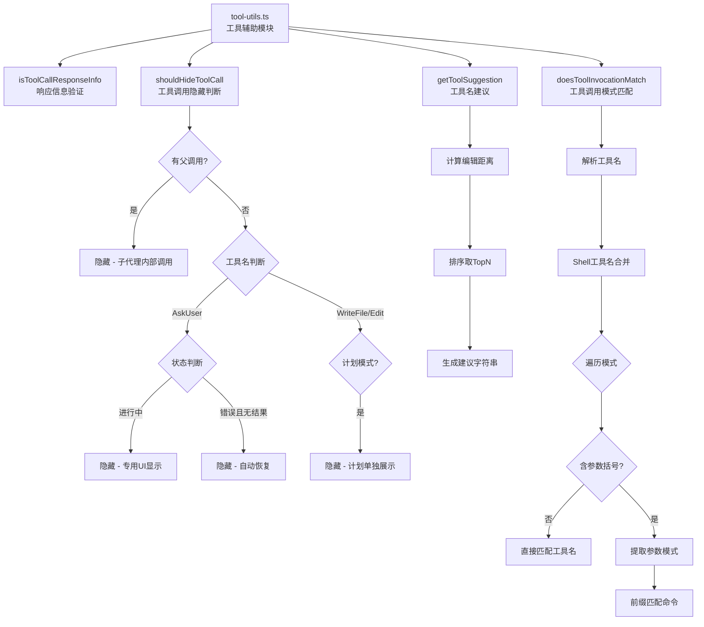

# tool-utils.ts

## 概述

`tool-utils.ts` 是 Gemini CLI 核心包中的工具辅助模块。该模块提供了一组与工具（Tool）系统相关的实用函数，主要包括：

1. **工具调用响应验证**：验证数据是否为有效的 `ToolCallResponseInfo`
2. **工具调用 UI 隐藏逻辑**：决定哪些工具调用应在 CLI 历史记录中隐藏
3. **工具名称建议**：当用户输入的工具名不存在时，基于 Levenshtein 编辑距离推荐相似工具名
4. **工具调用模式匹配**：检查工具调用是否匹配指定的模式列表（用于策略/权限控制）

**文件路径**: `packages/core/src/utils/tool-utils.ts`

## 架构图（Mermaid）

## 核心组件

### 1. `isToolCallResponseInfo(data: unknown): data is ToolCallResponseInfo`

类型守卫函数，验证一个未知对象是否为有效的 `ToolCallResponseInfo`。

**验证条件**：
- 是非空对象
- 包含 `callId` 属性
- 包含 `responseParts` 属性

### 2. `ShouldHideToolCallParams` 接口

`shouldHideToolCall` 函数的参数接口定义。

| 属性 | 类型 | 必填 | 说明 |
|---|---|---|---|
| `displayName` | `string` | 是 | 工具的显示名称 |
| `status` | `CoreToolCallStatus` | 是 | 工具调用的当前状态 |
| `approvalMode` | `ApprovalMode` | 否 | 工具调用时激活的审批模式 |
| `hasResultDisplay` | `boolean` | 是 | 工具是否已产生可展示的结果 |
| `parentCallId` | `string` | 否 | 父工具调用的 ID（如存在） |

### 3. `shouldHideToolCall(params: ShouldHideToolCallParams): boolean`

决定一个工具调用是否应在标准工具历史 UI 中隐藏。隐藏场景如下：

| 场景 | 条件 | 原因 |
|---|---|---|
| 子代理内部调用 | `parentCallId` 存在 | 这些是另一个工具（如子代理）的内部调用，不应暴露给用户 |
| AskUser 进行中 | 工具名为 AskUser 且状态为 Scheduled/Validating/Executing/AwaitingApproval | 通过专用 UI 展示，不需在历史中重复 |
| AskUser 错误 | 工具名为 AskUser 且状态为 Error 且无结果展示 | 通常是参数验证错误，代理会自动恢复 |
| 计划模式下的写入 | 工具名为 WriteFile 或 Edit 且审批模式为 PLAN | 计划模式下的修改会在退出计划模式时统一展示，无需重复 |

### 4. `getToolSuggestion(unknownToolName: string, allToolNames: string[], topN?: number): string`

当用户输入的工具名未找到时，基于 Levenshtein 编辑距离算法生成建议。

**处理流程**：
1. 计算未知工具名与所有可用工具名之间的 Levenshtein 编辑距离
2. 按距离升序排序
3. 取前 `topN` 个结果（默认 3 个）
4. 生成建议字符串：
   - 单个建议：`Did you mean "toolName"?`
   - 多个建议：`Did you mean one of: "tool1", "tool2", "tool3"?`
   - 无可用工具：返回空字符串

### 5. `doesToolInvocationMatch(toolOrToolName, invocation, patterns): boolean`

检查一个工具调用是否匹配给定的模式列表，用于策略和权限控制系统。

**模式语法**：
- **简单工具名**：如 `"ReadFileTool"` — 匹配该工具的任何调用
- **工具名 + 参数前缀**：如 `"ShellTool(git status)"` — 匹配工具名且命令以指定前缀开头的调用

**处理流程**：
1. **工具名解析**：如果输入是工具对象，提取 `name` 和 `constructor.name`；如果是字符串，直接使用
2. **Shell 工具合并**：如果工具名在 `SHELL_TOOL_NAMES` 列表中，将所有 Shell 工具名合并到候选列表中（因为不同 Shell 工具实质上等价）
3. **模式遍历与匹配**：
   - 无括号模式 → 直接检查工具名是否在候选列表中
   - 有括号模式 → 提取模式中的工具名和参数前缀，分别匹配工具名和命令字符串
4. **命令前缀匹配**（仅 Shell 工具）：命令必须等于参数模式或以 `参数模式 + 空格` 开头

## 依赖关系

### 内部依赖

| 模块 | 导入内容 | 用途 |
|---|---|---|
| `../index.js` | `isTool`, `AnyDeclarativeTool` (类型), `AnyToolInvocation` (类型) | 工具类型判断和类型定义 |
| `./shell-utils.js` | `SHELL_TOOL_NAMES` | Shell 工具名列表，用于 Shell 工具的等价匹配 |
| `../policy/types.js` | `ApprovalMode` | 审批模式枚举，用于判断是否为计划模式 |
| `../scheduler/types.js` | `CoreToolCallStatus`, `ToolCallResponseInfo` (类型) | 工具调用状态枚举和响应信息类型 |
| `../tools/tool-names.js` | `ASK_USER_DISPLAY_NAME`, `WRITE_FILE_DISPLAY_NAME`, `EDIT_DISPLAY_NAME` | 特定工具的显示名称常量 |

### 外部依赖

| 包名 | 导入内容 | 用途 |
|---|---|---|
| `fast-levenshtein` | `levenshtein` (默认导出) | 计算字符串之间的 Levenshtein 编辑距离，用于工具名建议功能 |

## 关键实现细节

1. **Shell 工具等价处理**：
   - 在 `doesToolInvocationMatch` 中，如果被检查的工具属于 Shell 工具家族（在 `SHELL_TOOL_NAMES` 中），则会自动将所有 Shell 工具名加入候选匹配列表。这意味着对 `ShellTool` 的策略规则也适用于 `BashTool` 等等价工具，避免了策略配置的冗余。

2. **模式匹配的安全性**：
   - 带参数的模式（如 `ShellTool(git status)`）只在 Shell 工具上进行命令前缀匹配，非 Shell 工具只做工具名匹配。
   - 前缀匹配要求命令 **完全等于** 参数模式，或以 `参数模式 + 空格` 开头，防止 `git status` 错误匹配 `git statusbar` 等。
   - 模式格式验证：必须以 `)` 结尾才视为有效的带参数模式。

3. **UI 隐藏策略的分层设计**：
   - `shouldHideToolCall` 按优先级检查：首先检查是否为子代理调用（最高优先级），然后根据不同工具名和状态组合判断。
   - 这种设计使得子代理（subagent）的所有内部工具调用对用户完全透明，同时为特定工具（AskUser、WriteFile、Edit）提供细粒度的可见性控制。

4. **Levenshtein 建议的实用性**：
   - 使用 `fast-levenshtein` 库而非自行实现，保证了编辑距离计算的性能。
   - 始终返回 topN 个结果，即使距离很大，也给出最接近的选项供参考。
   - 输出格式区分单个和多个建议，提供更自然的提示语。

5. **类型守卫模式**：
   - `isToolCallResponseInfo` 使用 TypeScript 的 `data is ToolCallResponseInfo` 类型谓词语法，使得调用方在通过验证后可以安全地访问 `callId` 和 `responseParts` 属性，无需额外的类型断言。
