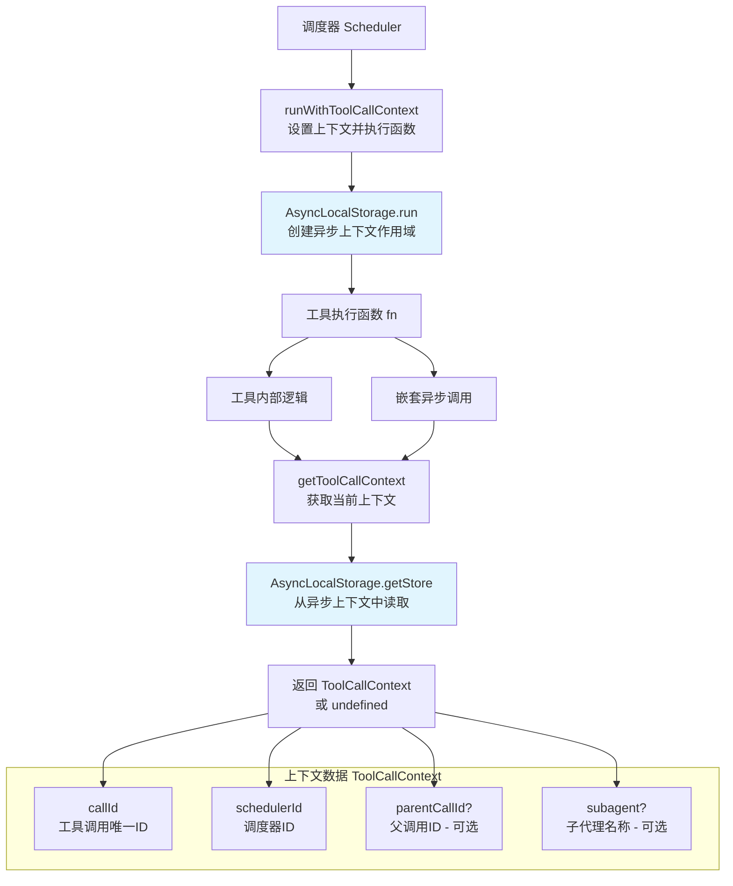

# toolCallContext.ts

## 概述

`toolCallContext.ts` 是 Gemini CLI 核心包中的工具调用上下文管理模块。该模块利用 Node.js 的 `AsyncLocalStorage` API 实现了**异步上下文传播**机制，使得在工具执行的整个异步调用链中，都可以访问到当前工具调用的上下文信息（如调用 ID、调度器 ID、父调用 ID、子代理名称等），而无需通过函数参数层层传递。

这是一种典型的**隐式上下文传递**模式，类似于 Java 的 ThreadLocal，但适用于 Node.js 的异步编程模型。

**文件路径**: `packages/core/src/utils/toolCallContext.ts`

## 架构图（Mermaid）



## 核心组件

### 1. `ToolCallContext` 接口

定义工具调用执行的上下文信息结构。

| 属性 | 类型 | 必填 | 说明 |
|---|---|---|---|
| `callId` | `string` | 是 | 工具调用的唯一标识符，用于追踪和关联特定的工具调用 |
| `schedulerId` | `string` | 是 | 管理该工具调用执行的调度器 ID，用于标识是哪个调度器实例发起的调用 |
| `parentCallId` | `string` | 否 | 父工具调用的 ID。当工具调用发生在嵌套执行中（如子代理场景）时存在，用于构建调用层级关系 |
| `subagent` | `string` | 否 | 执行该工具的子代理名称（如适用），用于标识工具调用是否属于某个子代理的执行范围 |

### 2. `toolCallContext`（模块级私有变量）

```typescript
const toolCallContext = new AsyncLocalStorage<ToolCallContext>();
```

模块级别的 `AsyncLocalStorage` 实例，作为工具调用上下文的存储容器。它是模块私有的，外部只能通过导出的 `runWithToolCallContext` 和 `getToolCallContext` 函数来操作。

### 3. `runWithToolCallContext<T>(context: ToolCallContext, fn: () => T): T`

在指定的工具调用上下文中执行函数。

- **参数**：
  - `context`: 要设置的 `ToolCallContext` 对象
  - `fn`: 要在该上下文中执行的函数（支持同步和异步函数）
- **返回值**：函数 `fn` 的执行结果（类型为泛型 `T`）
- **行为**：调用 `AsyncLocalStorage.run(context, fn)`，在 `fn` 及其内部触发的所有异步操作期间，通过 `getToolCallContext()` 都可以获取到传入的 `context`

### 4. `getToolCallContext(): ToolCallContext | undefined`

获取当前异步执行上下文中的工具调用信息。

- **返回值**：
  - 如果当前在某个 `runWithToolCallContext` 创建的上下文中执行，返回对应的 `ToolCallContext` 对象
  - 如果不在任何工具调用上下文中，返回 `undefined`

## 依赖关系

### 内部依赖

无。该模块是一个底层基础设施模块，不依赖项目中的其他模块。

### 外部依赖

| 包名 | 导入内容 | 用途 |
|---|---|---|
| `node:async_hooks` | `AsyncLocalStorage` | Node.js 内置模块，提供异步本地存储能力，用于在异步调用链中传播上下文数据 |

## 关键实现细节

1. **AsyncLocalStorage 机制**：
   - `AsyncLocalStorage` 是 Node.js 从 v12.17.0 开始提供的 API（v16.4.0 起稳定）。它允许在异步操作链（包括 `Promise`、`setTimeout`、`EventEmitter` 回调等）中存储和传播上下文数据。
   - 每次调用 `run(context, fn)` 时，会创建一个新的异步执行上下文。在 `fn` 内部发起的所有异步操作都会继承这个上下文，无论经过多少层异步调用。
   - 当 `fn` 执行结束后，上下文自动销毁，不会泄露到外部。

2. **隐式上下文传递的优势**：
   - 避免了在大量函数签名中添加 `context` 参数（"参数钻取"问题）
   - 工具执行的任何深度的嵌套调用都可以通过简单的 `getToolCallContext()` 获取上下文
   - 对现有代码的侵入性最小

3. **嵌套执行支持**：
   - `parentCallId` 和 `subagent` 字段的设计表明该模块支持工具调用的嵌套执行。例如，一个子代理（subagent）工具在执行内部工具时，可以通过 `parentCallId` 建立调用层级关系。
   - 内层的 `runWithToolCallContext` 调用会创建新的上下文作用域，覆盖外层的上下文。这意味着嵌套的工具调用会有自己独立的上下文。

4. **泛型设计**：
   - `runWithToolCallContext<T>` 使用泛型 `T`，使得它可以包装任意返回类型的函数（包括返回 `Promise` 的异步函数），保持了类型安全性和灵活性。

5. **模块封装**：
   - `AsyncLocalStorage` 实例 `toolCallContext` 是模块私有的（未导出），外部只能通过 `runWithToolCallContext` 和 `getToolCallContext` 两个函数来交互。这种封装确保了上下文的设置和读取行为是可控的，防止外部直接操作底层存储。

6. **线程安全性**：
   - 虽然 Node.js 是单线程模型，但并发的异步操作可能交错执行。`AsyncLocalStorage` 能正确区分不同异步调用链的上下文，确保每个工具调用读取到的都是自己的上下文数据，即使多个工具调用同时在执行中。
