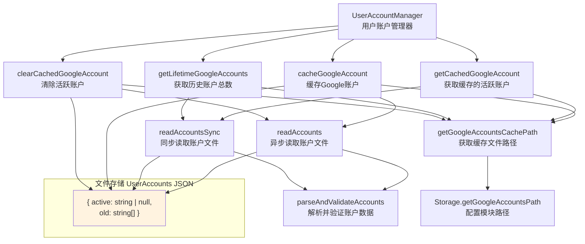

# userAccountManager.ts

## 概述

`userAccountManager.ts` 是 Gemini CLI 核心包中的用户账户管理模块。该模块提供了 `UserAccountManager` 类，负责管理 Google 账户的本地缓存，包括：

- **缓存当前活跃的 Google 账户**（email 地址）
- **追踪历史账户列表**（曾经使用过但不再活跃的账户）
- **账户切换逻辑**（活跃账户变更时，旧账户自动归档到历史列表）
- **统计生命周期内使用过的不同账户数量**

账户数据以 JSON 文件形式持久化存储在本地文件系统中，通过 `Storage` 配置模块获取存储路径。

**文件路径**: `packages/core/src/utils/userAccountManager.ts`

## 架构图（Mermaid）

## 核心组件

### 1. `UserAccounts` 接口（模块内部）

定义账户数据的存储结构。

| 属性 | 类型 | 说明 |
|---|---|---|
| `active` | `string \| null` | 当前活跃的 Google 账户邮箱地址。为 `null` 表示没有活跃账户 |
| `old` | `string[]` | 曾经使用过但不再活跃的历史账户邮箱列表 |

### 2. `UserAccountManager` 类

#### 私有方法

##### `getGoogleAccountsCachePath(): string`

获取 Google 账户缓存文件的路径。委托给 `Storage.getGoogleAccountsPath()` 实现。

##### `parseAndValidateAccounts(content: string): UserAccounts`

解析并验证账户文件的字符串内容。

**验证逻辑**：
1. 空字符串 → 返回默认状态 `{ active: null, old: [] }`
2. JSON 解析后不是对象或为 null → 记录日志，返回默认状态
3. 验证字段类型：
   - `active` 必须是 `undefined`、`null` 或 `string`
   - `old` 必须是 `undefined` 或全部元素为 `string` 的数组
4. 验证失败 → 记录日志，返回默认状态
5. 验证通过 → 返回标准化的 `UserAccounts` 对象（缺失字段用默认值填充）

##### `readAccountsSync(filePath: string): UserAccounts`

同步读取账户文件。

- 使用 `readFileSync` 读取文件内容
- 文件不存在（`ENOENT`）→ 返回默认状态（不报错）
- 其他错误 → 记录日志，返回默认状态

##### `readAccounts(filePath: string): Promise<UserAccounts>`

异步读取账户文件。逻辑与 `readAccountsSync` 相同，但使用 `fsp.readFile` 异步版本。

#### 公有方法

##### `cacheGoogleAccount(email: string): Promise<void>`

缓存一个 Google 账户为当前活跃账户。

**处理流程**：
1. 确保存储目录存在（递归创建）
2. 读取当前账户数据
3. 如果当前有活跃账户且与新账户不同：
   - 将旧活跃账户加入 `old` 列表（避免重复）
4. 从 `old` 列表中移除新账户（如果存在）
5. 将新账户设为 `active`
6. 写回文件（格式化 JSON，缩进 2 空格）

##### `getCachedGoogleAccount(): string | null`

**同步**获取当前缓存的活跃 Google 账户邮箱。

- 返回 `active` 字段的值
- 无缓存时返回 `null`

##### `getLifetimeGoogleAccounts(): number`

**同步**获取该 CLI 实例生命周期内使用过的不同 Google 账户总数。

- 使用 `Set` 合并 `old` 列表和 `active` 账户，去重后返回数量
- 包括当前活跃账户和所有历史账户

##### `clearCachedGoogleAccount(): Promise<void>`

清除当前活跃的 Google 账户。

**处理流程**：
1. 读取当前账户数据
2. 如果有活跃账户：
   - 将其加入 `old` 列表（避免重复）
   - 将 `active` 设为 `null`
3. 写回文件

## 依赖关系

### 内部依赖

| 模块 | 导入内容 | 用途 |
|---|---|---|
| `../config/storage.js` | `Storage` | 提供 `getGoogleAccountsPath()` 方法，获取账户缓存文件的存储路径 |
| `./debugLogger.js` | `debugLogger` | 记录调试日志，用于账户文件解析失败或读取错误的场景 |

### 外部依赖

| 包名 | 导入内容 | 用途 |
|---|---|---|
| `node:path` | `path` (默认导出) | Node.js 内置路径模块，用于从文件路径中提取目录名（`path.dirname`） |
| `node:fs` | `promises as fsp`, `readFileSync` | Node.js 文件系统模块，提供异步（`fsp.readFile`, `fsp.writeFile`, `fsp.mkdir`）和同步（`readFileSync`）文件操作 |

## 关键实现细节

1. **同步与异步双版本读取**：
   - 模块同时提供了 `readAccountsSync` 和 `readAccounts` 两种文件读取方式。
   - **同步版本**用于 `getCachedGoogleAccount` 和 `getLifetimeGoogleAccounts`，这些方法可能在启动流程或需要立即返回结果的场景中调用，同步读取避免了异步传播。
   - **异步版本**用于 `cacheGoogleAccount` 和 `clearCachedGoogleAccount`，这些写入操作不需要阻塞主线程。

2. **账户轮转逻辑**：
   - 当活跃账户变更时，旧账户不会丢失，而是被归档到 `old` 列表中。
   - 如果新账户之前在 `old` 列表中，会将其从 `old` 中移除（避免同一账户同时出现在 `active` 和 `old` 中）。
   - 清除活跃账户时，也会将其归档到 `old` 列表而非直接丢弃。
   - 这种设计使得 `getLifetimeGoogleAccounts` 能准确统计历史上使用过的所有不同账户。

3. **健壮的容错处理**：
   - 文件不存在（首次使用）→ 静默返回默认状态
   - JSON 解析失败 → 记录日志，返回默认状态（"starting fresh"）
   - Schema 验证失败 → 记录日志，返回默认状态
   - 所有错误场景都不会抛出异常到调用方，确保账户管理不会成为 CLI 运行的阻塞点。

4. **目录自动创建**：
   - `cacheGoogleAccount` 在写入前使用 `fsp.mkdir(dirname, { recursive: true })` 确保存储目录存在，这是一种防御性编程实践，避免目录不存在时写入失败。

5. **数据完整性**：
   - `parseAndValidateAccounts` 对每个字段进行严格的类型验证，拒绝不符合预期的数据格式。
   - 使用 `?? null` 和 `?? []` 对缺失字段进行默认值填充，确保返回的对象始终符合 `UserAccounts` 接口。
   - 文件写入使用格式化的 JSON（`JSON.stringify(accounts, null, 2)`），便于人工检查和调试。

6. **去重保护**：
   - 在将账户加入 `old` 列表前，先检查 `!accounts.old.includes(accounts.active)` 避免重复添加，保持列表的唯一性。
