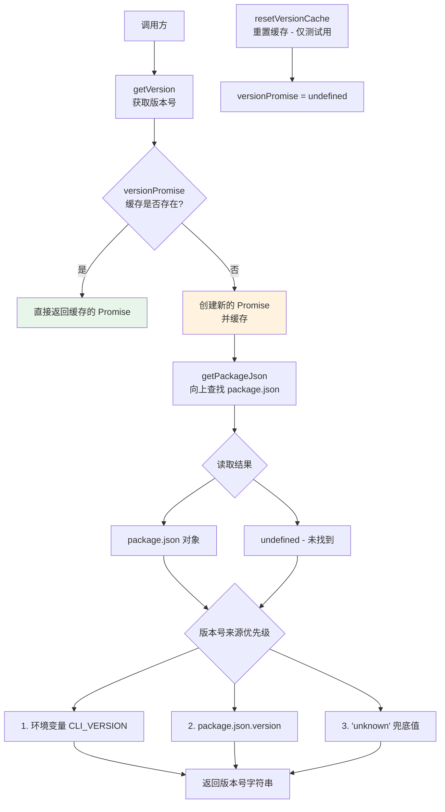

# version.ts

## 概述

`version.ts` 是 Gemini CLI 核心包中的版本号获取模块。该模块提供了获取当前 CLI 版本号的功能，采用**单例缓存模式**确保版本号只被读取和解析一次。

版本号的获取遵循以下优先级：
1. 环境变量 `CLI_VERSION`（最高优先级，适用于 CI/CD 或自定义构建场景）
2. `package.json` 中的 `version` 字段（标准场景）
3. 字符串 `'unknown'`（兜底值）

**文件路径**: `packages/core/src/utils/version.ts`

## 架构图（Mermaid）



## 核心组件

### 1. 模块级变量

#### `__filename` 和 `__dirname`

```typescript
const __filename = fileURLToPath(import.meta.url);
const __dirname = path.dirname(__filename);
```

ESM 模块中没有 CommonJS 的 `__filename` 和 `__dirname` 全局变量，因此需要通过 `import.meta.url` 和 `fileURLToPath` 手动构造。`__dirname` 用于作为 `getPackageJson` 的搜索起点目录。

#### `versionPromise`

```typescript
let versionPromise: Promise<string> | undefined;
```

模块级别的缓存变量，存储版本号获取的 Promise。初始值为 `undefined`，首次调用 `getVersion()` 后被赋值，后续调用直接返回已缓存的 Promise。

### 2. `getVersion(): Promise<string>`（导出函数）

获取当前 CLI 的版本号。

**行为**：
1. 如果 `versionPromise` 已存在（已缓存），直接返回
2. 否则创建一个新的 Promise：
   - 调用 `getPackageJson(__dirname)` 从当前文件所在目录向上搜索 `package.json`
   - 按优先级返回版本号：`process.env['CLI_VERSION']` > `pkgJson?.version` > `'unknown'`
3. 将 Promise 缓存到 `versionPromise`
4. 返回 Promise

**缓存策略**：Promise 本身被缓存（而非解析后的值），这意味着即使 Promise 尚未 resolve，后续调用也会共享同一个 Promise，避免重复发起文件读取操作。

### 3. `resetVersionCache(): void`（导出函数，仅测试用）

重置版本号缓存，将 `versionPromise` 设回 `undefined`。

- 这是一个专为测试设计的函数，允许测试用例在每次测试前重置缓存状态，确保测试的隔离性。
- 在生产代码中不应调用此函数。

## 依赖关系

### 内部依赖

| 模块 | 导入内容 | 用途 |
|---|---|---|
| `./package.js` | `getPackageJson` | 从指定目录向上搜索并读取 `package.json` 文件，返回解析后的 JSON 对象。内部使用 `read-package-up` 库实现目录向上遍历查找。 |

### 外部依赖

| 包名 | 导入内容 | 用途 |
|---|---|---|
| `node:url` | `fileURLToPath` | Node.js 内置 URL 模块，将 `import.meta.url`（`file://` 协议 URL）转换为文件系统路径 |
| `node:path` | `path` (默认导出) | Node.js 内置路径模块，用于从文件路径中提取目录名（`path.dirname`） |

#### 间接依赖（通过 `./package.js`）

| 包名 | 用途 |
|---|---|
| `read-package-up` | 从指定目录开始向上搜索文件系统，找到最近的 `package.json` 并返回其内容 |

## 关键实现细节

1. **Promise 级别的单例缓存**：
   - 缓存的是 `Promise<string>` 而非 `string`。这意味着在 Promise 尚未 resolve 的期间，如果有多个并发调用 `getVersion()`，它们都会获得同一个 Promise，避免了竞态条件下的重复文件读取。
   - 这是一种经典的"Promise 缓存"模式，比先 await 再缓存结果的方式更加高效和安全。

2. **ESM 兼容的路径处理**：
   - 项目使用 ES Module 格式（`import.meta.url`），因此需要手动构造 `__dirname`。
   - `import.meta.url` 返回 `file:///path/to/version.ts` 格式的 URL，通过 `fileURLToPath` 转为操作系统路径，再通过 `path.dirname` 提取目录。

3. **版本号来源的灵活性**：
   - **环境变量优先**：`process.env['CLI_VERSION']` 的最高优先级设计，允许在 CI/CD 流水线、Docker 镜像构建、或自定义分发中覆盖版本号，而无需修改 `package.json`。
   - **package.json 回退**：标准开发和分发场景中，版本号来源于 `package.json`。
   - **兜底值 `'unknown'`**：当 `package.json` 不存在或没有 `version` 字段时（如在非 Node.js 项目目录中运行），返回 `'unknown'` 而非抛出异常。

4. **向上查找策略**：
   - `getPackageJson(__dirname)` 从当前文件所在目录开始向上查找 `package.json`。由于 `version.ts` 位于 `packages/core/src/utils/`，它会先在 `utils/` 目录查找，然后是 `src/`、`core/`，最终在 `packages/core/` 目录找到 `package.json`。这种策略使得模块在 monorepo 结构中也能正确定位到所属包的版本号。

5. **测试友好设计**：
   - `resetVersionCache()` 函数的存在使得单元测试可以：
     - 在不同测试用例之间重置缓存状态
     - 测试不同的环境变量配置
     - 测试 `package.json` 不存在的场景
   - 函数被标记为"仅测试用"（通过注释 `/** For testing purposes only */`），作为对开发者的约定提示。

6. **惰性初始化**：
   - 版本号不在模块加载时立即读取，而是在首次调用 `getVersion()` 时才触发文件读取。这种惰性初始化策略避免了不必要的 I/O 操作——如果运行过程中从未需要版本号，就不会发生文件读取。
