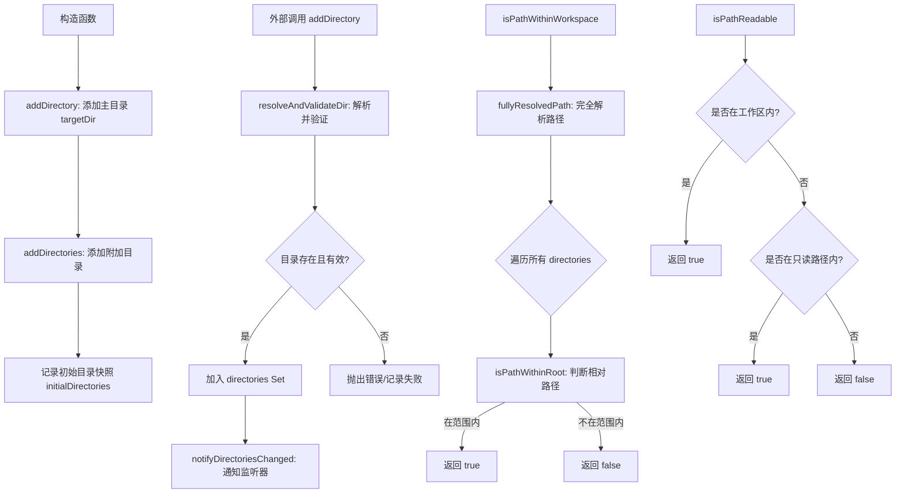

# workspaceContext.ts

## 概述

`WorkspaceContext` 是 Gemini CLI 核心包中的工作区上下文管理器。它负责管理多个工作区目录，并提供路径验证能力，使 CLI 能够在单个会话中操作来自多个目录的文件。该类同时支持"可读写"的工作区目录和"只读"路径两种访问级别，是文件系统安全访问控制的基础组件。

## 架构图（Mermaid）

```mermaid
classDiagram
    class WorkspaceContext {
        -directories: Set~string~
        -initialDirectories: Set~string~
        -readOnlyPaths: Set~string~
        -onDirectoriesChangedListeners: Set~Function~
        +targetDir: string
        +constructor(targetDir, additionalDirectories)
        +onDirectoriesChanged(listener): Unsubscribe
        +addDirectory(directory): void
        +addDirectories(directories): AddDirectoriesResult
        +addReadOnlyPath(pathToAdd): void
        +getDirectories(): readonly string[]
        +getInitialDirectories(): readonly string[]
        +setDirectories(directories): void
        +isPathWithinWorkspace(pathToCheck): boolean
        +isPathReadable(pathToCheck): boolean
        -notifyDirectoriesChanged(): void
        -resolveAndValidateDir(directory): string
        -fullyResolvedPath(pathToCheck): string
        -isPathWithinRoot(pathToCheck, rootDirectory): boolean
    }

    class AddDirectoriesResult {
        +added: string[]
        +failed: Array~path_error~
    }

    class Unsubscribe {
        <<type>>
        () => void
    }

    WorkspaceContext --> AddDirectoriesResult : 返回
    WorkspaceContext --> Unsubscribe : 返回
```



## 核心组件

### 类型定义

| 名称 | 类型 | 说明 |
|------|------|------|
| `Unsubscribe` | `() => void` | 取消订阅函数的类型别名，调用后可移除已注册的监听器 |
| `AddDirectoriesResult` | `interface` | 批量添加目录的结果，包含 `added`（成功列表）和 `failed`（失败列表及错误信息） |

### WorkspaceContext 类

#### 私有属性

| 属性 | 类型 | 说明 |
|------|------|------|
| `directories` | `Set<string>` | 当前所有工作区目录的集合（已解析为绝对真实路径） |
| `initialDirectories` | `Set<string>` | 构造时的初始目录快照，不会随后续添加而改变 |
| `readOnlyPaths` | `Set<string>` | 只读路径集合，仅允许读取操作 |
| `onDirectoriesChangedListeners` | `Set<() => void>` | 目录变更监听器集合 |

#### 公开属性

| 属性 | 类型 | 说明 |
|------|------|------|
| `targetDir` | `string`（readonly） | 初始工作目录（通常是 `cwd`），同时作为相对路径解析的基准目录 |

#### 核心方法

1. **`constructor(targetDir, additionalDirectories)`**
   - 初始化工作区，先添加 `targetDir` 作为主目录，再添加可选的附加目录
   - 最后拍摄 `initialDirectories` 快照

2. **`addDirectory(directory)`**
   - 添加单个目录到工作区，内部调用 `addDirectories`
   - 如果添加失败会直接抛出异常

3. **`addDirectories(directories)`**
   - 批量添加多个目录，返回 `AddDirectoriesResult`
   - 对每个目录调用 `resolveAndValidateDir` 进行解析验证
   - 仅在确实有新目录被添加时才触发一次变更通知（合并通知，避免频繁触发）

4. **`addReadOnlyPath(pathToAdd)`**
   - 添加只读路径；检查路径是否存在，解析符号链接后加入 `readOnlyPaths` 集合
   - 失败时静默处理（仅记录警告日志）

5. **`setDirectories(directories)`**
   - 替换整个工作区目录集合
   - 内部对比新旧集合，仅在内容变化时才触发通知

6. **`isPathWithinWorkspace(pathToCheck)`**
   - 核心安全检查方法：判断给定路径是否在任意一个工作区目录内
   - 通过完全解析路径（包括符号链接），然后对每个工作区目录调用 `isPathWithinRoot`

7. **`isPathReadable(pathToCheck)`**
   - 扩展的可读性检查：先检查工作区，再检查只读路径
   - 支持精确匹配和子路径匹配

8. **`onDirectoriesChanged(listener)`**
   - 注册目录变更监听器，返回取消订阅函数
   - 采用观察者模式（Observer Pattern）

#### 私有方法

1. **`notifyDirectoriesChanged()`**
   - 遍历监听器集合的副本（防止迭代中修改）并依次调用
   - 使用 try-catch 隔离每个监听器的异常，确保一个失败不影响其他

2. **`resolveAndValidateDir(directory)`**
   - 将目录路径解析为绝对路径，验证其存在性和是否是目录
   - 最终通过 `fs.realpathSync` 解析符号链接，返回真实路径

3. **`fullyResolvedPath(pathToCheck)`**
   - 将路径相对于 `targetDir` 解析，并通过 `resolveToRealPath` 处理符号链接
   - 即使路径不存在也能返回预期的完全解析路径

4. **`isPathWithinRoot(pathToCheck, rootDirectory)`**
   - 通过 `path.relative` 计算相对路径
   - 判断条件：不以 `..` 开头、不等于 `..`、不是绝对路径

## 依赖关系

### 内部依赖

| 模块 | 导入内容 | 用途 |
|------|----------|------|
| `./debugLogger.js` | `debugLogger` | 调试和警告日志输出，用于记录目录添加失败等非致命错误 |
| `./paths.js` | `resolveToRealPath` | 路径解析工具，处理符号链接解析（即使目标路径不存在也能工作） |

### 外部依赖

| 模块 | 导入内容 | 用途 |
|------|----------|------|
| `node:fs` | `fs`（整体导入） | 文件系统操作：`existsSync`、`statSync`、`realpathSync` |
| `node:path` | `path`（整体导入） | 路径操作：`resolve`、`relative`、`isAbsolute`、`sep` |

## 关键实现细节

1. **路径安全机制**：所有路径在存储和比较前都会经过完全解析（`realpathSync` / `resolveToRealPath`），包括符号链接解析，防止通过符号链接绕过工作区边界。

2. **两级访问控制**：
   - **工作区目录**（`directories`）：可读可写
   - **只读路径**（`readOnlyPaths`）：仅可读取
   - `isPathWithinWorkspace` 仅检查工作区目录，`isPathReadable` 同时检查两者

3. **观察者模式**：目录变更通过监听器机制通知外部组件。特别注意：
   - 遍历监听器时使用集合副本（`[...this.onDirectoriesChangedListeners]`），避免迭代中修改导致问题
   - 每个监听器用 try-catch 包裹，互不影响

4. **批量操作优化**：`addDirectories` 在循环结束后才检查是否有变更，确保多个目录添加只触发一次通知事件。

5. **初始目录快照**：`initialDirectories` 在构造时冻结，后续的 `addDirectory`/`setDirectories` 不会改变它，可用于重置或对比初始状态。

6. **路径包含判断算法**：`isPathWithinRoot` 使用 `path.relative` 计算相对路径，通过三重条件判断确保路径确实在根目录之下：
   - 相对路径不以 `../` 开头（不在上级目录）
   - 相对路径不等于 `..`（不是父目录本身）
   - 相对路径不是绝对路径（排除跨磁盘等异常情况）

7. **容错处理**：`addReadOnlyPath` 采用静默失败策略（仅日志警告），而 `addDirectory` 对单个目录添加失败会抛出异常，`addDirectories` 对批量操作则收集错误信息返回。
