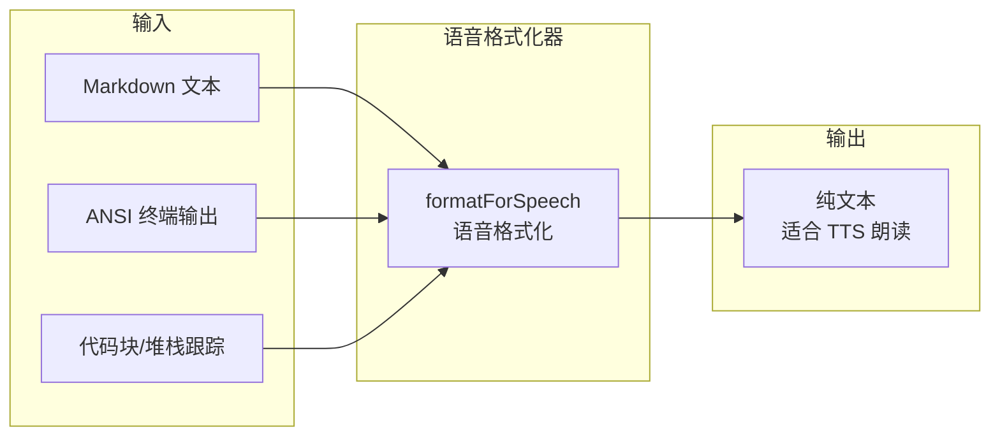

# voice

## 概述

`voice` 目录负责将 Gemini CLI 的富文本输出（包含 Markdown 格式、ANSI 转义码、代码块、堆栈跟踪等）转换为适合语音朗读的纯文本。该模块通过一系列文本清洗和简化规则，确保 TTS (Text-to-Speech) 输出自然流畅。

## 目录结构

```
voice/
├── responseFormatter.ts        # 语音格式化器（Markdown/ANSI 到纯文本的转换）
└── responseFormatter.test.ts   # responseFormatter 的单元测试
```

## 架构图



## 核心组件

### `formatForSpeech` (responseFormatter.ts)
- **职责**: 将 Markdown/ANSI 格式的文本转换为语音友好的纯文本
- **转换步骤** (按顺序):
  1. **去除 ANSI 转义码** - 清除终端颜色/样式代码
  2. **折叠代码块** - 保留内容或将大段 JSON 摘要为 "(JSON object with N keys)"
  3. **折叠堆栈跟踪** - 保留首行，其余替换为 "(and N more frames)"
  4. **去除 Markdown 语法** - 清除加粗、斜体、引用、标题、链接、列表标记、行内代码
  5. **缩略长路径** - 将深层绝对路径缩短为最后 N 段（如 `.../src/utils/file.ts`）
  6. **规范化空白** - 合并多个连续空行
  7. **截断长文本** - 超过 `maxLength` 时截断并标注总长度

### `FormatForSpeechOptions`
配置选项接口：

| 选项 | 默认值 | 描述 |
|------|--------|------|
| `maxLength` | 500 | 最大输出字符数 |
| `pathDepth` | 3 | 路径缩略时保留的尾部目录层级数 |
| `jsonThreshold` | 80 | JSON 值超过此长度时自动摘要 |

### 内部辅助函数
- `abbreviatePath(full, suffix, depth)` - 缩略绝对路径，将行号后缀转换为 "line N" 格式
- `summariseJson(jsonStr)` - 将 JSON 字符串摘要为 "(JSON array with N items)" 等描述

## 依赖关系

### 内部依赖
无内部模块依赖。

### 外部依赖
无外部 npm 包依赖。

## 数据流

### 语音输出处理流程
1. 模型生成包含 Markdown 和代码块的响应文本
2. `formatForSpeech()` 接收原始文本和可选配置
3. 按照7步转换流水线逐步清洗文本
4. 返回适合 TTS 引擎朗读的纯文本字符串
