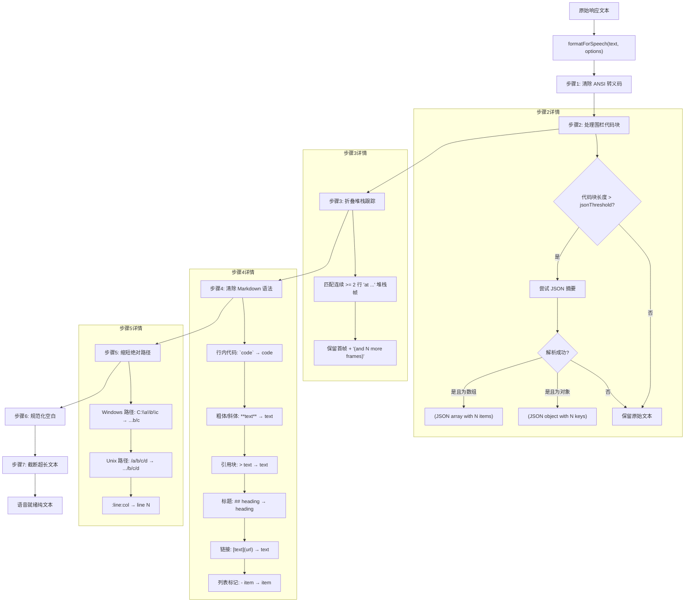

# responseFormatter.ts

## 概述

`responseFormatter.ts` 是语音（Voice）模块的响应格式化器，提供 `formatForSpeech` 函数，用于将包含 Markdown 格式、ANSI 终端转义码、代码块、堆栈跟踪、深层文件路径等内容的富文本响应转换为适合语音合成（TTS）朗读的纯文本。

该模块解决了一个核心问题：LLM 生成的响应通常包含大量视觉格式化元素（Markdown 语法、代码围栏、终端颜色代码等），这些在语音输出时要么无法朗读，要么会严重影响听觉体验。`formatForSpeech` 通过一系列有序的文本转换管道，将这些内容清洗为简洁、自然的口语文本。

## 架构图（Mermaid）



## 核心组件

### 1. FormatForSpeechOptions 接口

格式化选项配置：

| 属性 | 类型 | 默认值 | 说明 |
|------|------|--------|------|
| `maxLength` | `number` | 500 | 输出最大字符数，超出则截断 |
| `pathDepth` | `number` | 3 | 缩短路径时保留的尾部路径段数 |
| `jsonThreshold` | `number` | 80 | JSON 值超过此长度时尝试摘要化 |

### 2. 正则表达式常量

| 常量名 | 匹配目标 | 说明 |
|--------|----------|------|
| `ANSI_RE` | ANSI 转义序列 | 匹配 CSI（`\x1b[...m`）、OSC（`\x1b]...\x07`）等终端控制码 |
| `CODE_FENCE_RE` | 围栏代码块 | 匹配 ` ```lang\n...\n``` ` 格式 |
| `INLINE_CODE_RE` | 行内代码 | 匹配 `` `code` `` 格式 |
| `BOLD_ITALIC_RE` | 粗体/斜体标记 | 匹配 `**text**`、`*text*`、`__text__`、`_text_`，不跨行以避免误匹配列表标记 |
| `BLOCKQUOTE_RE` | 引用块前缀 | 匹配行首 `> ` |
| `HEADING_RE` | ATX 标题 | 匹配行首 `# ` 到 `###### ` |
| `LINK_RE` | Markdown 链接 | 匹配 `[text](url)` 格式 |
| `LIST_MARKER_RE` | 列表标记 | 匹配行首 `- `、`* `、`1. ` 等 |
| `STACK_BLOCK_RE` | 堆栈跟踪块 | 匹配连续 >= 2 行的 `    at ...` 格式 |
| `UNIX_PATH_RE` | Unix 绝对路径 | 匹配 `/path/to/file:line:col`，带前瞻断言确保正确边界 |
| `WIN_PATH_RE` | Windows 绝对路径 | 匹配 `C:\path\to\file:line:col` 或 `C:/path/to/file` |

### 3. abbreviatePath 函数

**私有函数**，将绝对路径缩短为尾部若干段：

- 输入：`/Users/yuanlin/workspace/gemini-cli/packages/core/src/voice/responseFormatter.ts:142:7`
- 输出（depth=3）：`...voice/responseFormatter.ts line 142`

处理逻辑：
1. 按 `/` 或 `\` 分割路径段
2. 如果段数超过 `depth`，只保留最后 `depth` 段，前缀 `...`（U+2026 省略号）
3. 如果有 `:line:col` 后缀，转换为 `line N` 格式（丢弃列号）

### 4. summariseJson 函数

**私有函数**，将大型 JSON 字符串摘要化：

- JSON 数组 → `"(JSON array with N items)"`
- JSON 对象 → `"(JSON object with N keys)"`
- 解析失败 → 返回原始字符串

### 5. formatForSpeech 函数

**导出的核心函数**，按以下 7 步有序管道处理文本：

| 步骤 | 操作 | 目的 |
|------|------|------|
| 1 | 清除 ANSI 转义码 | 移除终端颜色/格式控制字符 |
| 2 | 处理围栏代码块 | 大型 JSON 摘要化，其他保留内容文本 |
| 3 | 折叠堆栈跟踪 | 将连续堆栈帧压缩为首帧 + 计数 |
| 4 | 清除 Markdown 语法 | 移除行内代码、粗体、斜体、引用、标题、链接、列表标记 |
| 5 | 缩短绝对路径 | Windows 和 Unix 路径缩短为尾部几段 |
| 6 | 规范化空白 | 将 3+ 连续空行压缩为 2 行，首尾 trim |
| 7 | 截断超长文本 | 超过 `maxLength` 时截断并附加 `... (N chars total)` |

## 依赖关系

### 内部依赖

无。该模块是完全独立的纯函数模块，不依赖任何内部模块。

### 外部依赖

无。该模块仅使用 JavaScript 原生 API（正则表达式、字符串操作、JSON.parse），不依赖任何第三方库。

## 关键实现细节

1. **处理顺序至关重要**：7 步转换的顺序经过精心设计：
   - ANSI 清除必须最先，否则转义码会干扰后续正则匹配
   - 围栏代码块在 Markdown 语法清除之前处理，避免代码内容被误清洗
   - 堆栈跟踪在 Markdown 清除之前折叠，因为堆栈帧格式不含 Markdown 但可能被列表标记正则误匹配
   - 路径缩短在 Markdown 清除之后，因为 Markdown 链接中的路径已被正确处理
   - 截断是最后一步，确保之前的所有压缩和清洗都能减少文本长度

2. **BOLD_ITALIC_RE 不跨行**：正则排除了换行符（`[^*\n]`、`[^_\n]`），防止在多行文本中意外跨行匹配，特别是避免误消费尚未清除的列表标记（以 `*` 开头）。

3. **堆栈跟踪的就地折叠**：`STACK_BLOCK_RE` 要求至少 2 行连续帧才触发，单行 `at ...` 不会被处理。替换时保留了第一帧的完整信息，只折叠后续帧为计数，保持了关键调试信息的可读性。

4. **路径处理优先级**：Windows 路径先于 Unix 路径处理，因为 Windows 路径的驱动器字母前缀可能被 Unix 路径正则的 `/` 匹配逻辑干扰。

5. **JSON 摘要的条件触发**：只有当代码块内容超过 `jsonThreshold`（默认 80 字符）时才尝试 JSON 摘要。短小的 JSON 内容（如简单配置）会被原样保留，因为它们朗读起来还是有意义的。

6. **截断的用户提示**：截断后附加 `... (N chars total)` 提示，让听者知道内容被截断了，以及原始内容的完整长度。

7. **零依赖设计**：整个模块不依赖任何外部包或内部模块，完全由纯函数和正则表达式组成。这使得它易于测试（同目录下已有 `responseFormatter.test.ts`）、易于移植、无副作用。

8. **前瞻断言的路径边界**：路径正则使用了后向断言（`(?<=\s|[(\`"'])`）确保路径不会从单词中间开始匹配。这对于避免误匹配文本中恰好以 `/` 开头的片段至关重要。

9. **Unicode 省略号**：使用 `\u2026`（...）而非三个点号（`...`），在语音合成中更可能被正确识别为省略标记。
