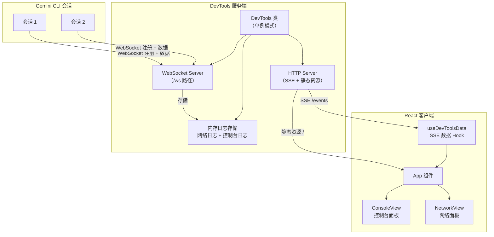
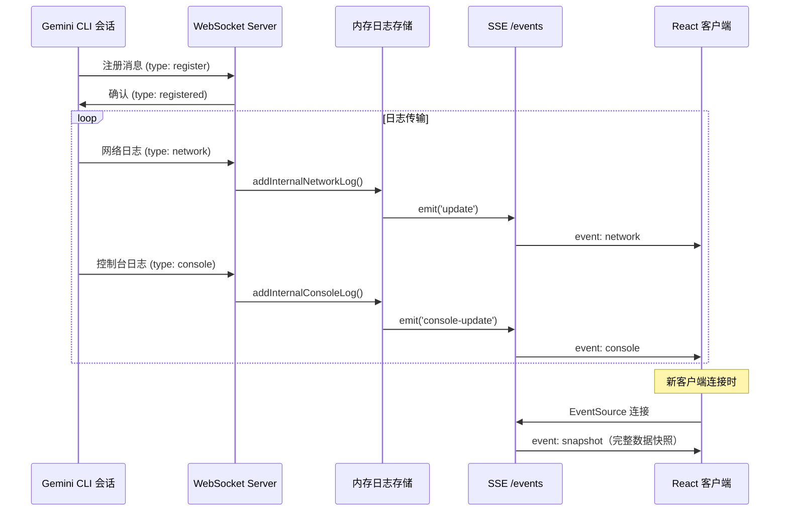

# packages/devtools

## 概述

`@google/gemini-cli-devtools` 是 Gemini CLI 的开发者工具包，提供一个基于 Web 的调试界面，用于实时查看 CLI 会话的网络请求和控制台日志。它包含一个 WebSocket 服务端（接收 CLI 会话数据）和一个 React 客户端（可视化展示数据）。

## 目录结构

```
packages/devtools/
├── package.json              # 包配置
├── GEMINI.md                 # Gemini 上下文文件
├── esbuild.client.js         # 客户端构建脚本
├── tsconfig.json             # TypeScript 配置
├── tsconfig.build.json       # 构建用 TypeScript 配置
├── src/                      # 服务端源码
│   ├── index.ts              # DevTools 类 - 核心服务器
│   └── types.ts              # 类型定义（NetworkLog, ConsoleLog）
└── client/                   # 前端客户端
    ├── index.html            # HTML 入口
    └── src/
        ├── main.tsx          # React 应用入口
        ├── App.tsx           # 主应用组件（Console/Network 面板）
        └── hooks.ts          # 自定义 Hook（useDevToolsData）
```

## 架构图



## 核心组件

### DevTools 类 (`src/index.ts`)

单例模式的调试服务器：

- **HTTP 服务器**：提供静态资源（HTML/JS）和 SSE 事件流
  - `GET /` - 返回客户端 HTML
  - `GET /assets/main.js` - 返回构建后的客户端 JS
  - `GET /events` - SSE 端点，推送实时日志更新
- **WebSocket 服务器**（`/ws` 路径）：接收 CLI 会话数据
  - `register` 消息 - 注册新会话
  - `network` 消息 - 网络请求日志
  - `console` 消息 - 控制台日志
  - 心跳机制：每 10 秒发送 ping，30 秒超时断开
- **端口管理**：默认端口 25417，支持最多 10 次端口递增重试
- **安全策略**：仅允许同源请求（防止跨域数据泄漏）

### 类型定义 (`src/types.ts`)

| 类型 | 说明 |
|------|------|
| `NetworkLog` | 网络请求日志：URL、方法、请求头、响应、分块数据等 |
| `ConsoleLogPayload` | 控制台日志：类型（log/warn/error/debug/info）+ 内容 |
| `InspectorConsoleLog` | 扩展的控制台日志，包含 id、sessionId、timestamp |

### React 客户端

- **App 组件** (`client/src/App.tsx`)
  - 双面板界面：Console（控制台）和 Network（网络）
  - 支持深色/浅色主题切换
  - 会话选择器（支持多会话 + 连接状态显示）
  - 导入/导出 JSONL 格式的会话数据
- **ConsoleView** - 控制台日志面板，支持长文本折叠
- **NetworkView** - 网络请求面板，支持域名分组、URL 过滤、请求详情（Headers/Payload/Response）
  - **CodeView** - JSON 语法高亮、代码折叠
  - **JsonViewer** - SSE 数据分块展示
- **useDevToolsData Hook** (`client/src/hooks.ts`) - 通过 EventSource (SSE) 实时获取日志数据

## 依赖关系

### 外部依赖
- `ws` (^8.16.0) - WebSocket 服务端
- `react` (^19.2.0) - 前端框架（devDependencies）
- `react-dom` (^19.2.0) - React DOM 渲染

## 数据流


