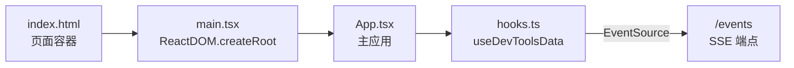

# packages/devtools/client

## 概述

DevTools 的前端客户端，一个基于 React 的 Web 应用，提供类似 Chrome DevTools 的调试界面，用于查看 Gemini CLI 会话的控制台日志和网络请求。

## 目录结构

```
client/
├── index.html    # HTML 入口页面
└── src/
    ├── main.tsx  # React 应用入口
    ├── App.tsx   # 主应用组件
    └── hooks.ts  # SSE 数据订阅 Hook
```

## 架构图



## 核心组件

### index.html

最小化的 HTML 页面，包含 `#root` 容器和 `/assets/main.js` 脚本引用。构建后由 DevTools 服务端直接提供。

### 功能特性

- 双面板视图（Console / Network）
- 深色/浅色主题切换（跟随系统或手动切换）
- 多会话支持（会话选择器 + 连接状态指示灯）
- JSONL 格式的会话数据导入/导出
- 网络请求域名分组、URL 过滤、JSON 语法高亮、代码折叠

## 依赖关系

### 外部依赖
- `react` (^19.2.0)
- `react-dom` (^19.2.0)

### 构建工具
- 使用 `esbuild.client.js` 构建，输出为单个 JS 文件
