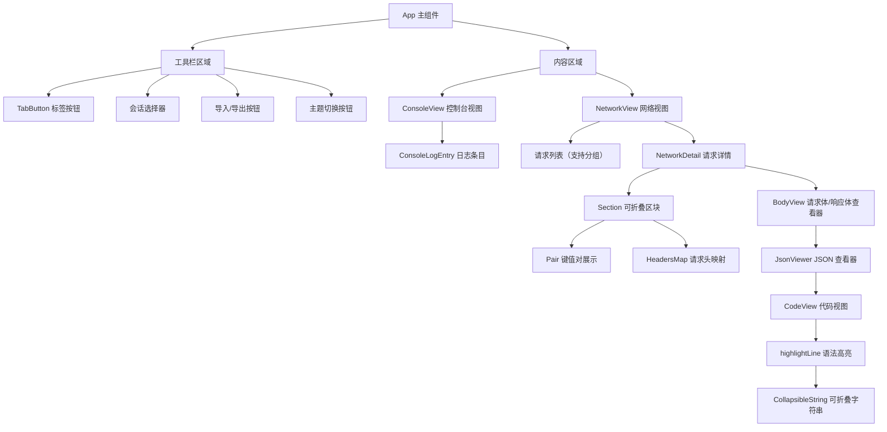
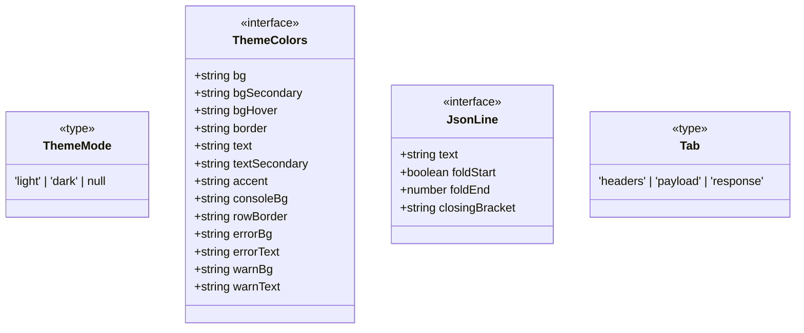

# App.tsx

## 概述

`App.tsx` 是 Gemini CLI DevTools 客户端的主应用组件文件。它实现了一个类似 Chrome DevTools 的调试面板，提供 **Console（控制台）** 和 **Network（网络）** 两个核心功能标签页，用于实时查看和调试 Gemini CLI 的运行时日志和网络请求。

该文件包含完整的 UI 渲染逻辑，包括：
- 主题切换（深色/浅色/跟随系统）
- 会话管理（多会话选择、连接状态指示）
- 日志导入/导出（JSONL 格式）
- 控制台日志查看（支持 error/warn/info 等类型）
- 网络请求查看（请求列表、请求详情、Headers/Payload/Response 标签页）
- JSON 语法高亮与代码折叠

## 架构图





## 核心组件

### 1. `App()` — 默认导出，主应用组件

**职责**：作为应用的根组件，管理全局状态（当前标签页、选中会话、主题模式、导入日志），编排工具栏和内容区域的渲染。

**内部状态**：
| 状态 | 类型 | 说明 |
|------|------|------|
| `activeTab` | `'console' \| 'network'` | 当前激活的标签页 |
| `selectedSessionId` | `string \| null` | 当前选中的会话 ID |
| `importedLogs` | `{ network: NetworkLog[], console: ConsoleLog[] } \| null` | 导入的日志数据 |
| `importedSessionId` | `string \| null` | 导入会话的标识 |
| `themeMode` | `ThemeMode` | 主题模式（light/dark/null=跟随系统） |
| `systemIsDark` | `boolean` | 系统当前是否为暗色模式 |

**核心逻辑**：
- **主题管理**：通过 `localStorage` 持久化主题偏好，通过 `matchMedia` 监听系统主题变化，`useMemo` 计算完整主题色彩对象 `t`
- **会话发现**：通过 `useMemo` 从 `networkLogs` 和 `consoleLogs` 中提取所有唯一的 `sessionId`，按最新活动时间排序
- **日志过滤**：根据 `selectedSessionId` 过滤出当前会话的 console 和 network 日志
- **导入逻辑**：解析 JSONL 文件，区分 `console` 和 `network` 类型，network 日志通过 Map 合并请求和响应
- **导出逻辑**：将当前会话的 console 和 network 日志合并、按时间排序，序列化为 JSONL 下载

---

### 2. `TabButton` — 标签按钮组件

**签名**：
```tsx
function TabButton({
  active: boolean,
  onClick: () => void,
  label: string,
  t: ThemeColors
}): JSX.Element
```

**职责**：渲染工具栏中的标签按钮（Console / Network），激活状态时显示底部高亮条。

---

### 3. `ConsoleLogEntry` — 控制台日志条目组件

**签名**：
```tsx
function ConsoleLogEntry({
  log: ConsoleLog,
  t: ThemeColors
}): JSX.Element
```

**职责**：渲染单条控制台日志。支持以下特性：
- 根据日志类型（`error`/`warn`/普通）显示不同背景色和图标
- 长内容自动折叠（超过 500 字符或超过 5 行），提供展开/收起按钮
- 显示时间戳

---

### 4. `ConsoleView` — 控制台视图组件

**签名**：
```tsx
function ConsoleView({
  logs: ConsoleLog[],
  t: ThemeColors
}): JSX.Element
```

**职责**：渲染完整的控制台日志列表，支持自动滚动到最新日志（通过 `bottomRef`）。空状态显示提示信息。

---

### 5. `NetworkView` — 网络视图组件

**签名**：
```tsx
function NetworkView({
  logs: NetworkLog[],
  t: ThemeColors,
  isDark: boolean
}): JSX.Element
```

**职责**：渲染网络请求的主视图，采用左右分栏布局：
- **左侧**：请求列表，支持 URL 过滤、按域名分组（可折叠）、可拖拽调整宽度
- **右侧**：选中请求的详情面板（`NetworkDetail`）

**内部状态**：
| 状态 | 类型 | 说明 |
|------|------|------|
| `selectedId` | `string \| null` | 当前选中的请求 ID |
| `filter` | `string` | URL 过滤关键字 |
| `groupByDomain` | `boolean` | 是否按域名分组 |
| `expandedGroups` | `Record<string, boolean>` | 各分组的展开/收起状态 |
| `sidebarWidth` | `number` | 左侧列表宽度（像素） |

**特殊行为**：
- `play.googleapis.com` 域名分组默认收起
- 拖拽分隔线调整左右面板比例（最小 200px）

---

### 6. `NetworkDetail` — 网络请求详情组件

**签名**：
```tsx
function NetworkDetail({
  log: NetworkLog,
  t: ThemeColors
}): JSX.Element
```

**职责**：展示单个网络请求的完整详情，包含三个子标签页：
- **Headers**：显示 General 信息（URL、Method、Status）、请求头、响应头
- **Payload**：显示请求体（`BodyView`）
- **Response**：显示响应体，支持流式 chunks 展示

---

### 7. `Section` — 可折叠区块组件

**签名**：
```tsx
function Section({
  title: string,
  children: React.ReactNode,
  t: ThemeColors
}): JSX.Element
```

**职责**：渲染带标题的可折叠面板，用于 Headers 标签页中的各个分区。

---

### 8. `Pair` — 键值对展示组件

**签名**：
```tsx
function Pair({
  k: string,
  v: string,
  color?: string,
  t: ThemeColors
}): JSX.Element
```

**职责**：以左右布局展示键值对（如 `Request URL: https://...`），键名固定 160px 宽度。

---

### 9. `HeadersMap` — HTTP 头部映射展示组件

**签名**：
```tsx
function HeadersMap({
  headers: Record<string, unknown> | undefined,
  t: ThemeColors
}): JSX.Element
```

**职责**：遍历 headers 对象，为每个 header 渲染一个 `Pair` 组件。

---

### 10. `BodyView` — 请求体/响应体查看器

**签名**：
```tsx
function BodyView({
  content?: string,
  chunks?: Array<{ index: number, data: string, timestamp: number }>,
  t: ThemeColors
}): JSX.Element
```

**职责**：展示 HTTP 请求体或响应体，支持两种模式：
- **JSON 模式**：通过 `JsonViewer` 展示格式化的 JSON，带语法高亮
- **Raw 模式**：原始文本展示，流式 chunks 带时间戳

提供复制 JSON 和下载 JSON 的工具按钮。

---

### 11. `JsonViewer` — JSON 查看器

**签名**：
```tsx
function JsonViewer({
  content: string,
  t: ThemeColors
}): JSX.Element
```

**职责**：智能解析 JSON 内容。如果内容包含 SSE（Server-Sent Events）格式的 `data:` 前缀，则按 chunk 分段展示；否则直接调用 `CodeView` 渲染。

---

### 12. `CodeView` — 代码视图组件

**签名**：
```tsx
function CodeView({
  data: unknown,
  t: ThemeColors
}): JSX.Element
```

**职责**：核心 JSON 渲染组件，提供以下特性：
- **代码折叠**：通过 `jsonToLines` 解析 JSON 结构，匹配 `{}`/`[]` 的开闭括号，支持点击 gutter 区域折叠/展开
- **语法高亮**：通过 `highlightLine` 函数对 JSON key、string、number、boolean、null 使用不同颜色
- **全选支持**：`Ctrl+A` / `Cmd+A` 选中全部内容
- **Grid 布局**：左侧 20px gutter（折叠图标），右侧为代码内容

---

### 13. `CollapsibleString` — 可折叠长字符串组件

**签名**：
```tsx
function CollapsibleString({
  lines: string[],
  indent: string,
  t: ThemeColors
}): JSX.Element
```

**职责**：当 JSON 字符串值包含多行且超过 20 行阈值（`STRING_LINE_THRESHOLD`）时，默认只显示前 20 行并提供展开按钮。

---

### 辅助函数

#### `tryParse(str: string): unknown`
尝试 `JSON.parse`，失败则返回原始字符串。

#### `jsonToLines(data: unknown): JsonLine[]`
将 JSON 数据序列化并解析为行数组，标记每行的折叠信息（是否为折叠起始行、折叠结束位置、闭合括号类型）。使用栈匹配 `{}`/`[]` 的配对。

#### `highlightLine(text: string, t: ThemeColors): React.ReactNode`
使用正则表达式 `TOKEN_RE` 对 JSON 行进行词法分析和语法高亮：
- **key**（属性名）：使用 `accent` 颜色 + 粗体
- **string**（字符串值）：绿色 `#81c995`，多行字符串使用 `CollapsibleString`
- **number**：紫色 `#ad7fa8`
- **boolean**：黄色 `#fdd663` + 粗体
- **null**：灰色 `#babdb6` + 粗体

---

### 接口与类型

#### `ThemeMode`
```typescript
type ThemeMode = 'light' | 'dark' | null; // null 表示跟随系统
```

#### `ThemeColors`
定义主题中所有颜色变量的接口，共 13 个颜色属性，涵盖背景、文字、边框、强调色以及错误/警告的专用颜色。

#### `JsonLine`
```typescript
interface JsonLine {
  text: string;          // 该行的原始文本
  foldStart: boolean;    // 是否为可折叠区域的起始行
  foldEnd: number;       // 折叠结束行号，-1 表示不可折叠
  closingBracket: string; // 闭合括号类型 '}' 或 ']'
}
```

#### `Tab`
```typescript
type Tab = 'headers' | 'payload' | 'response';
```

---

### 常量

| 常量 | 值 | 说明 |
|------|-----|------|
| `CHAR_LIMIT` | `500` | ConsoleLogEntry 中文本折叠的字符数阈值 |
| `LINE_LIMIT` | `5` | ConsoleLogEntry 中文本折叠的行数阈值 |
| `STRING_LINE_THRESHOLD` | `20` | CollapsibleString 中长字符串截断的行数阈值 |
| `TOKEN_RE` | 正则表达式 | JSON 语法高亮的词法分析正则 |

## 依赖关系

### 内部依赖
| 模块 | 导入内容 | 用途 |
|------|---------|------|
| `./hooks` | `useDevToolsData`, `ConsoleLog`(type), `NetworkLog`(type) | 获取实时 DevTools 数据（网络日志、控制台日志、已连接会话列表） |

### 外部依赖
| 模块 | 导入内容 | 用途 |
|------|---------|------|
| `react` | `React`, `useState`, `useEffect`, `useRef`, `useMemo` | React 核心 Hooks 和组件渲染 |

## 关键实现细节

1. **主题持久化与系统跟随**：默认跟随系统主题（`themeMode === null`），用户手动切换后存入 `localStorage('devtools-theme')`，通过 `matchMedia` 监听系统主题变更事件。

2. **会话发现机制**：从所有 networkLogs 和 consoleLogs 中提取 `sessionId`，以最大 `timestamp` 排序，最新的会话排在最前。导入的会话始终排在最前面。

3. **JSONL 导入合并策略**：network 日志通过 `Map<id, NetworkLog>` 实现请求-响应合并——同一 `id` 的后续条目视为响应更新，保留原始的 `type` 和 `timestamp`。

4. **网络面板拖拽调整**：通过 `mousedown` → `mousemove` → `mouseup` 事件链实现侧边栏宽度拖拽，限制最小 200px，最大为 `window.innerWidth - 200`。拖拽期间设置 `cursor: col-resize` 并禁用文本选择。

5. **JSON 代码折叠**：`jsonToLines` 使用栈算法匹配 `{`/`[` 与 `}`/`]`（考虑尾部逗号），为每个可折叠区域记录起止行号。`CodeView` 渲染时跳过折叠区域内的行，显示 `... }` 或 `... ]` 占位符。

6. **JSON 语法高亮正则**：`TOKEN_RE` 使用 6 个捕获组，通过正向前瞻 `(?=:)` 区分 key 和普通字符串。对多行字符串使用 `JSON.parse` 反转义后按行拆分展示。

7. **性能优化**：
   - 主题颜色对象通过 `useMemo` 缓存，仅 `isDark` 变化时重新计算
   - 会话列表、过滤日志均使用 `useMemo` 避免不必要的重算
   - 网络日志分组使用 `useMemo` 缓存
   - `CodeView` 的行解析使用 `useMemo` 缓存

8. **SSE 流式响应处理**：`JsonViewer` 检测 `data:` 前缀识别 SSE 格式，按空行分割为多个 event block，每个 block 提取 `data:` 行的 JSON 内容独立渲染，带 "CHUNK N" 标签。
