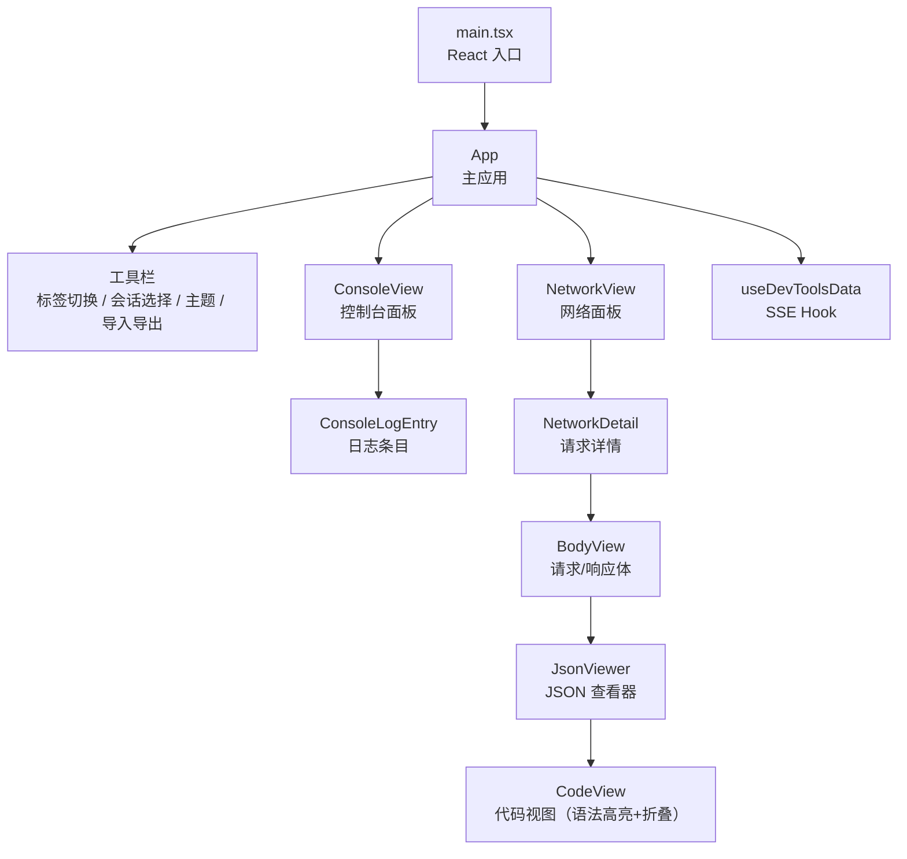

# packages/devtools/client/src

## 概述

DevTools 的 React 前端客户端源码，提供控制台日志查看和网络请求调试的可视化界面。类似 Chrome DevTools 的设计风格。

## 目录结构

```
client/src/
├── main.tsx    # React 应用入口（ReactDOM.createRoot）
├── App.tsx     # 主应用组件（工具栏 + Console/Network 面板）
└── hooks.ts    # useDevToolsData Hook（SSE 数据订阅）
```

## 架构图



## 核心组件

### useDevToolsData (`hooks.ts`)

通过 EventSource 连接服务端的 `/events` 端点，监听以下事件：
- `snapshot` - 初始数据快照（网络日志 + 控制台日志 + 活跃会话）
- `network` - 增量网络日志更新
- `console` - 增量控制台日志更新
- `session` - 会话列表更新

返回 `{ networkLogs, consoleLogs, isConnected, connectedSessions }`

### App 组件 (`App.tsx`)

主要功能：
- **主题系统**：支持浅色/深色/跟随系统，持久化到 localStorage
- **会话管理**：自动发现会话，支持选择切换
- **导入/导出**：JSONL 格式的会话数据导入导出
- **ConsoleView** - 滚动到底部自动跟踪，日志分级显示（error/warn/info），长文本折叠
- **NetworkView** - 域名分组、URL 过滤、可拖拽调整侧边栏宽度
- **NetworkDetail** - Headers/Payload/Response 三标签，JSON 语法高亮，代码折叠
- **CodeView** - 语法高亮（key/string/number/boolean/null），可折叠的 JSON 对象/数组

## 依赖关系

### 外部依赖
- `react` (^19.2.0) - UI 框架
- `react-dom` (^19.2.0) - DOM 渲染
