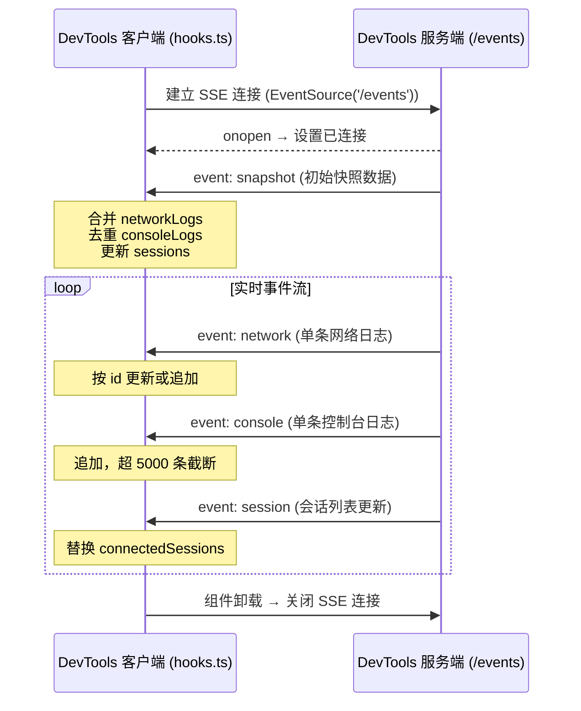
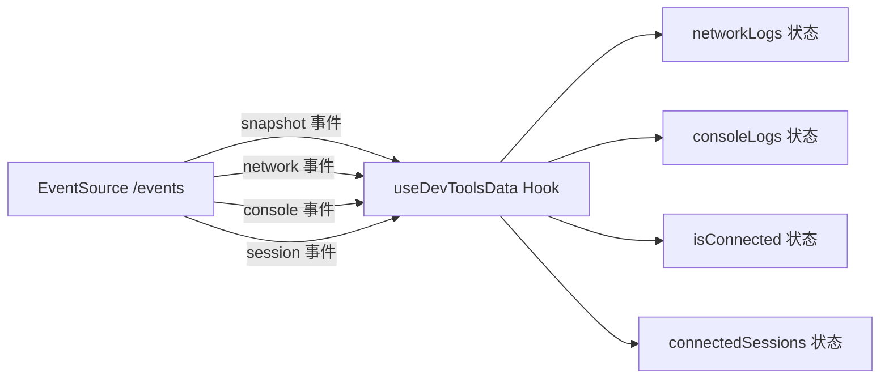

# hooks.ts

## 概述

`hooks.ts` 是 DevTools 客户端的核心数据层文件，提供自定义 React Hook `useDevToolsData`。该 Hook 通过 **Server-Sent Events (SSE)** 与后端 DevTools 服务器建立实时通信连接，接收并管理网络日志、控制台日志和会话连接状态。它是整个 DevTools 前端的数据源，为 `App.tsx` 提供所有运行时数据。

## 架构图





## 核心组件

### 导出类型

#### `NetworkLog`（re-export）
从 `../../src/types.js` 重新导出的网络日志类型。

#### `ConsoleLog`（re-export）
从 `../../src/types.js` 重新导出 `InspectorConsoleLog` 类型，并重命名为 `ConsoleLog`。

---

### `useDevToolsData()` — 自定义 Hook

**签名**：
```typescript
function useDevToolsData(): {
  networkLogs: NetworkLog[];
  consoleLogs: ConsoleLog[];
  isConnected: boolean;
  connectedSessions: string[];
}
```

**职责**：建立与 DevTools 服务端的 SSE 连接，实时接收并管理四类状态数据。

**返回值**：

| 字段 | 类型 | 说明 |
|------|------|------|
| `networkLogs` | `NetworkLog[]` | 所有网络请求日志，按 id 去重 |
| `consoleLogs` | `ConsoleLog[]` | 所有控制台日志，最多保留 5000 条 |
| `isConnected` | `boolean` | SSE 连接是否处于活跃状态 |
| `connectedSessions` | `string[]` | 当前已连接的会话 ID 列表 |

**SSE 事件处理**：

#### 1. `snapshot` 事件
- **触发时机**：初始连接时或服务端推送全量快照
- **处理逻辑**：
  - **networkLogs**：使用 `Map<id, NetworkLog>` 合并已有数据和快照数据，保留跨服务器重启的日志
  - **consoleLogs**：通过 `Set<id>` 去重，仅追加新日志，超过 5000 条时截断保留最新的
  - **sessions**：直接替换 `connectedSessions`

#### 2. `network` 事件
- **触发时机**：单条网络请求创建或更新
- **处理逻辑**：通过 `id` 查找已有记录，存在则原地替换（更新响应信息），不存在则追加

#### 3. `console` 事件
- **触发时机**：新增一条控制台日志
- **处理逻辑**：追加到数组末尾，超过 5000 条时 `slice(-5000)` 截断旧数据

#### 4. `session` 事件
- **触发时机**：会话连接或断开
- **处理逻辑**：直接替换整个 `connectedSessions` 数组

**生命周期**：
- `useEffect` 中创建 `EventSource`，组件卸载时调用 `evtSource.close()` 清理连接
- 依赖数组为空 `[]`，仅在挂载时建立一次连接

## 依赖关系

### 内部依赖
| 模块 | 导入内容 | 用途 |
|------|---------|------|
| `../../src/types.js` | `NetworkLog`(type), `InspectorConsoleLog`(type) | DevTools 数据类型定义 |

### 外部依赖
| 模块 | 导入内容 | 用途 |
|------|---------|------|
| `react` | `useState`, `useEffect` | React 状态管理和副作用 Hooks |

## 关键实现细节

1. **SSE 而非 WebSocket**：选择 `EventSource`（SSE）作为实时通信方案，属于单向服务端推送，比 WebSocket 更轻量，适合日志监控这种只需要服务端向客户端推送的场景。SSE 也天然支持自动重连。

2. **跨重启日志保留**：`snapshot` 事件处理中使用合并（merge）而非替换策略。对于 networkLogs 使用 `Map` 按 id 合并，对于 consoleLogs 使用 `Set` 去重后追加，确保服务端重启不会丢失客户端已有的日志。

3. **内存保护**：consoleLogs 设置了 5000 条的上限，超出时使用 `slice(-5000)` 只保留最新的记录，防止长时间运行导致内存膨胀。

4. **网络日志更新语义**：对于同一个 `id` 的 network 事件，新数据直接替换旧数据（而非合并字段）。这意味着服务端发送的每条 network 事件都应包含该请求的完整最新状态。

5. **容错处理**：所有事件处理器都包含 `try/catch`，格式错误的数据会被静默忽略，不会导致 UI 崩溃。

6. **连接状态**：通过 `evtSource.onopen` 和 `evtSource.onerror` 简单追踪连接状态，但 `isConnected` 目前在 `App.tsx` 中未被使用（UI 使用 `connectedSessions` 判断特定会话的连接状态）。
