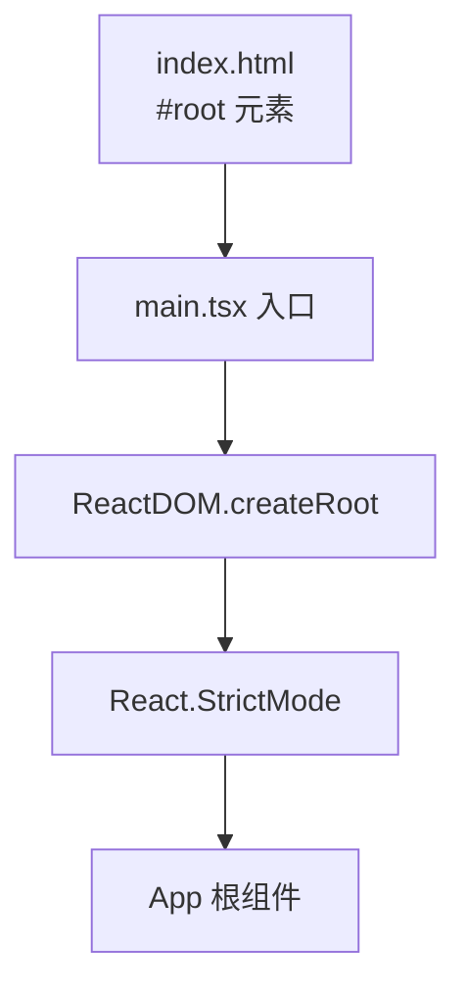
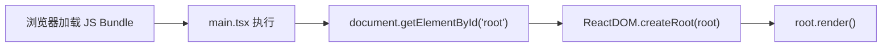

# main.tsx

## 概述

`main.tsx` 是 DevTools 客户端应用的入口文件（Entry Point）。它负责初始化 React 应用，将根组件 `App` 挂载到 DOM 中的 `#root` 元素上。这是一个标准的 React 18+ 应用启动文件，使用了 `createRoot` API 和 `StrictMode`。

## 架构图





## 核心组件

### 入口逻辑

**代码**：
```tsx
ReactDOM.createRoot(document.getElementById('root')!).render(
  <React.StrictMode>
    <App />
  </React.StrictMode>,
);
```

**执行流程**：
1. 通过 `document.getElementById('root')` 获取 HTML 中预定义的挂载点元素
2. 使用非空断言 `!` 表示该元素一定存在（由配套的 HTML 模板保证）
3. 调用 `ReactDOM.createRoot()` 创建 React 18 的并发模式根节点
4. 在 `React.StrictMode` 包裹下渲染 `App` 组件

**关于 `React.StrictMode`**：
- 仅在开发模式下生效，生产构建中不会增加任何开销
- 会对组件进行双重渲染以检测副作用问题
- 会检查废弃的 API 使用
- 帮助发现潜在的问题（如不纯的渲染函数）

## 依赖关系

### 内部依赖
| 模块 | 导入内容 | 用途 |
|------|---------|------|
| `./App` | `App`（默认导出） | 应用根组件 |

### 外部依赖
| 模块 | 导入内容 | 用途 |
|------|---------|------|
| `react` | `React` | JSX 运行时支持 |
| `react-dom/client` | `ReactDOM` | React 18 的客户端渲染 API（`createRoot`） |

## 关键实现细节

1. **React 18 Concurrent Mode**：使用 `createRoot` 而非旧版的 `ReactDOM.render`，启用了 React 18 的并发特性，支持自动批处理（automatic batching）、Suspense 等新特性。

2. **非空断言**：`document.getElementById('root')!` 使用 TypeScript 非空断言操作符，要求对应的 HTML 文件中必须包含 `<div id="root"></div>` 元素，否则会在运行时抛出错误。

3. **最小化入口**：该文件仅包含应用启动逻辑，不包含任何业务代码、状态管理或路由配置，符合单一职责原则。所有业务逻辑都委托给 `App` 组件处理。
