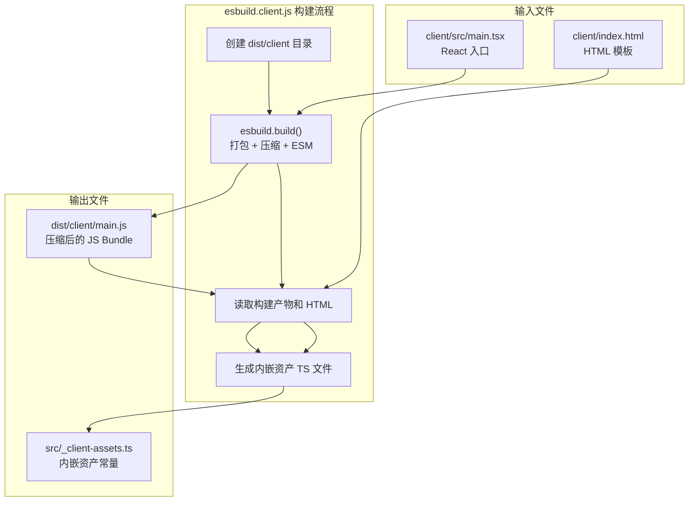
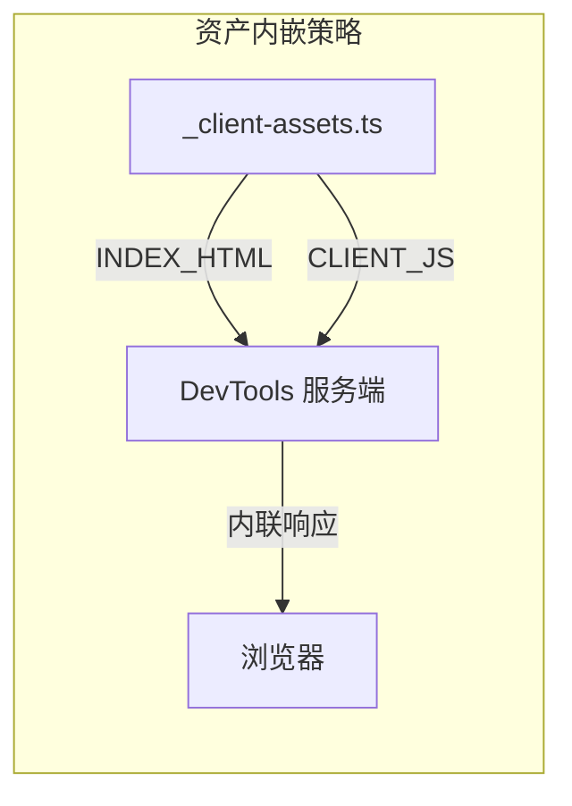

# esbuild.client.js

## 概述

`esbuild.client.js` 是 DevTools 客户端的构建脚本。它使用 **esbuild** 作为构建工具，完成两个核心任务：

1. **构建前端 Bundle**：将 React TSX 源码打包为单个压缩的 ESM JavaScript 文件
2. **生成内嵌资产模块**：将构建产物（JS）和 HTML 模板作为字符串常量写入 TypeScript 文件，使 DevTools 服务端可以在不依赖文件系统的情况下直接通过 import 获取前端资产

这种"资产内嵌"策略使得 DevTools 服务端可以被完整打包进 Gemini CLI 的发布产物中，无需在运行时读取额外的静态文件。

## 架构图





## 核心组件

### 构建流程

#### 步骤 1：创建输出目录
```javascript
mkdirSync('dist/client', { recursive: true });
```
使用 `recursive: true` 递归创建 `dist/client` 目录，确保目录存在。

#### 步骤 2：esbuild 打包构建
```javascript
await esbuild.build({
  entryPoints: ['client/src/main.tsx'],
  bundle: true,
  minify: true,
  format: 'esm',
  target: 'es2020',
  jsx: 'automatic',
  outfile: 'dist/client/main.js',
});
```

**esbuild 配置项说明**：

| 配置项 | 值 | 说明 |
|--------|-----|------|
| `entryPoints` | `['client/src/main.tsx']` | 入口文件，即 React 应用的 main.tsx |
| `bundle` | `true` | 将所有依赖（React、ReactDOM 等）打包到单个文件中 |
| `minify` | `true` | 启用代码压缩（移除空白、缩短变量名等） |
| `format` | `'esm'` | 输出 ES Module 格式 |
| `target` | `'es2020'` | 目标运行环境为 ES2020，支持可选链、空值合并等语法 |
| `jsx` | `'automatic'` | 使用 React 17+ 的自动 JSX 运行时，无需手动 `import React` |
| `outfile` | `'dist/client/main.js'` | 输出文件路径 |

#### 步骤 3：资产内嵌
```javascript
const indexHtml = readFileSync('client/index.html', 'utf-8');
const clientJs = readFileSync('dist/client/main.js', 'utf-8');

writeFileSync(
  'src/_client-assets.ts',
  `// Auto-generated ...
export const INDEX_HTML = ${JSON.stringify(indexHtml)};
export const CLIENT_JS = ${JSON.stringify(clientJs)};`,
);
```

**执行逻辑**：
1. 读取 HTML 模板文件（`client/index.html`）
2. 读取刚刚构建的 JS Bundle（`dist/client/main.js`）
3. 将两者通过 `JSON.stringify` 转为安全的字符串字面量
4. 写入自动生成的 TypeScript 文件 `src/_client-assets.ts`，导出 `INDEX_HTML` 和 `CLIENT_JS` 两个常量

### 生成的文件：`src/_client-assets.ts`

**导出内容**：
| 常量 | 类型 | 说明 |
|------|------|------|
| `INDEX_HTML` | `string` | `client/index.html` 的完整内容 |
| `CLIENT_JS` | `string` | 压缩后的 JS Bundle 的完整内容 |

该文件头部包含 `// Auto-generated by esbuild.client.js — do not edit` 注释，标明为自动生成文件。

## 依赖关系

### 内部依赖
| 文件 | 用途 |
|------|------|
| `client/src/main.tsx` | esbuild 的入口文件 |
| `client/index.html` | 要内嵌的 HTML 模板 |

### 外部依赖
| 模块 | 导入内容 | 用途 |
|------|---------|------|
| `esbuild` | 默认导入 | JavaScript/TypeScript 打包工具 |
| `node:fs` | `mkdirSync`, `readFileSync`, `writeFileSync` | Node.js 文件系统操作 |

## 关键实现细节

1. **资产内嵌策略的动机**：注释明确说明了原因——"so the devtools server can be bundled into the CLI without needing readFileSync + __dirname at runtime"。传统方式需要在服务端运行时读取静态文件，但当 DevTools 被打包进 CLI 后，文件的相对路径可能不再有效。通过将资产内嵌为 JS 字符串常量，完全消除了运行时的文件系统依赖。

2. **JSON.stringify 的安全性**：使用 `JSON.stringify` 将文件内容转为字符串字面量，这会自动转义所有特殊字符（引号、换行、反斜杠等），确保生成的 TypeScript 代码语法正确。

3. **构建顺序依赖**：脚本是顺序执行的 —— 先 `esbuild.build()`（使用 `await`），完成后才读取构建产物。这确保了 `dist/client/main.js` 在读取时已经存在。

4. **Top-level await**：脚本使用了 `await esbuild.build(...)` 的顶层 await 语法，要求运行环境支持 ESM（通过 `.js` 扩展名 + `"type": "module"` 或通过其他方式启用）。

5. **无 watch 模式**：这是一个一次性构建脚本，不包含 watch/dev server 功能。每次执行都会完整重新构建。

6. **全量打包**：`bundle: true` 会将 React、ReactDOM 等所有依赖打包到单个文件中，这对于内嵌到 CLI 的场景是必要的，因为运行时环境不会有 `node_modules`。
