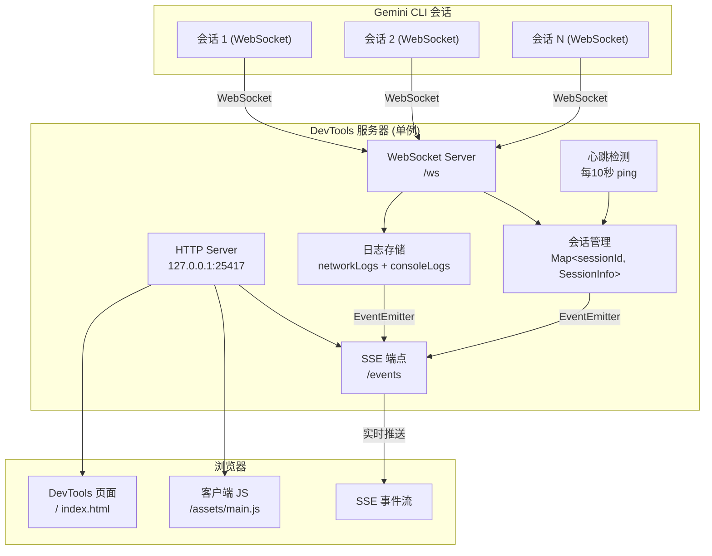
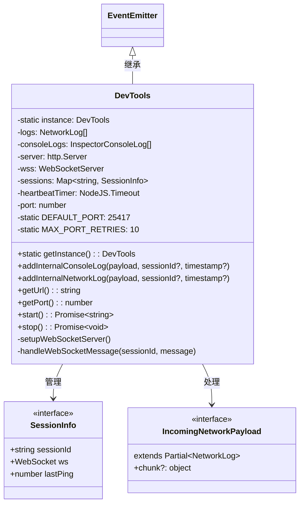
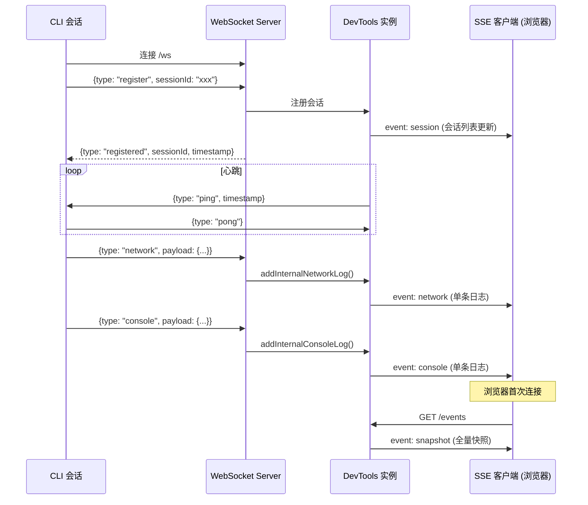

# index.ts (DevTools Server)

## 概述

`index.ts` 是 DevTools 包的核心服务端模块，实现了 `DevTools` 类。该类是一个**单例模式**的 HTTP + WebSocket 混合服务器，承担以下职责：

1. **HTTP 服务**：提供 DevTools 前端页面（通过内嵌资产）和 SSE（Server-Sent Events）实时推送接口
2. **WebSocket 服务**：接收来自 Gemini CLI 会话的实时日志数据（网络请求、控制台输出）
3. **数据中转**：作为 CLI 会话（WebSocket 生产者）和浏览器 DevTools UI（SSE 消费者）之间的桥梁
4. **会话管理**：跟踪多个 CLI 会话的连接状态，支持心跳检测

该类继承自 `EventEmitter`，通过事件机制将日志更新推送给所有连接的 SSE 客户端。

## 架构图







## 核心组件

### 导出类型

从 `./types.js` 重新导出：
- `NetworkLog` — 网络日志类型
- `ConsoleLogPayload` — 控制台日志负载类型
- `InspectorConsoleLog` — 带元数据的控制台日志类型

---

### `SessionInfo` 接口（导出）

```typescript
interface SessionInfo {
  sessionId: string;   // CLI 会话标识符
  ws: WebSocket;       // WebSocket 连接对象
  lastPing: number;    // 最后一次心跳响应的时间戳
}
```

---

### `IncomingNetworkPayload` 接口（内部）

```typescript
interface IncomingNetworkPayload extends Partial<NetworkLog> {
  chunk?: {
    index: number;     // chunk 序号
    data: string;      // chunk 数据
    timestamp: number; // chunk 时间戳
  };
}
```

继承自 `Partial<NetworkLog>`，额外支持 `chunk` 字段用于流式响应的增量数据传输。

---

### `DevTools` 类（导出）

继承自 `EventEmitter`，采用单例模式。

#### 私有属性

| 属性 | 类型 | 说明 |
|------|------|------|
| `instance` | `static DevTools \| undefined` | 单例实例 |
| `logs` | `NetworkLog[]` | 网络日志数组，最多 2000 条 |
| `consoleLogs` | `InspectorConsoleLog[]` | 控制台日志数组，最多 5000 条 |
| `server` | `http.Server \| null` | HTTP 服务器实例 |
| `wss` | `WebSocketServer \| null` | WebSocket 服务器实例 |
| `sessions` | `Map<string, SessionInfo>` | 已注册会话映射 |
| `heartbeatTimer` | `NodeJS.Timeout \| null` | 心跳定时器 |
| `port` | `number` | 当前监听端口 |
| `DEFAULT_PORT` | `static readonly 25417` | 默认端口号 |
| `MAX_PORT_RETRIES` | `static readonly 10` | 端口占用时的最大重试次数 |

#### 公开方法

##### `static getInstance(): DevTools`
获取单例实例。如果不存在则创建新实例。

##### `addInternalConsoleLog(payload, sessionId?, timestamp?)`
添加一条控制台日志。
- 为日志生成 `randomUUID()` 作为 id
- 追加到 `consoleLogs` 数组
- 超过 5000 条时 `shift()` 删除最旧的
- 触发 `console-update` 事件

##### `addInternalNetworkLog(payload, sessionId?, timestamp?)`
添加或更新一条网络日志。处理逻辑：
- **已存在的日志（按 id 查找）**：
  - 如果 payload 包含 `chunk`：累积到 `chunks` 数组
  - 否则：合并 payload 到已有日志，如果有完整的 `response.body` 则丢弃 `chunks`（避免数据冗余），`response` 对象进行深度合并
- **新日志**：要求 `payload.url` 存在才创建，超过 2000 条时 `shift()` 删除最旧的
- 触发 `update` 事件

##### `getUrl(): string`
返回服务器的完整 URL（`http://127.0.0.1:{port}`）。

##### `getPort(): number`
返回当前监听端口号。

##### `start(): Promise<string>`
启动 DevTools 服务器，返回服务器 URL。
- 如果服务器已启动则直接返回 URL
- 创建 HTTP 服务器，处理以下路由：
  - `GET /events` — SSE 端点
  - `GET /` 或 `GET /index.html` — 返回内嵌的 HTML 页面
  - `GET /assets/main.js` — 返回内嵌的 JS Bundle
  - 其他路径 — 404
- 端口冲突时自动递增重试（最多 10 次）
- 监听成功后调用 `setupWebSocketServer()` 初始化 WebSocket

##### `stop(): Promise<void>`
停止 DevTools 服务器。
- 清除心跳定时器
- 关闭 WebSocket 服务器
- 关闭 HTTP 服务器
- 重置单例实例（允许重新 `start()`）

#### 私有方法

##### `setupWebSocketServer()`
初始化 WebSocket 服务器：
- 创建 `WebSocketServer`，挂载在 HTTP 服务器的 `/ws` 路径
- 处理连接事件：
  - 第一条消息必须是 `{type: "register", sessionId: "..."}` 注册消息
  - 注册后发送 `{type: "registered"}` 确认
  - 后续消息由 `handleWebSocketMessage` 处理
  - 连接关闭时清理会话并通知
- 启动心跳定时器（每 10 秒）：
  - 超过 30 秒未响应的会话断开连接并清理
  - 活跃会话发送 ping 消息
  - 定时器使用 `.unref()` 避免阻止 Node.js 进程退出

##### `handleWebSocketMessage(sessionId, message)`
处理已注册会话的 WebSocket 消息：
- `pong` — 更新 `lastPing` 时间戳
- `console` — 调用 `addInternalConsoleLog()` 处理控制台日志
- `network` — 调用 `addInternalNetworkLog()` 处理网络日志

## 依赖关系

### 内部依赖
| 模块 | 导入内容 | 用途 |
|------|---------|------|
| `./types.js` | `NetworkLog`, `ConsoleLogPayload`, `InspectorConsoleLog` | 数据类型定义 |
| `./_client-assets.js` | `INDEX_HTML`, `CLIENT_JS` | 内嵌的前端页面和 JS 资产（由 esbuild.client.js 自动生成） |

### 外部依赖
| 模块 | 导入内容 | 用途 |
|------|---------|------|
| `node:http` | `http` | Node.js HTTP 服务器 |
| `node:crypto` | `randomUUID` | 生成唯一日志 ID |
| `node:events` | `EventEmitter` | 事件发射器基类 |
| `ws` | `WebSocketServer`, `WebSocket`(type) | WebSocket 服务器实现 |

## 关键实现细节

1. **单例模式**：`DevTools` 使用经典的私有构造函数 + 静态 `getInstance()` 实现单例。`stop()` 方法会重置单例引用，允许后续重新创建实例。

2. **双协议架构**：
   - **WebSocket（/ws）**：用于 CLI 会话向服务器推送日志数据，支持双向通信（心跳机制）
   - **SSE（/events）**：用于浏览器客户端从服务器接收实时日志更新，单向推送，更轻量

3. **安全性 — 同源策略**：HTTP 服务器仅对 `origin === http://127.0.0.1:{port}` 的请求设置 CORS 头，阻止恶意网站通过跨域请求窃取日志中可能包含的 API 密钥和请求头信息。

4. **端口自动递增**：默认端口 25417，如果被占用（`EADDRINUSE`），自动尝试 25418、25419... 直到 25427（最多 10 次）。

5. **流式响应 chunk 合并**：网络日志支持流式响应——`chunk` 数据逐步累积到 `chunks` 数组中。当收到完整的 `response.body` 时，丢弃 `chunks`，避免数据冗余和内存膨胀（注释提到可能超过 V8 字符串限制）。

6. **日志容量限制**：
   - `networkLogs`：最多 2000 条，超出 FIFO（先进先出）淘汰
   - `consoleLogs`：最多 5000 条，超出 FIFO 淘汰

7. **心跳机制**：
   - 每 10 秒向所有已注册会话发送 `{type: "ping"}` 消息
   - 会话通过 `{type: "pong"}` 响应
   - 超过 30 秒未响应的会话被视为断线，自动清理
   - 定时器使用 `unref()` 确保不会阻止 Node.js 进程正常退出

8. **SSE 快照 + 增量更新**：SSE 客户端连接时先接收全量 `snapshot` 事件（包含所有日志和会话列表），之后通过 `update`/`console-update`/`session-update` 事件接收增量更新。客户端断开时自动移除事件监听器。

9. **EventEmitter 最大监听器**：构造函数中将最大监听器数设为 50（默认 10），因为每个 SSE 客户端会添加 3 个事件监听器（network、console、session），支持约 16 个同时连接的浏览器标签页。

10. **资产内嵌服务**：`INDEX_HTML` 和 `CLIENT_JS` 从自动生成的 `_client-assets.ts` 导入，HTTP 路由直接返回这些字符串，无需运行时文件系统访问。
