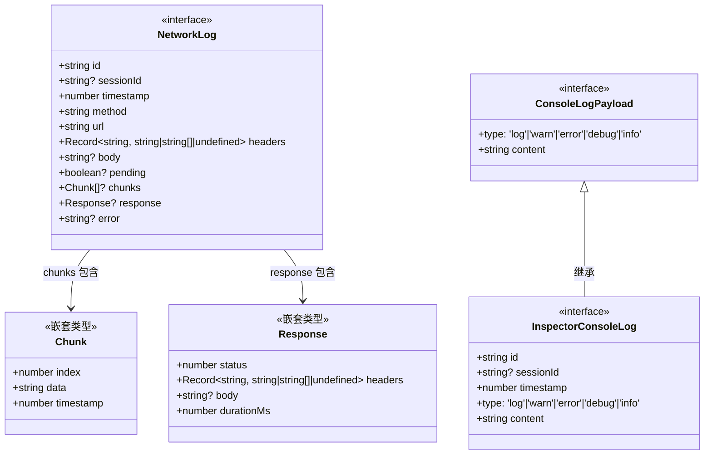
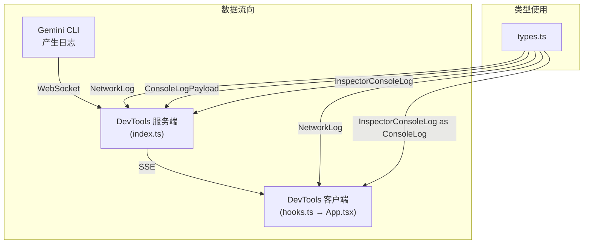

# types.ts

## 概述

`types.ts` 是 DevTools 包的核心类型定义文件，定义了整个 DevTools 系统中共享的数据接口。这些类型被服务端（`src/index.ts`）和客户端（`client/src/hooks.ts` → `client/src/App.tsx`）共同使用，是前后端数据契约的单一真实来源（Single Source of Truth）。

该文件定义了三个关键接口：
- `NetworkLog` — 网络请求日志的完整数据结构
- `ConsoleLogPayload` — 控制台日志的负载数据
- `InspectorConsoleLog` — 带元数据的控制台日志完整结构

## 架构图





## 核心组件

### `NetworkLog` 接口（导出）

网络请求日志的完整数据结构，描述一次 HTTP 请求的全部生命周期信息。

```typescript
export interface NetworkLog {
  id: string;
  sessionId?: string;
  timestamp: number;
  method: string;
  url: string;
  headers: Record<string, string | string[] | undefined>;
  body?: string;
  pending?: boolean;
  chunks?: Array<{
    index: number;
    data: string;
    timestamp: number;
  }>;
  response?: {
    status: number;
    headers: Record<string, string | string[] | undefined>;
    body?: string;
    durationMs: number;
  };
  error?: string;
}
```

**字段说明**：

| 字段 | 类型 | 必需 | 说明 |
|------|------|------|------|
| `id` | `string` | 是 | 请求的唯一标识符 |
| `sessionId` | `string` | 否 | 所属的 CLI 会话 ID |
| `timestamp` | `number` | 是 | 请求发起时间戳（毫秒） |
| `method` | `string` | 是 | HTTP 方法（GET、POST 等） |
| `url` | `string` | 是 | 请求的完整 URL |
| `headers` | `Record<string, string \| string[] \| undefined>` | 是 | 请求头，值可以是字符串、字符串数组或 undefined |
| `body` | `string` | 否 | 请求体内容 |
| `pending` | `boolean` | 否 | 请求是否仍在进行中（未收到响应） |
| `chunks` | `Array<Chunk>` | 否 | 流式响应的数据块数组 |
| `response` | `Response` | 否 | 响应信息（请求完成后填充） |
| `error` | `string` | 否 | 错误信息（请求失败时填充） |

**嵌套类型 — `chunks` 元素**：

| 字段 | 类型 | 说明 |
|------|------|------|
| `index` | `number` | chunk 的序号 |
| `data` | `string` | chunk 的数据内容 |
| `timestamp` | `number` | chunk 接收时间戳 |

**嵌套类型 — `response` 对象**：

| 字段 | 类型 | 说明 |
|------|------|------|
| `status` | `number` | HTTP 状态码（200、404、500 等） |
| `headers` | `Record<string, string \| string[] \| undefined>` | 响应头 |
| `body` | `string` | 响应体内容（可选，流式响应可能为空，数据在 chunks 中） |
| `durationMs` | `number` | 请求耗时（毫秒） |

---

### `ConsoleLogPayload` 接口（导出）

控制台日志的基础负载数据，不包含元数据（id、sessionId、timestamp），用于从 CLI 会话向 DevTools 服务端传输日志内容。

```typescript
export interface ConsoleLogPayload {
  type: 'log' | 'warn' | 'error' | 'debug' | 'info';
  content: string;
}
```

**字段说明**：

| 字段 | 类型 | 说明 |
|------|------|------|
| `type` | `'log' \| 'warn' \| 'error' \| 'debug' \| 'info'` | 日志级别/类型，对应 `console` API 的五种方法 |
| `content` | `string` | 日志的文本内容 |

---

### `InspectorConsoleLog` 接口（导出）

完整的控制台日志结构，继承自 `ConsoleLogPayload`，添加了服务端需要的元数据字段。

```typescript
export interface InspectorConsoleLog extends ConsoleLogPayload {
  id: string;
  sessionId?: string;
  timestamp: number;
}
```

**额外字段说明**：

| 字段 | 类型 | 必需 | 说明 |
|------|------|------|------|
| `id` | `string` | 是 | 唯一标识符（服务端通过 `randomUUID()` 生成） |
| `sessionId` | `string` | 否 | 所属的 CLI 会话 ID |
| `timestamp` | `number` | 是 | 日志产生时间戳（毫秒） |

**继承的字段**：
- `type`: `'log' | 'warn' | 'error' | 'debug' | 'info'`
- `content`: `string`

## 依赖关系

### 内部依赖
无。这是纯类型定义文件，不依赖任何其他模块。

### 外部依赖
无。

## 关键实现细节

1. **类型分层设计**：`ConsoleLogPayload` 和 `InspectorConsoleLog` 采用继承关系，`ConsoleLogPayload` 作为"传输层"类型（CLI → 服务端），只包含日志内容；`InspectorConsoleLog` 作为"存储层"类型（服务端内部 + 推送给客户端），由服务端添加 `id`、`sessionId`、`timestamp` 等元数据。

2. **NetworkLog 的生命周期状态**：一个 NetworkLog 对象会经历以下状态变化：
   - **创建时**：包含 `id`、`method`、`url`、`headers`、`body`，`pending` 可能为 `true`
   - **流式响应中**：`chunks` 数组逐步累积数据块
   - **完成时**：`response` 被填充（status、headers、body、durationMs），`chunks` 可能被清除
   - **失败时**：`error` 字段被设置

3. **Headers 类型灵活性**：请求头和响应头的值类型为 `string | string[] | undefined`，兼容 HTTP 协议中同名 header 可能有多个值的场景（如 `Set-Cookie`），以及值可能缺失的场景。

4. **可选字段语义**：
   - `sessionId` 为可选，因为服务端可能通过 `addInternalConsoleLog`/`addInternalNetworkLog` 内部添加日志（无会话上下文）
   - `body`、`pending`、`chunks`、`response`、`error` 均为可选，反映了网络请求不同阶段的数据可用性

5. **客户端类型重命名**：客户端（`hooks.ts`）将 `InspectorConsoleLog` 重新导出为 `ConsoleLog`，提供更简洁的类型名称，不影响实际的类型结构。

6. **跨端共享**：该文件通过相对路径被服务端（`../src/types.js`）和客户端（`../../src/types.js`）同时导入，确保前后端使用完全一致的数据结构定义。
