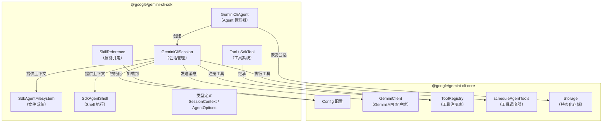
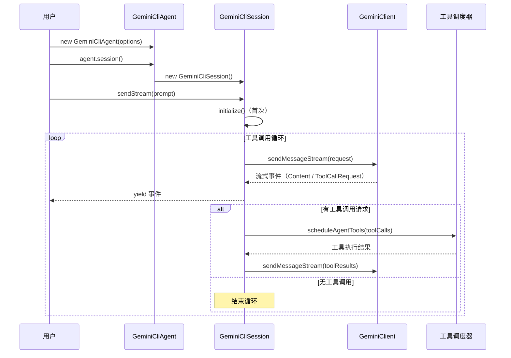

# packages/sdk

## 概述

`@google/gemini-cli-sdk` 是 Gemini CLI 的编程 SDK，为开发者提供了以编程方式创建和管理 AI Agent 的能力。它封装了 `@google/gemini-cli-core` 的底层能力，提供简洁的 API 来创建 Agent、管理会话、定义自定义工具和加载技能。

## 目录结构

```
packages/sdk/
├── index.ts                 # 包入口文件，重导出 src/index.ts
├── package.json             # 包配置，名称为 @google/gemini-cli-sdk
├── vitest.config.ts         # Vitest 测试配置
├── examples/                # 使用示例
│   ├── simple.ts            # 简单使用示例（自定义工具 + Agent）
│   └── session-context.ts   # 会话上下文示例
└── src/                     # 核心源码
    ├── index.ts             # 模块导出入口
    ├── agent.ts             # GeminiCliAgent 类 - Agent 创建与管理
    ├── session.ts           # GeminiCliSession 类 - 会话管理与消息流
    ├── tool.ts              # 工具定义与执行框架
    ├── skills.ts            # 技能引用与加载
    ├── types.ts             # 类型定义（Agent选项、会话上下文等）
    ├── fs.ts                # 文件系统抽象层
    ├── shell.ts             # Shell 命令执行抽象层
    ├── agent.integration.test.ts
    ├── skills.integration.test.ts
    ├── tool.integration.test.ts
    └── tool.test.ts
```

## 架构图



## 核心组件

### GeminiCliAgent (`agent.ts`)

Agent 管理器，是 SDK 的主入口。负责创建新会话或恢复已有会话。

- `constructor(options: GeminiCliAgentOptions)` - 传入指令、工具、技能等配置
- `session(options?)` - 创建新的会话实例
- `resumeSession(sessionId)` - 通过 sessionId 恢复之前的会话

### GeminiCliSession (`session.ts`)

会话管理核心，负责初始化配置、注册工具、与 Gemini API 通信。

- `initialize()` - 初始化认证、加载技能、注册工具
- `sendStream(prompt, signal?)` - 发送消息并返回异步流式响应
- 内部实现了完整的工具调用循环（LLM 请求 -> 工具执行 -> 结果回传 -> LLM 继续）

### Tool 系统 (`tool.ts`)

提供声明式工具定义框架，基于 Zod 进行参数校验。

- `tool(definition, action)` - 工厂函数，创建工具实例
- `SdkTool` - 继承 `BaseDeclarativeTool`，桥接 SDK 工具到 Core 工具注册表
- `SdkToolInvocation` - 工具调用执行器，处理执行结果与错误
- `ModelVisibleError` - 特殊错误类型，错误信息会返回给模型

### SkillReference (`skills.ts`)

技能引用系统，支持从目录加载技能定义。

- `skillDir(path)` - 指定一个包含技能定义的目录

### SdkAgentFilesystem (`fs.ts`)

安全的文件系统抽象，通过 Config 的路径访问验证进行权限控制。

### SdkAgentShell (`shell.ts`)

Shell 命令执行抽象，集成了策略检查（ShellTool）和安全执行（ShellExecutionService）。

## 依赖关系

### 内部依赖
- `@google/gemini-cli-core` - 核心库，提供 Config、GeminiClient、工具注册表、调度器等

### 外部依赖
- `zod` (^3.23.8) - 运行时类型校验，用于工具参数定义
- `zod-to-json-schema` (^3.23.1) - 将 Zod Schema 转为 JSON Schema

## 数据流

### 消息发送流程



### 会话恢复流程

1. 调用 `agent.resumeSession(sessionId)`
2. 通过 `Storage` 加载项目会话文件列表
3. 根据 sessionId 前8位筛选候选文件
4. 加载并匹配完整 sessionId
5. 从会话记录中恢复历史消息
6. 创建带有恢复数据的新 `GeminiCliSession`
