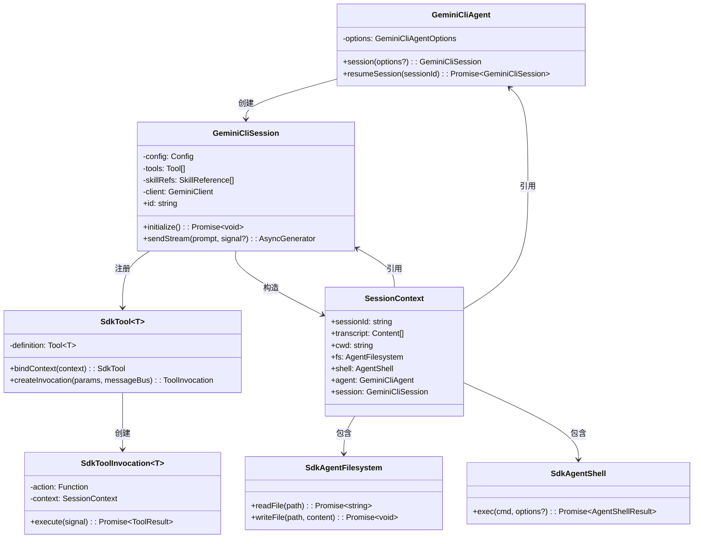

# packages/sdk/src

## 概述

SDK 核心源码目录，包含了 Agent、Session、Tool、Skills 等核心模块的实现，以及文件系统和 Shell 执行的安全抽象层。

## 目录结构

```
src/
├── index.ts             # 模块导出入口（导出 agent、session、tool、skills、types）
├── agent.ts             # GeminiCliAgent - Agent 管理器
├── session.ts           # GeminiCliSession - 会话管理与消息流
├── tool.ts              # 工具定义框架（tool 工厂函数、SdkTool、SdkToolInvocation）
├── skills.ts            # 技能引用系统（skillDir 函数）
├── types.ts             # 核心类型定义
├── fs.ts                # SdkAgentFilesystem - 文件系统安全抽象
├── shell.ts             # SdkAgentShell - Shell 执行安全抽象
├── agent.integration.test.ts   # Agent 集成测试
├── skills.integration.test.ts  # 技能集成测试
├── tool.integration.test.ts    # 工具集成测试
└── tool.test.ts                # 工具单元测试
```

## 架构图



## 核心组件

### 类型定义 (`types.ts`)

| 类型 | 说明 |
|------|------|
| `GeminiCliAgentOptions` | Agent 配置选项：instructions, tools, skills, model, cwd, debug 等 |
| `SystemInstructions` | 系统指令，支持字符串或动态函数 |
| `SessionContext` | 会话上下文，包含 sessionId、transcript、fs、shell 等 |
| `AgentFilesystem` | 文件系统接口：readFile / writeFile |
| `AgentShell` | Shell 接口：exec(cmd, options) |
| `AgentShellResult` | Shell 执行结果：exitCode, output, stdout, stderr |
| `AgentShellOptions` | Shell 选项：env, timeoutSeconds, cwd |

### 工具系统 (`tool.ts`)

- **`tool()` 工厂函数** - 便捷创建工具实例，接受 ToolDefinition 和 action 回调
- **`SdkTool<T>`** - 继承 `BaseDeclarativeTool`，使用 `zod-to-json-schema` 将 Zod 参数 Schema 转为 JSON Schema
- **`SdkToolInvocation<T>`** - 执行单次工具调用，支持 `sendErrorsToModel` 选项将错误信息发送给模型
- **`ModelVisibleError`** - 始终将错误信息传递给模型的特殊错误类型

## 依赖关系

### 内部依赖
- `@google/gemini-cli-core`: Config, GeminiClient, Storage, BaseDeclarativeTool, ShellTool, ShellExecutionService, scheduleAgentTools 等

### 外部依赖
- `zod` - 参数 Schema 定义
- `zod-to-json-schema` - Schema 转换

## 数据流

### 工具执行数据流

1. `Session.sendStream()` 收到 `ToolCallRequest` 事件
2. 收集所有工具调用请求
3. 创建 `scopedRegistry`，为 SdkTool 绑定 SessionContext
4. 调用 `scheduleAgentTools()` 执行工具
5. 每个工具通过 `SdkToolInvocation.execute()` 执行 action
6. 收集执行结果（functionResponses）
7. 将结果作为新的请求发送给 LLM
8. 重复直到无工具调用为止
