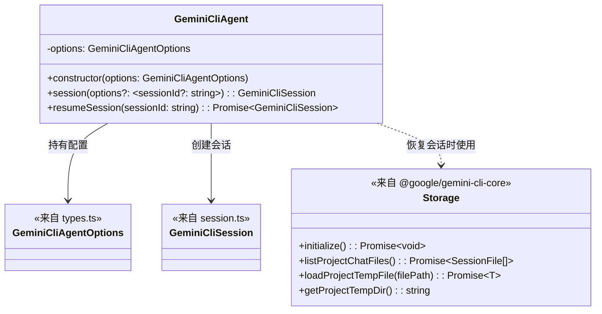
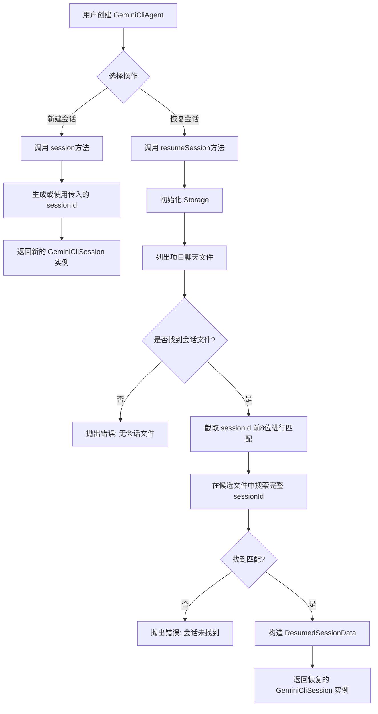

# agent.ts

## 概述

`agent.ts` 是 Gemini CLI SDK 的核心入口类文件，定义了 `GeminiCliAgent` 类。该类作为 SDK 的顶层抽象，负责管理代理（Agent）的配置，并提供创建新会话和恢复已有会话的能力。它是用户与 Gemini CLI 交互的主要入口点，封装了会话的生命周期管理逻辑。

## 架构图

## 核心组件

### `GeminiCliAgent` 类

SDK 的主入口类，封装了代理的全局配置，并提供会话管理方法。

#### 属性

| 属性名 | 类型 | 可见性 | 描述 |
|--------|------|--------|------|
| `options` | `GeminiCliAgentOptions` | `private` | 代理的全局配置选项，包括工作目录等 |

#### 方法

##### `constructor(options: GeminiCliAgentOptions)`

构造函数，接收代理配置选项并存储。

- **参数**: `options` - 代理配置选项对象（类型定义在 `types.ts` 中）
- **返回**: `GeminiCliAgent` 实例

##### `session(options?: { sessionId?: string }): GeminiCliSession`

创建一个新的会话实例。

- **参数**: `options`（可选）- 包含可选的 `sessionId` 字段
  - 如果提供了 `sessionId`，则使用该 ID
  - 如果未提供，则通过 `createSessionId()` 自动生成
- **返回**: 新的 `GeminiCliSession` 实例
- **特点**: 同步方法，无需等待异步操作

##### `async resumeSession(sessionId: string): Promise<GeminiCliSession>`

根据 sessionId 恢复一个已有的会话。

- **参数**: `sessionId` - 要恢复的会话的唯一标识符
- **返回**: `Promise<GeminiCliSession>` - 恢复的会话实例
- **异常**:
  - 如果项目中没有任何会话文件，抛出 `Error`
  - 如果找不到匹配的 sessionId，抛出 `Error`
- **实现细节**:
  1. 使用 `this.options.cwd` 或 `process.cwd()` 确定工作目录
  2. 创建并初始化 `Storage` 实例
  3. 列出所有项目聊天文件
  4. 使用 sessionId 前 8 个字符进行文件名快速筛选（优化性能）
  5. 在候选文件中逐一加载并比对完整 sessionId
  6. 找到后构造 `ResumedSessionData` 并创建会话实例

## 依赖关系

### 内部依赖

| 模块 | 导入内容 | 用途 |
|------|---------|------|
| `./session.js` | `GeminiCliSession` | 会话类，用于创建和返回会话实例 |
| `./types.js` | `GeminiCliAgentOptions`（类型） | 代理配置选项的类型定义 |

### 外部依赖

| 模块 | 导入内容 | 用途 |
|------|---------|------|
| `node:path` | `path` | 用于文件路径拼接（`path.join`） |
| `@google/gemini-cli-core` | `Storage` | 存储管理类，用于读取持久化的会话数据 |
| `@google/gemini-cli-core` | `createSessionId` | 生成唯一会话 ID 的工具函数 |
| `@google/gemini-cli-core` | `ResumedSessionData`（类型） | 恢复会话时的数据结构类型 |
| `@google/gemini-cli-core` | `ConversationRecord`（类型） | 会话对话记录的类型定义 |

## 关键实现细节

1. **会话 ID 快速匹配优化**: `resumeSession` 方法在搜索目标会话时，先截取 sessionId 的前 8 个字符（`truncatedId`），对文件名进行快速筛选。这是基于文件名命名约定（文件名包含 sessionId 前 8 位）的优化策略，可以显著减少需要完整加载和比对的文件数量。

2. **降级回退策略**: 如果基于前缀的文件名筛选没有匹配到候选文件（可能因为旧版本文件不遵循命名约定），方法会自动回退到遍历所有会话文件进行查找。

3. **工作目录确定**: `resumeSession` 中通过 `this.options.cwd || process.cwd()` 确定工作目录，优先使用配置中指定的目录，否则使用当前进程工作目录。

4. **会话创建模式**: `session()` 方法是同步的轻量操作，仅创建 `GeminiCliSession` 对象；而 `resumeSession()` 是异步操作，涉及文件系统 I/O（初始化存储、列出文件、加载文件）。

5. **Agent 与 Session 的关系**: `GeminiCliAgent` 将自身（`this`）传递给 `GeminiCliSession` 构造函数，建立了双向引用关系，使得 Session 可以回溯到创建它的 Agent。
