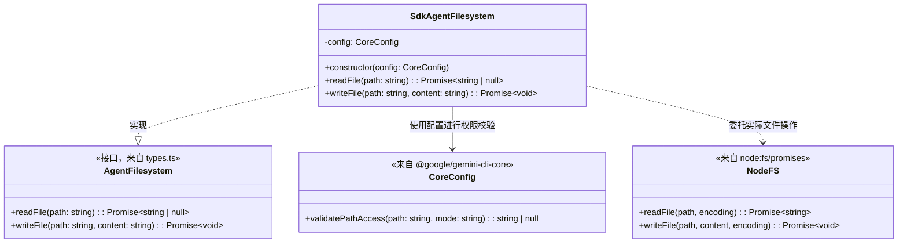
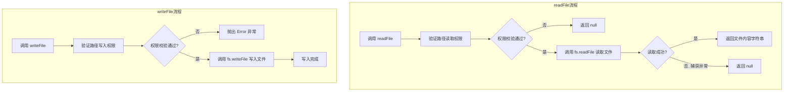

# fs.ts

## 概述

`fs.ts` 文件定义了 `SdkAgentFilesystem` 类，它是 `AgentFilesystem` 接口的具体实现。该类为 Gemini CLI SDK 提供了受控的文件系统访问能力，在实际的文件读写操作之前，通过核心配置（`CoreConfig`）进行路径访问权限校验，确保 Agent 只能在被允许的范围内访问文件系统。这是一种安全沙箱机制的实现。

## 架构图

## 核心组件

### `SdkAgentFilesystem` 类

实现了 `AgentFilesystem` 接口，提供带权限校验的文件系统操作。

#### 属性

| 属性名 | 类型 | 可见性 | 描述 |
|--------|------|--------|------|
| `config` | `CoreConfig` | `private readonly` | 核心配置对象，用于路径访问权限校验 |

#### 方法

##### `constructor(config: CoreConfig)`

构造函数，通过 TypeScript 参数属性简写语法初始化 `config` 属性。

- **参数**: `config` - 核心配置实例，必须提供 `validatePathAccess` 方法

##### `async readFile(path: string): Promise<string | null>`

安全地读取文件内容。

- **参数**: `path` - 要读取的文件路径
- **返回**: 文件内容字符串，如果无权限或读取失败则返回 `null`
- **行为**:
  1. 先调用 `config.validatePathAccess(path, 'read')` 校验读取权限
  2. 如果权限校验失败（返回错误信息），直接返回 `null`
  3. 如果权限校验通过，调用 Node.js `fs.readFile` 以 UTF-8 编码读取
  4. 如果读取过程中发生异常（如文件不存在），捕获异常并返回 `null`
- **错误处理策略**: 静默处理 -- 无论是权限不足还是文件不存在，都统一返回 `null`，不抛异常

##### `async writeFile(path: string, content: string): Promise<void>`

安全地写入文件内容。

- **参数**:
  - `path` - 要写入的文件路径
  - `content` - 要写入的内容字符串
- **返回**: `Promise<void>`
- **异常**: 如果权限校验失败，抛出 `Error`（错误消息为校验返回的错误信息）
- **行为**:
  1. 先调用 `config.validatePathAccess(path, 'write')` 校验写入权限
  2. 如果权限校验失败，抛出 `Error`
  3. 如果权限校验通过，调用 Node.js `fs.writeFile` 以 UTF-8 编码写入
- **错误处理策略**: 严格处理 -- 权限不足时直接抛出异常，阻止写入操作

## 依赖关系

### 内部依赖

| 模块 | 导入内容 | 用途 |
|------|---------|------|
| `./types.js` | `AgentFilesystem`（类型） | 文件系统操作接口定义，`SdkAgentFilesystem` 实现该接口 |

### 外部依赖

| 模块 | 导入内容 | 用途 |
|------|---------|------|
| `@google/gemini-cli-core` | `Config`（类型，别名 `CoreConfig`） | 核心配置类型，提供 `validatePathAccess` 路径权限校验方法 |
| `node:fs/promises` | `fs`（默认导入） | Node.js 异步文件系统 API，提供实际的 `readFile` 和 `writeFile` 操作 |

## 关键实现细节

1. **读写权限校验的不对称错误处理**:
   - `readFile` 在权限被拒绝时返回 `null`（静默失败），这与"文件未找到或不可读"的语义一致
   - `writeFile` 在权限被拒绝时抛出 `Error`（显式失败），因为写入失败通常需要调用者明确处理
   - 这种设计体现了读操作的容错性（查询式）和写操作的严格性（命令式）之间的区别

2. **安全沙箱模式**: 通过 `CoreConfig.validatePathAccess` 实现路径级别的访问控制。所有文件操作都必须先通过权限校验，防止 Agent 越权访问不被允许的文件路径。`validatePathAccess` 接收两个参数：路径和访问模式（`'read'` 或 `'write'`），返回 `null` 表示允许，返回错误字符串表示拒绝。

3. **编码固定为 UTF-8**: 读写操作均使用 `'utf-8'` 编码，不支持其他编码格式，这对于处理代码文件和文本配置文件是合理的默认设置。

4. **异常静默吞没**: `readFile` 方法使用空的 `catch` 块吞没了所有异常，这意味着除了文件不存在外，其他文件系统错误（如权限错误、磁盘故障等）也会被静默处理为返回 `null`。
