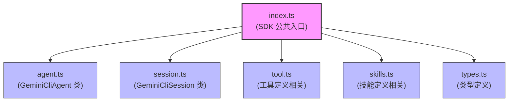
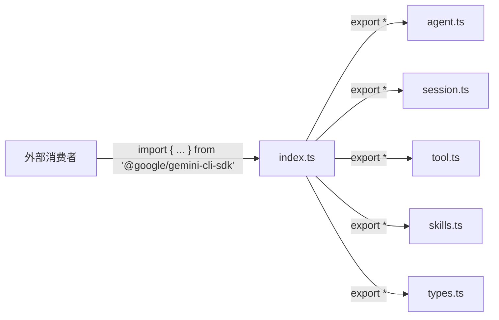

# index.ts

## 概述

`index.ts` 是 `@google/gemini-cli-sdk` 包的公共 API 入口文件（barrel 文件）。它通过 `export *` 语法统一聚合并重新导出 SDK 的所有公共模块，使得外部消费者可以从单一入口点引入所有需要的类、接口、函数和类型。该文件不包含任何业务逻辑，仅承担模块聚合和导出的职责。

## 架构图

## 核心组件

### 重新导出的模块

`index.ts` 没有定义自己的类、接口或函数，它通过 `export *` 重新导出以下 5 个模块中的所有公共导出内容：

| 导出来源 | 模块路径 | 主要导出内容 |
|---------|---------|-------------|
| Agent 模块 | `./agent.js` | `GeminiCliAgent` 类 |
| Session 模块 | `./session.js` | `GeminiCliSession` 类 |
| Tool 模块 | `./tool.js` | 工具定义辅助函数和相关类型 |
| Skills 模块 | `./skills.js` | 技能定义辅助函数和相关类型 |
| Types 模块 | `./types.js` | SDK 公共类型定义（接口、类型别名等） |

### 未导出的内部模块

以下模块是 SDK 的内部实现，**不**通过 `index.ts` 对外暴露：

| 模块 | 路径 | 原因 |
|------|------|------|
| `fs.ts` | `./fs.js` | 内部文件系统实现，不属于公共 API |
| `shell.ts` | `./shell.js` | 内部 Shell 执行实现，不属于公共 API |

## 依赖关系

### 内部依赖

| 模块 | 导入方式 | 用途 |
|------|---------|------|
| `./agent.js` | `export *` | 重新导出 Agent 相关的所有公共导出 |
| `./session.js` | `export *` | 重新导出 Session 相关的所有公共导出 |
| `./tool.js` | `export *` | 重新导出 Tool 相关的所有公共导出 |
| `./skills.js` | `export *` | 重新导出 Skills 相关的所有公共导出 |
| `./types.js` | `export *` | 重新导出 Types 相关的所有公共导出 |

### 外部依赖

无。`index.ts` 不直接依赖任何外部包。

## 关键实现细节

1. **Barrel 模式**: 该文件采用经典的 Barrel（桶）导出模式，将分散在多个文件中的导出内容汇聚到一个统一的入口。这样外部消费者只需 `import { GeminiCliAgent, GeminiCliSession } from '@google/gemini-cli-sdk'` 即可，无需知道内部模块结构。

2. **公共 API 边界定义**: 通过选择性地重新导出模块，`index.ts` 隐式地定义了 SDK 的公共 API 边界。`fs.ts` 和 `shell.ts` 没有被导出，意味着它们是内部实现细节，不是公共 API 的一部分。外部消费者不应直接导入这些模块。

3. **ESM 模块路径**: 所有导入路径使用 `.js` 扩展名（如 `./agent.js`），遵循 ESM（ECMAScript Module）规范。在 TypeScript 项目中，这些 `.js` 路径会在编译时被正确解析到对应的 `.ts` 源文件。

4. **导出顺序**: 模块按逻辑层次排列：Agent（顶层入口） -> Session（会话管理） -> Tool（工具定义） -> Skills（技能定义） -> Types（类型定义），体现了从高层到底层的依赖关系。
