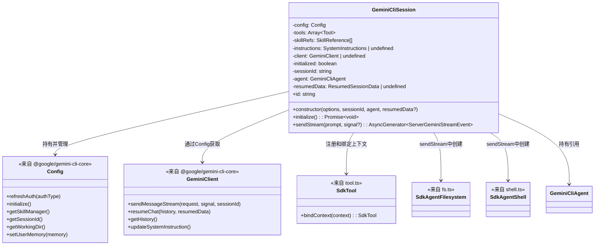
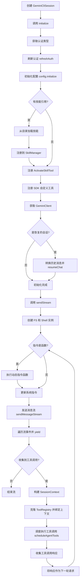

# session.ts

## 概述

`session.ts` 定义了 `GeminiCliSession` 类，这是 Gemini CLI SDK 中最核心的运行时类。它代表一次与 Gemini 模型的交互会话，负责管理会话的完整生命周期，包括：初始化认证和配置、注册工具和技能、发送消息并以流式方式接收响应、自动处理工具调用的循环（Agentic Loop）。该类是 SDK 中连接用户输入与模型输出的关键纽带。

## 架构图

## 核心组件

### `GeminiCliSession` 类

代表一次 Gemini CLI 交互会话，管理从初始化到消息流的完整生命周期。

#### 属性

| 属性名 | 类型 | 可见性 | 描述 |
|--------|------|--------|------|
| `config` | `Config` | `private readonly` | 核心配置实例，封装了认证、模型、工具注册表等 |
| `tools` | `Array<Tool<any>>` | `private readonly` | 用户定义的工具列表 |
| `skillRefs` | `SkillReference[]` | `private readonly` | 技能引用列表（如目录路径） |
| `instructions` | `SystemInstructions \| undefined` | `private readonly` | 系统指令，可以是字符串或动态函数 |
| `client` | `GeminiClient \| undefined` | `private` | Gemini API 客户端，初始化后赋值 |
| `initialized` | `boolean` | `private` | 初始化标志，防止重复初始化 |
| `sessionId` | `string` | `private readonly` | 会话唯一标识符 |
| `agent` | `GeminiCliAgent` | `private readonly` | 创建此会话的 Agent 实例引用 |
| `resumedData` | `ResumedSessionData \| undefined` | `private readonly` | 恢复会话时的历史数据 |

#### 方法

##### `constructor(options: GeminiCliAgentOptions, sessionId: string, agent: GeminiCliAgent, resumedData?: ResumedSessionData)`

构造函数，初始化会话配置。

- **参数**:
  - `options` - 代理配置选项
  - `sessionId` - 会话唯一标识符
  - `agent` - 创建此会话的 Agent 实例
  - `resumedData`（可选）- 恢复会话时的历史数据
- **行为**:
  1. 解析 `instructions`，如果是字符串则作为初始 `userMemory`
  2. 如果 `instructions` 既不是字符串也不是函数，抛出异常
  3. 构建 `ConfigParameters` 对象，包含：
     - 会话ID、工作目录、调试模式、模型名称
     - 禁用 hooks、MCP、扩展
     - 启用技能支持和管理员技能
     - 默认策略引擎配置为 `ALLOW`
  4. 创建 `Config` 实例

##### `get id(): string`

获取会话 ID 的访问器。

- **返回**: 会话的唯一标识符字符串

##### `async initialize(): Promise<void>`

初始化会话，包括认证、配置、技能加载和工具注册。

- **行为**:
  1. **幂等性检查**: 如果已初始化则直接返回
  2. **认证**: 从环境变量获取认证类型，默认使用 `AuthType.COMPUTE_ADC`，然后刷新认证
  3. **配置初始化**: 调用 `config.initialize()`
  4. **技能加载**: 遍历 `skillRefs`，从目录中并行加载技能，加载失败时静默输出错误到控制台
  5. **ActivateSkillTool 注册**: 如果有可用技能，重新注册 `ActivateSkillTool`（先卸载旧的再注册新的）
  6. **工具注册**: 将用户定义的 `tools` 包装为 `SdkTool` 并注册到工具注册表
  7. **客户端获取**: 从 `AgentLoopContext` 获取 `GeminiClient`
  8. **会话恢复**: 如果有 `resumedData`，将历史消息转换为 `Content[]` 格式并调用 `client.resumeChat`
  9. 标记 `initialized = true`

##### `async *sendStream(prompt: string, signal?: AbortSignal): AsyncGenerator<ServerGeminiStreamEvent>`

以流式方式发送消息并接收 Gemini 模型的响应。这是 SDK 最核心的方法，实现了 Agentic Loop（代理循环）。

- **参数**:
  - `prompt` - 用户输入的提示文本
  - `signal`（可选）- 用于中止请求的 AbortSignal
- **返回**: `AsyncGenerator<ServerGeminiStreamEvent>` - 异步生成器，逐个产出流事件
- **行为**（Agentic Loop）:
  1. **自动初始化**: 如果未初始化，自动调用 `initialize()`
  2. **创建沙箱工具**: 每次调用创建新的 `SdkAgentFilesystem` 和 `SdkAgentShell` 实例
  3. **循环开始**:
     - 如果 `instructions` 是函数，构建 `SessionContext` 并调用函数获取动态系统指令，更新到配置中
     - 调用 `client.sendMessageStream` 发送消息
     - 遍历流事件，逐个 `yield` 给调用者
     - 收集所有 `ToolCallRequest` 类型的事件
  4. **工具调用处理**:
     - 如果没有工具调用请求，跳出循环（会话结束）
     - 如果有工具调用请求：
       - 构建 `SessionContext` 上下文
       - 克隆 `ToolRegistry` 并为 `SdkTool` 绑定上下文
       - 调用 `scheduleAgentTools` 执行所有工具调用
       - 将工具执行结果作为下一轮请求，继续循环

## 依赖关系

### 内部依赖

| 模块 | 导入内容 | 用途 |
|------|---------|------|
| `./tool.js` | `Tool`（类型）, `SdkTool` | 工具定义类型和 SDK 工具包装类 |
| `./fs.js` | `SdkAgentFilesystem` | 受控文件系统访问实现 |
| `./shell.js` | `SdkAgentShell` | 受控 Shell 命令执行实现 |
| `./types.js` | `SessionContext`, `GeminiCliAgentOptions`, `SystemInstructions` | 类型定义 |
| `./skills.js` | `SkillReference`（类型） | 技能引用类型定义 |
| `./agent.js` | `GeminiCliAgent`（类型） | Agent 类型，用于 constructor 参数 |

### 外部依赖

| 模块 | 导入内容 | 用途 |
|------|---------|------|
| `@google/gemini-cli-core` | `AgentLoopContext` | Agent 循环上下文类型 |
| `@google/gemini-cli-core` | `Config`, `ConfigParameters` | 核心配置类和参数类型 |
| `@google/gemini-cli-core` | `AuthType` | 认证类型枚举 |
| `@google/gemini-cli-core` | `PREVIEW_GEMINI_MODEL_AUTO` | 默认模型常量 |
| `@google/gemini-cli-core` | `GeminiEventType` | 流事件类型枚举 |
| `@google/gemini-cli-core` | `ToolCallRequestInfo` | 工具调用请求信息类型 |
| `@google/gemini-cli-core` | `ServerGeminiStreamEvent` | 流事件类型 |
| `@google/gemini-cli-core` | `GeminiClient`, `Content` | Gemini 客户端和内容类型 |
| `@google/gemini-cli-core` | `scheduleAgentTools` | 工具调度执行函数 |
| `@google/gemini-cli-core` | `getAuthTypeFromEnv` | 从环境变量获取认证类型 |
| `@google/gemini-cli-core` | `ToolRegistry` | 工具注册表类型 |
| `@google/gemini-cli-core` | `loadSkillsFromDir` | 从目录加载技能的函数 |
| `@google/gemini-cli-core` | `ActivateSkillTool` | 激活技能的内置工具 |
| `@google/gemini-cli-core` | `ResumedSessionData` | 恢复会话数据类型 |
| `@google/gemini-cli-core` | `PolicyDecision` | 策略决策枚举 |

## 关键实现细节

1. **Agentic Loop（代理循环）模式**: `sendStream` 方法实现了经典的 Agent 循环 -- 发送请求到模型，如果模型返回工具调用请求，则执行工具并将结果作为新请求发送回模型，如此循环直到模型不再请求工具调用。这是 LLM Agent 的核心运行模式。

2. **动态系统指令**: `instructions` 支持函数形式，每次循环迭代时都会调用该函数获取最新的系统指令。函数接收 `SessionContext`（包含会话历史、工作目录、文件系统、Shell 等），可以基于上下文动态生成指令。这提供了极高的灵活性。

3. **工具上下文绑定**: 在工具调用阶段，代码克隆了 `ToolRegistry` 并覆盖了 `getTool` 方法。对于 `SdkTool` 类型的工具，会调用 `bindContext(context)` 将当前会话上下文注入到工具中，使工具能够访问会话相关信息（文件系统、Shell、历史记录等）。

4. **懒初始化**: `sendStream` 方法在执行前检查是否已初始化，如果没有则自动调用 `initialize()`。这允许用户在不显式调用 `initialize()` 的情况下直接发送消息。

5. **流式响应 + 异步生成器**: 使用 `async *` 异步生成器语法，让调用者可以使用 `for await...of` 逐个消费流事件，实现了反压（backpressure）控制。

6. **默认安全策略**: 构造函数中将 `PolicyDecision` 默认设置为 `ALLOW`，即默认允许所有工具调用。代码注释中标注了 TODO，未来会添加审批机制。

7. **工具调用参数解析**: 工具调用的 `args` 可能是字符串或对象。如果是字符串，会先通过 `JSON.parse` 解析为对象。

8. **会话恢复逻辑**: 恢复会话时，将历史消息中的 `type` 字段映射为 Gemini API 的角色：`'gemini'` -> `'model'`，其他 -> `'user'`。消息内容支持数组和字符串两种格式。

9. **最小化配置**: 构造函数中明确禁用了 hooks、MCP 和扩展（`enableHooks: false, mcpEnabled: false, extensionsEnabled: false`），保持 SDK 的轻量和可控性。
