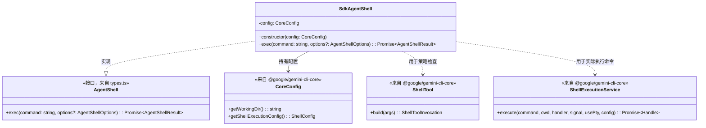
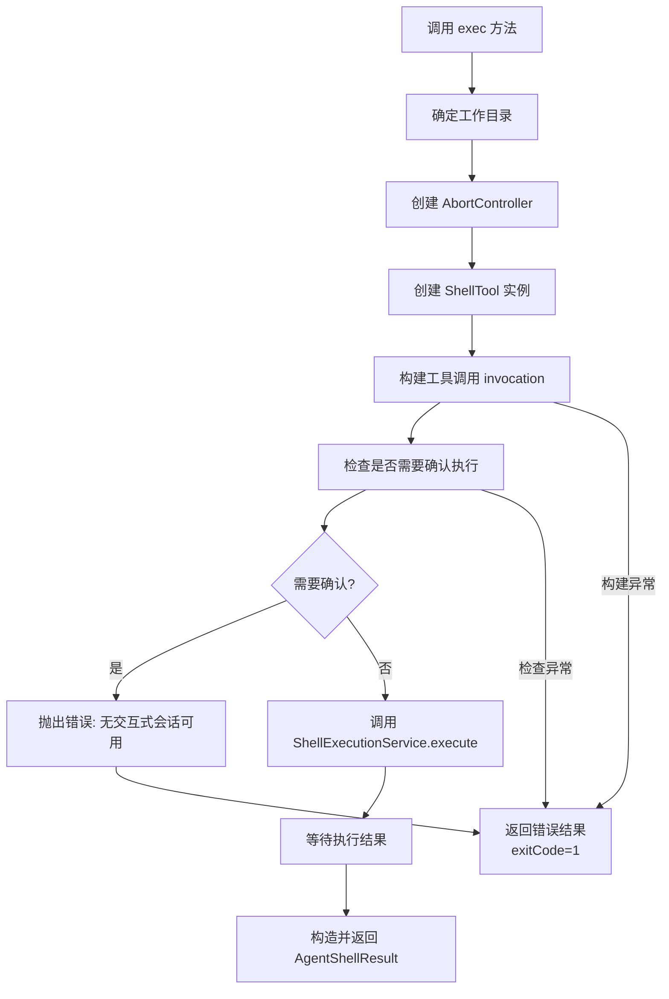

# shell.ts

## 概述

`shell.ts` 定义了 `SdkAgentShell` 类，它是 `AgentShell` 接口的具体实现。该类为 Gemini CLI SDK 提供了受控的 Shell 命令执行能力，在执行命令之前通过策略引擎（Policy Engine）进行安全检查。它封装了底层的 `ShellExecutionService` 和 `ShellTool`，实现了无交互式（headless）环境下的命令执行。

## 架构图

## 核心组件

### `SdkAgentShell` 类

实现了 `AgentShell` 接口，提供带策略检查的 Shell 命令执行能力。

#### 属性

| 属性名 | 类型 | 可见性 | 描述 |
|--------|------|--------|------|
| `config` | `CoreConfig` | `private readonly` | 核心配置实例，用于获取工作目录和 Shell 执行配置 |

#### 方法

##### `constructor(config: CoreConfig)`

构造函数，通过 TypeScript 参数属性简写语法初始化 `config`。

- **参数**: `config` - 核心配置实例

##### `async exec(command: string, options?: AgentShellOptions): Promise<AgentShellResult>`

执行一个 Shell 命令并返回执行结果。

- **参数**:
  - `command` - 要执行的 Shell 命令字符串
  - `options`（可选）- 执行选项，包含：
    - `cwd`（可选）- 命令执行的工作目录，默认使用 `config.getWorkingDir()`
- **返回**: `AgentShellResult` 对象，包含：
  - `output` - 合并的输出内容
  - `stdout` - 标准输出（当前与 output 相同）
  - `stderr` - 标准错误（当前为空字符串）
  - `exitCode` - 退出码
  - `error`（可选）- 错误对象（仅在策略检查失败时存在）
- **执行流程**:
  1. **确定工作目录**: 使用 `options.cwd` 或回退到 `config.getWorkingDir()`
  2. **创建 AbortController**: 用于控制命令执行的中止信号
  3. **策略检查**:
     - 创建 `ShellTool` 实例
     - 调用 `build()` 构建工具调用
     - 调用 `shouldConfirmExecute()` 检查是否需要用户确认
     - 如果需要确认，抛出错误（SDK 环境无交互式会话）
  4. **命令执行**:
     - 调用 `ShellExecutionService.execute()` 执行命令
     - 传入空的输出事件处理器（无 UI 环境）
     - 设置 `shouldUseNodePty: false`（headless 模式）
     - 等待执行结果
  5. **结果封装**: 将执行结果映射为 `AgentShellResult` 格式

## 依赖关系

### 内部依赖

| 模块 | 导入内容 | 用途 |
|------|---------|------|
| `./types.js` | `AgentShell`（类型） | Shell 接口定义，`SdkAgentShell` 实现该接口 |
| `./types.js` | `AgentShellResult`（类型） | Shell 执行结果的类型定义 |
| `./types.js` | `AgentShellOptions`（类型） | Shell 执行选项的类型定义 |

### 外部依赖

| 模块 | 导入内容 | 用途 |
|------|---------|------|
| `@google/gemini-cli-core` | `AgentLoopContext`（类型） | Agent 循环上下文，用于获取 messageBus |
| `@google/gemini-cli-core` | `ShellExecutionService` | 底层 Shell 命令执行服务，提供实际的命令执行能力 |
| `@google/gemini-cli-core` | `ShellTool` | Shell 工具类，用于构建工具调用并进行策略检查 |
| `@google/gemini-cli-core` | `Config`（类型，别名 `CoreConfig`） | 核心配置类型 |

## 关键实现细节

1. **策略引擎集成**: 在执行命令之前，代码通过 `ShellTool.build()` 和 `shouldConfirmExecute()` 机制检查命令是否被策略允许。如果策略要求用户确认（`confirmation` 为 truthy），由于 SDK 运行在无交互式环境中，会直接抛出错误而不是等待用户输入。

2. **Headless 执行模式**: 调用 `ShellExecutionService.execute()` 时：
   - 输出事件处理器设为空函数 `() => {}`，因为没有 UI 来显示实时输出
   - `shouldUseNodePty` 设为 `false`，使用标准的子进程而不是伪终端（PTY），适合无头环境

3. **stdout/stderr 合并限制**: 当前 `ShellExecutionService` 将标准输出和标准错误合并到一起。因此 `AgentShellResult` 中 `stdout` 实际等于 `output`，而 `stderr` 始终为空字符串。代码注释中说明了这一已知限制。

4. **错误处理策略**: 策略检查阶段的所有异常都被 try-catch 捕获，统一返回一个 `exitCode: 1` 的错误结果对象。这确保了 `exec` 方法在策略检查失败时不会抛出异常，而是返回一个表示失败的结果。

5. **AbortController 的作用**: 虽然创建了 `AbortController`，但在当前实现中没有暴露给外部调用者进行控制。它主要用于满足 `shouldConfirmExecute` 和 `ShellExecutionService.execute` 的 API 签名要求。未来可能会扩展以支持外部取消。

6. **Config 的双重角色**: `this.config` 既作为 `CoreConfig` 使用（获取工作目录和 Shell 配置），也通过类型断言 `as AgentLoopContext` 使用（获取 `messageBus`）。这表明 `Config` 类同时实现了 `AgentLoopContext` 接口。
