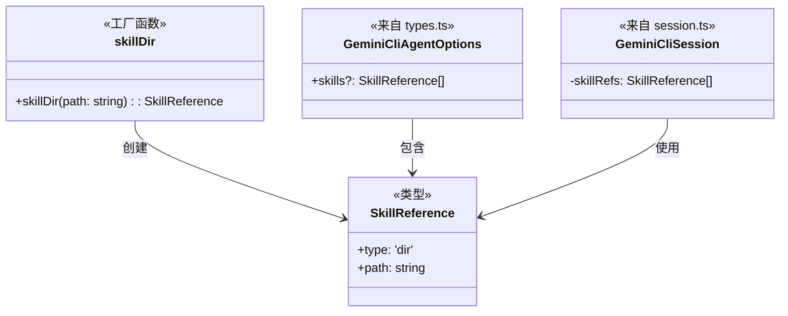
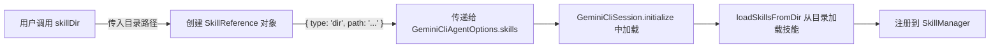

# skills.ts

## 概述

`skills.ts` 定义了技能引用（Skill Reference）的类型和工厂函数。技能（Skills）是 Gemini CLI 的一种扩展机制，允许用户将预定义的提示词和工具集打包为可复用的模块。该文件提供了一种声明式的方式来引用技能目录，供 `GeminiCliSession` 在初始化时加载使用。当前仅支持目录类型的技能引用。

## 架构图





## 核心组件

### `SkillReference` 类型

技能引用的类型定义，是一个带有判别联合（Discriminated Union）特征的对象类型。

```typescript
type SkillReference = { type: 'dir'; path: string }
```

| 字段 | 类型 | 描述 |
|------|------|------|
| `type` | `'dir'`（字面量类型） | 技能引用的类型标识符，当前仅支持 `'dir'`（目录） |
| `path` | `string` | 技能目录的文件系统路径 |

**设计说明**: 虽然当前只有 `'dir'` 一种类型，但使用了判别联合的模式（`type` 字段作为判别符），为未来扩展其他类型的技能引用（如 URL、包名等）预留了空间。

### `skillDir(path: string): SkillReference`

创建目录类型技能引用的工厂函数。

- **参数**: `path` - 技能目录的文件系统路径
- **返回**: `SkillReference` 对象，`type` 为 `'dir'`
- **用途**: 提供简洁的 API 来创建技能引用，例如：
  ```typescript
  const agent = new GeminiCliAgent({
    skills: [skillDir('/path/to/my-skills')],
  });
  ```

## 依赖关系

### 内部依赖

无。`skills.ts` 不依赖任何内部模块。

### 外部依赖

无。`skills.ts` 不依赖任何外部包。

## 关键实现细节

1. **极简设计**: 该文件仅包含一个类型定义和一个简单的工厂函数，体现了 SDK 设计中"简单的事情保持简单"的原则。

2. **判别联合预留扩展性**: `SkillReference` 使用 `type` 字段作为判别符，虽然目前只有 `'dir'` 一种变体。未来可以轻松扩展为：
   ```typescript
   type SkillReference =
     | { type: 'dir'; path: string }
     | { type: 'npm'; packageName: string }
     | { type: 'url'; url: string };
   ```
   在 `session.ts` 的 `initialize` 方法中已经通过 `if (ref.type === 'dir')` 进行类型区分，支持这种扩展。

3. **与 Core 层的桥接**: `SkillReference` 是 SDK 层的概念，在 `session.ts` 中会被转换为对 Core 层 `loadSkillsFromDir` 函数的调用。这种分层设计使得 SDK 用户不需要直接接触 Core 层的 API。

4. **纯数据结构**: `SkillReference` 是纯数据对象，不包含任何行为逻辑。实际的技能加载逻辑在 `session.ts` 中通过调用 `@google/gemini-cli-core` 的 `loadSkillsFromDir` 实现。
