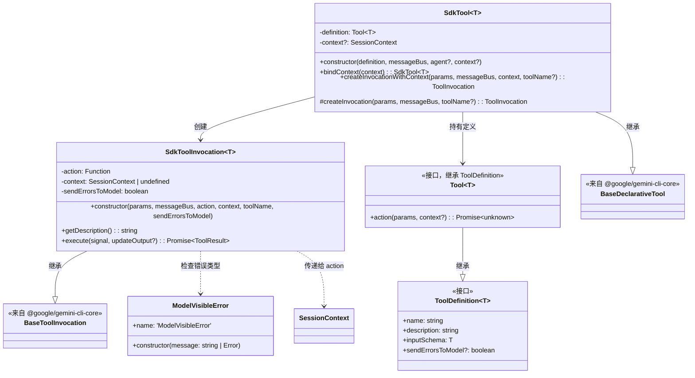
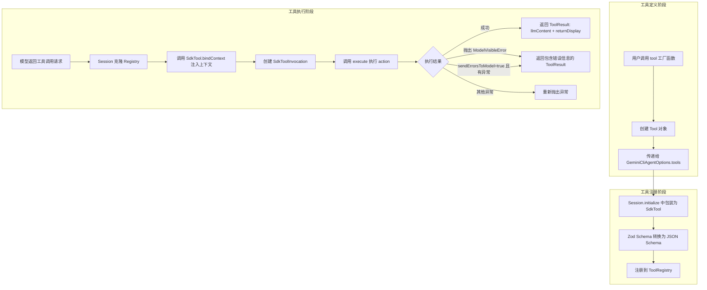

# tool.ts

## 概述

`tool.ts` 是 Gemini CLI SDK 的工具定义模块，提供了完整的工具（Tool）抽象层。它允许 SDK 用户通过 Zod Schema 定义工具的输入参数，编写工具的执行逻辑，并将其集成到 Gemini 的 Agent 循环中。该文件包含：工具定义接口、工具调用（Invocation）实现、工具注册包装器、错误处理机制，以及便捷的工厂函数。这是 SDK 用户自定义扩展能力的主要入口。

## 架构图





## 核心组件

### `ModelVisibleError` 类

一种特殊的错误类型，表示该错误信息应该被返回给模型（LLM）而不是直接抛出。

```typescript
class ModelVisibleError extends Error
```

- **继承**: `Error`
- **属性**: `name = 'ModelVisibleError'`
- **构造函数**: 接受 `string` 或 `Error` 参数
- **用途**: 当工具执行中发生的错误应该让模型知道（以便模型可以修正行为或向用户解释）时，抛出此错误类型

### `ToolDefinition<T>` 接口

工具的声明性定义，不包含执行逻辑。

| 字段 | 类型 | 描述 |
|------|------|------|
| `name` | `string` | 工具名称，在模型的工具列表中唯一标识 |
| `description` | `string` | 工具描述，帮助模型理解何时以及如何使用该工具 |
| `inputSchema` | `T extends z.ZodTypeAny` | 使用 Zod 定义的输入参数 Schema |
| `sendErrorsToModel` | `boolean`（可选） | 是否将所有错误信息发送给模型，默认 `false` |

### `Tool<T>` 接口

完整的工具定义，继承 `ToolDefinition` 并添加执行逻辑。

| 字段 | 类型 | 描述 |
|------|------|------|
| `action` | `(params: z.infer<T>, context?: SessionContext) => Promise<unknown>` | 工具的执行函数 |

- `params` - 经过 Zod Schema 验证后的输入参数
- `context`（可选） - 会话上下文，在 Agent 循环中由框架注入
- 返回值会被自动序列化为字符串返回给模型

### `SdkToolInvocation<T>` 类

工具调用的具体执行单元，继承自 Core 层的 `BaseToolInvocation`。

#### 方法

##### `getDescription(): string`

返回工具执行的描述文本。

- **返回**: `"Executing {工具名}..."` 格式的字符串

##### `async execute(_signal: AbortSignal, _updateOutput?: (output: string) => void): Promise<ToolResult>`

执行工具的 `action` 函数并处理结果。

- **参数**:
  - `_signal` - 中止信号（当前未使用，以下划线前缀标记）
  - `_updateOutput`（可选）- 输出更新回调（当前未使用）
- **返回**: `ToolResult` 对象
- **错误处理**:
  - 如果 `sendErrorsToModel` 为 `true` 或错误是 `ModelVisibleError` 实例，将错误消息封装为 `ToolResult` 返回给模型
  - 否则重新抛出异常

### `SdkTool<T>` 类

SDK 工具的注册包装器，继承自 Core 层的 `BaseDeclarativeTool`。负责将 SDK 层的 `Tool` 定义适配到 Core 层的工具注册系统。

#### 构造函数

```typescript
constructor(
  definition: Tool<T>,
  messageBus: MessageBus,
  _agent?: unknown,
  context?: SessionContext,
)
```

- 调用 `zodToJsonSchema` 将 Zod Schema 转换为 JSON Schema
- 工具种类（Kind）固定为 `Kind.Other`

#### 方法

##### `bindContext(context: SessionContext): SdkTool<T>`

创建一个绑定了会话上下文的新 `SdkTool` 实例。

- **参数**: `context` - 会话上下文
- **返回**: 新的 `SdkTool` 实例（不修改原实例，符合不可变模式）
- **用途**: 在 `session.ts` 的 `sendStream` 方法中，克隆 ToolRegistry 时为每个 SdkTool 绑定当前会话上下文

##### `createInvocationWithContext(params, messageBus, context, toolName?): ToolInvocation`

创建带上下文的工具调用实例。

- 优先使用传入的 `context`，如果为空则回退到构造时的 `this.context`

##### `protected createInvocation(params, messageBus, toolName?): ToolInvocation`

创建工具调用实例（使用构造时的上下文）。这是 `BaseDeclarativeTool` 要求实现的受保护方法。

### `tool<T>(definition, action): Tool<T>` 工厂函数

用户友好的工具创建工厂函数。

- **参数**:
  - `definition` - 工具定义（名称、描述、Schema）
  - `action` - 工具执行函数
- **返回**: 完整的 `Tool<T>` 对象
- **用法示例**:
  ```typescript
  const myTool = tool(
    {
      name: 'greet',
      description: 'Greets a user by name',
      inputSchema: z.object({ name: z.string() }),
    },
    async (params) => `Hello, ${params.name}!`,
  );
  ```

### 重新导出

```typescript
export { z };
```

将 `zod` 的 `z` 对象重新导出，方便 SDK 用户直接从 SDK 包中导入 `z` 来定义 Schema，无需额外安装 `zod`。

## 依赖关系

### 内部依赖

| 模块 | 导入内容 | 用途 |
|------|---------|------|
| `./types.js` | `SessionContext`（类型） | 会话上下文类型，传递给工具的 action 函数 |

### 外部依赖

| 模块 | 导入内容 | 用途 |
|------|---------|------|
| `zod` | `z` | Zod Schema 验证库，用于定义工具输入参数的类型和验证规则 |
| `zod-to-json-schema` | `zodToJsonSchema` | 将 Zod Schema 转换为 JSON Schema，供 Gemini API 使用 |
| `@google/gemini-cli-core` | `BaseDeclarativeTool` | 声明式工具基类，`SdkTool` 继承该类 |
| `@google/gemini-cli-core` | `BaseToolInvocation` | 工具调用基类，`SdkToolInvocation` 继承该类 |
| `@google/gemini-cli-core` | `ToolResult`（类型） | 工具执行结果的类型定义 |
| `@google/gemini-cli-core` | `ToolInvocation`（类型） | 工具调用实例的类型定义 |
| `@google/gemini-cli-core` | `Kind` | 工具种类枚举 |
| `@google/gemini-cli-core` | `MessageBus`（类型） | 消息总线类型，用于工具间通信 |

## 关键实现细节

1. **Zod 到 JSON Schema 的桥接**: SDK 用户使用 Zod 定义工具输入 Schema（开发者体验友好），在 `SdkTool` 构造时通过 `zodToJsonSchema` 转换为 JSON Schema 格式，这是 Gemini API Function Calling 所需的格式。这一转换对用户透明。

2. **双层错误处理策略**:
   - **ModelVisibleError**: 无论 `sendErrorsToModel` 设置如何，`ModelVisibleError` 类型的错误始终会被发送给模型。这是一种"选择性暴露"机制。
   - **sendErrorsToModel 标志**: 设为 `true` 时，所有错误都会被发送给模型。这适用于那些错误信息对模型有参考价值的工具。
   - **默认行为**: 当 `sendErrorsToModel` 为 `false` 且错误不是 `ModelVisibleError` 时，异常会被重新抛出，由上层调用者处理。

3. **不可变上下文绑定**: `bindContext` 方法不修改现有 `SdkTool` 实例，而是创建一个新的实例。这符合不可变性原则，避免了并发场景下的状态竞争问题。

4. **结果自动序列化**: `SdkToolInvocation.execute` 方法自动处理结果的序列化：如果结果是字符串则直接使用，否则通过 `JSON.stringify(result, null, 2)` 格式化为 JSON 字符串。这简化了工具作者的工作。

5. **z 的重新导出**: 将 `zod` 的 `z` 对象直接从 SDK 包重新导出，确保 SDK 用户使用的 `z` 与内部使用的版本一致，避免了版本不匹配导致的 Schema 兼容性问题。

6. **工具种类固定为 Other**: 所有 SDK 工具的 `Kind` 固定为 `Kind.Other`，区别于 Core 层内置的 Shell、FileSystem 等工具类型。这影响了策略引擎对工具的分类和权限控制。

7. **信号和输出回调未使用**: `SdkToolInvocation.execute` 方法中 `_signal` 和 `_updateOutput` 参数以下划线前缀命名，表示当前未使用。这留下了未来支持取消执行和实时输出更新的扩展空间。
