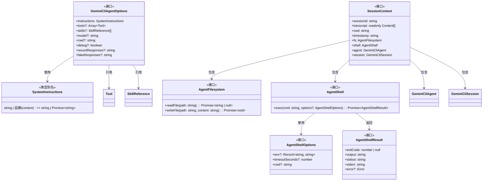
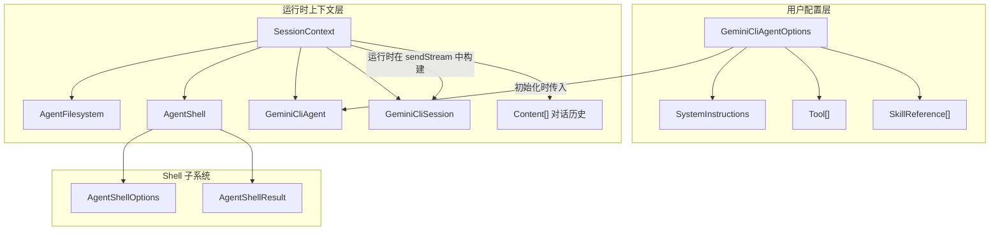

# types.ts

## 概述

`types.ts` 是 Gemini CLI SDK 的核心类型定义文件，集中定义了 SDK 中所有公共接口和类型别名。这些类型为 SDK 的各个组件提供了契约（Contract），确保了类型安全和组件间的解耦。该文件定义了：代理选项配置、系统指令、文件系统接口、Shell 接口、会话上下文等关键抽象。

## 架构图





## 核心组件

### `SystemInstructions` 类型别名

系统指令的类型定义，支持静态字符串和动态函数两种形式。

```typescript
type SystemInstructions =
  | string
  | ((context: SessionContext) => string | Promise<string>);
```

| 变体 | 类型 | 描述 |
|------|------|------|
| 静态指令 | `string` | 固定的系统指令文本，在会话创建时设置一次 |
| 动态指令 | `(context: SessionContext) => string \| Promise<string>` | 函数形式，每次 Agent 循环迭代时调用，可基于上下文动态生成指令 |

**使用场景**:
- 静态指令：简单场景，指令不变
- 动态指令：需要根据对话历史、当前工作目录、时间戳等信息动态调整指令

### `GeminiCliAgentOptions` 接口

创建 `GeminiCliAgent` 时的配置选项。

| 字段 | 类型 | 必填 | 描述 |
|------|------|------|------|
| `instructions` | `SystemInstructions` | 是 | 系统指令，定义 Agent 的行为准则 |
| `tools` | `Array<Tool<any>>` | 否 | 用户自定义工具列表 |
| `skills` | `SkillReference[]` | 否 | 技能引用列表 |
| `model` | `string` | 否 | 使用的模型名称，默认 `PREVIEW_GEMINI_MODEL_AUTO` |
| `cwd` | `string` | 否 | 工作目录，默认 `process.cwd()` |
| `debug` | `boolean` | 否 | 是否启用调试模式，默认 `false` |
| `recordResponses` | `string` | 否 | 记录响应的文件路径（用于测试/调试） |
| `fakeResponses` | `string` | 否 | 使用假响应的文件路径（用于测试/调试） |

### `AgentFilesystem` 接口

文件系统访问的抽象接口，由 `SdkAgentFilesystem`（`fs.ts`）实现。

| 方法 | 签名 | 描述 |
|------|------|------|
| `readFile` | `(path: string) => Promise<string \| null>` | 读取文件，返回内容或 null |
| `writeFile` | `(path: string, content: string) => Promise<void>` | 写入文件 |

### `AgentShellOptions` 接口

Shell 命令执行的选项。

| 字段 | 类型 | 必填 | 描述 |
|------|------|------|------|
| `env` | `Record<string, string>` | 否 | 环境变量键值对 |
| `timeoutSeconds` | `number` | 否 | 命令执行超时时间（秒） |
| `cwd` | `string` | 否 | 命令执行的工作目录 |

### `AgentShellResult` 接口

Shell 命令执行的结果。

| 字段 | 类型 | 描述 |
|------|------|------|
| `exitCode` | `number \| null` | 进程退出码，`null` 表示进程未正常退出 |
| `output` | `string` | 合并的输出（stdout + stderr） |
| `stdout` | `string` | 标准输出 |
| `stderr` | `string` | 标准错误 |
| `error` | `Error`（可选） | 执行错误对象 |

### `AgentShell` 接口

Shell 命令执行的抽象接口，由 `SdkAgentShell`（`shell.ts`）实现。

| 方法 | 签名 | 描述 |
|------|------|------|
| `exec` | `(cmd: string, options?: AgentShellOptions) => Promise<AgentShellResult>` | 执行 Shell 命令并返回结果 |

### `SessionContext` 接口

会话上下文，在 Agent 循环中传递给工具和动态指令函数，是运行时信息的聚合体。

| 字段 | 类型 | 描述 |
|------|------|------|
| `sessionId` | `string` | 当前会话的唯一标识符 |
| `transcript` | `readonly Content[]` | 只读的对话历史记录（Gemini API 的 Content 格式） |
| `cwd` | `string` | 当前工作目录 |
| `timestamp` | `string` | ISO 8601 格式的当前时间戳 |
| `fs` | `AgentFilesystem` | 文件系统访问接口 |
| `shell` | `AgentShell` | Shell 命令执行接口 |
| `agent` | `GeminiCliAgent` | 创建此会话的 Agent 实例 |
| `session` | `GeminiCliSession` | 当前会话实例 |

**特点**:
- `transcript` 使用 `readonly` 修饰符，防止工具或指令函数修改对话历史
- 同时持有 `agent` 和 `session` 引用，允许工具在需要时创建新会话或访问 Agent 级别的功能

## 依赖关系

### 内部依赖

| 模块 | 导入内容 | 用途 |
|------|---------|------|
| `./tool.js` | `Tool`（类型） | 工具定义类型，用于 `GeminiCliAgentOptions.tools` |
| `./skills.js` | `SkillReference`（类型） | 技能引用类型，用于 `GeminiCliAgentOptions.skills` |
| `./agent.js` | `GeminiCliAgent`（类型） | Agent 类型，用于 `SessionContext.agent` |
| `./session.js` | `GeminiCliSession`（类型） | Session 类型，用于 `SessionContext.session` |

### 外部依赖

| 模块 | 导入内容 | 用途 |
|------|---------|------|
| `@google/gemini-cli-core` | `Content`（类型） | Gemini API 的对话内容类型，用于 `SessionContext.transcript` |

## 关键实现细节

1. **接口与实现分离**: `types.ts` 仅定义接口（`AgentFilesystem`、`AgentShell`），具体实现在 `fs.ts` 和 `shell.ts` 中。这种分离允许在测试中轻松提供 mock 实现，也允许未来替换底层实现而不影响上层 API。

2. **SessionContext 作为核心上下文对象**: `SessionContext` 是一个"上帝对象"（God Object）风格的上下文聚合体，汇集了工具执行时可能需要的所有信息。虽然字段较多，但这种设计简化了工具的签名和使用方式 -- 工具只需要一个 `context` 参数就能访问所有运行时信息。

3. **SystemInstructions 的联合类型设计**: 使用联合类型（`string | function`）而不是两个独立的配置项，让 API 更加简洁。在 `session.ts` 的构造函数中通过 `typeof` 检查来区分两种形式。

4. **recordResponses 和 fakeResponses**: 这两个字段是测试辅助功能：
   - `recordResponses` 允许将 API 响应录制到文件，用于后续回放测试
   - `fakeResponses` 允许从文件加载预录制的响应，实现离线测试
   - 两者配合实现了"录制-回放"（Record-Replay）测试模式

5. **transcript 的只读保护**: `SessionContext.transcript` 使用 TypeScript 的 `readonly` 数组类型，确保工具无法通过 push/pop 等方法修改对话历史。这是一种防御性编程实践，保护了共享状态的完整性。

6. **exitCode 可为 null**: `AgentShellResult.exitCode` 类型为 `number | null`，`null` 表示进程非正常退出（如被信号杀死），这比单纯的 `number` 类型提供了更精确的语义。

7. **循环类型引用**: `types.ts` 导入了 `agent.ts` 和 `session.ts` 的类型，而这两个文件也导入了 `types.ts` 的类型。这构成了循环依赖，但由于所有导入都是 `import type`（仅用于类型检查，编译时擦除），不会在运行时产生问题。
