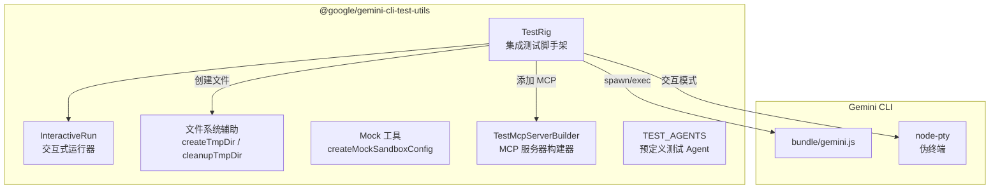
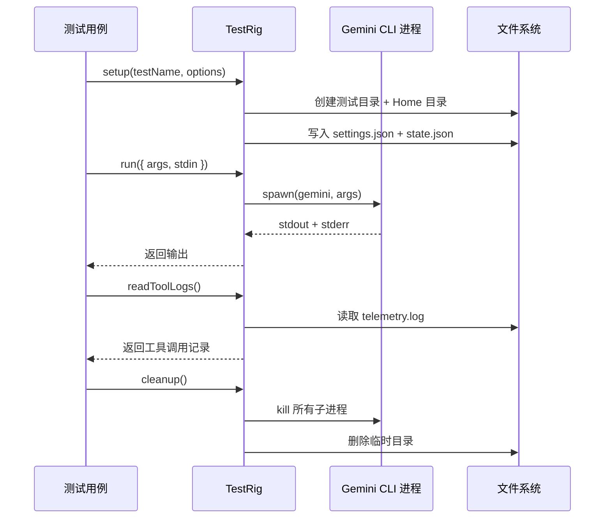

# packages/test-utils

## 概述

`@google/gemini-cli-test-utils` 是 Gemini CLI 的测试工具包（私有包），为集成测试和单元测试提供通用的辅助工具。包含测试脚手架（TestRig）、文件系统辅助函数、Mock 工具、测试 Agent 夹具和 MCP 测试服务器构建器。

## 目录结构

```
packages/test-utils/
├── index.ts                # 包入口
├── package.json            # 包配置（private: true）
├── vitest.config.ts        # Vitest 配置
└── src/
    ├── index.ts            # 模块导出入口
    ├── test-rig.ts         # TestRig - 集成测试脚手架
    ├── file-system-test-helpers.ts  # 文件系统测试辅助
    ├── mock-utils.ts       # Mock 工具（SandboxConfig）
    ├── test-mcp-server.ts  # MCP 测试服务器构建器
    └── fixtures/
        └── agents.ts       # 预定义测试 Agent
```

## 架构图



## 核心组件

### TestRig (`src/test-rig.ts`)

集成测试的核心脚手架，管理测试环境的完整生命周期：

- **环境设置**：创建隔离的测试目录和 Home 目录，配置 settings.json
- **CLI 执行**：
  - `run(options)` - 非交互式运行 CLI
  - `runCommand(args, options)` - 执行 CLI 命令
  - `runInteractive(options)` - 启动交互式终端（使用 node-pty）
  - `runWithStreams(args)` - 分离 stdout/stderr 输出
- **遥测读取**：
  - `readToolLogs()` - 读取工具调用日志
  - `waitForToolCall(toolName)` - 等待特定工具调用
  - `readHookLogs()` - 读取 Hook 调用日志
  - `waitForMetric(metricName)` - 等待指标数据
- **MCP 支持**：`addTestMcpServer(name, config)` 向工作区添加测试 MCP 服务器
- **清理**：`cleanup()` 杀死所有子进程，清理临时目录
- 支持 fake responses 模式（录制/回放 LLM 响应）

### InteractiveRun (`src/test-rig.ts`)

基于 node-pty 的交互式运行器：
- `expectText(text, timeout)` - 等待输出中出现指定文本
- `type(text)` - 模拟逐字符输入
- `sendText(text)` / `sendKeys(text)` - 快速输入
- `expectExit()` - 等待进程退出

### 文件系统辅助 (`src/file-system-test-helpers.ts`)

- `createTmpDir(structure)` - 根据声明式结构创建临时目录
- `cleanupTmpDir(dir)` - 清理临时目录
- `FileSystemStructure` 类型支持嵌套的文件/目录结构定义

### TestMcpServerBuilder (`src/test-mcp-server.ts`)

链式 API 构建测试 MCP 服务器配置：
```typescript
new TestMcpServerBuilder('my-server')
    .addTool('hello', 'Say hello', 'Hello World!')
    .build();
```

### TEST_AGENTS (`src/fixtures/agents.ts`)

预定义的测试 Agent 夹具：
- `DOCS_AGENT` - 文档更新 Agent
- `TESTING_AGENT` - 测试编写 Agent

## 依赖关系

### 内部依赖
- `@google/gemini-cli-core` - GEMINI_DIR, DEFAULT_GEMINI_MODEL 等常量

### 外部依赖
- `@lydell/node-pty` (1.1.0) - 伪终端支持
- `strip-ansi` (^7.1.2) - ANSI 转义符清理
- `vitest` (^3.2.4) - 测试框架

## 数据流

### 集成测试执行流程


