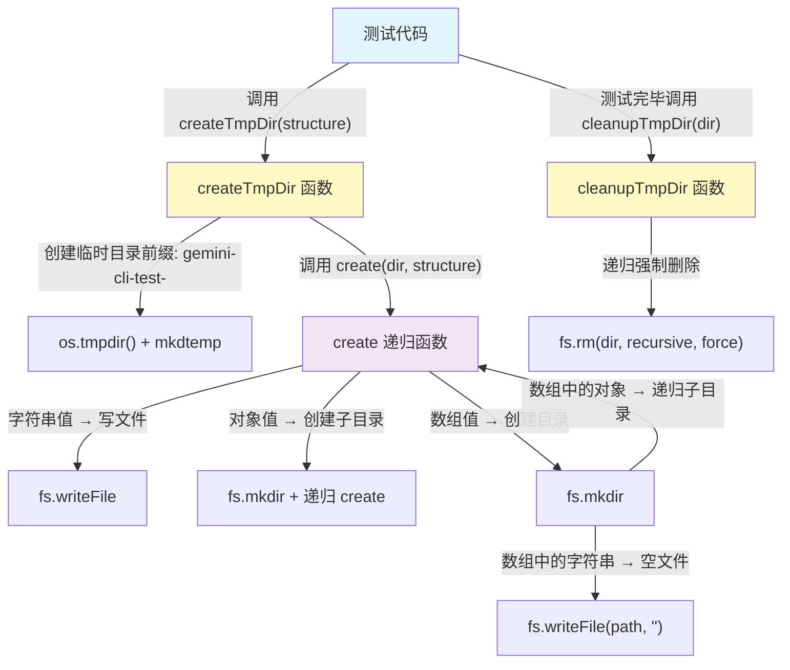
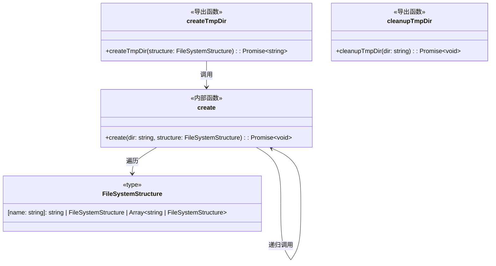

# file-system-test-helpers.ts

## 概述

该文件是 `test-utils` 包中的**文件系统测试辅助工具**，提供在测试场景下快速创建和清理临时目录结构的能力。它通过声明式的 `FileSystemStructure` 类型，允许测试代码以 JSON 对象的方式描述期望的文件系统布局，然后自动在操作系统临时目录中创建出对应的文件和目录。测试结束后可一键清理。

**核心职责：**
- 定义声明式文件系统结构类型 (`FileSystemStructure`)
- 递归创建临时目录及其文件/子目录
- 清理临时目录

## 架构图





## 核心组件

### 类型: `FileSystemStructure`

```typescript
export type FileSystemStructure = {
  [name: string]:
    | string
    | FileSystemStructure
    | Array<string | FileSystemStructure>;
};
```

**职责：** 定义声明式虚拟文件系统结构的类型。键为文件名或目录名，值支持三种形态：

| 值类型 | 含义 | 示例 |
|--------|------|------|
| `string` | 一个文件，字符串为文件内容 | `'file.txt': 'Hello'` |
| `FileSystemStructure` (对象) | 一个子目录，嵌套定义其内部结构 | `'src': { 'main.js': '...' }` |
| `Array<string \| FileSystemStructure>` | 一个目录，数组元素为空文件名或子目录定义 | `'data': ['a.csv', { logs: ['e.log'] }]` |

### 内部函数: `create`

```typescript
async function create(dir: string, structure: FileSystemStructure): Promise<void>
```

**职责：** 递归地根据 `FileSystemStructure` 在指定 `dir` 下创建文件和目录。

**处理逻辑：**
1. 遍历 `structure` 的所有键值对
2. 若值为 `string`：通过 `fs.writeFile` 写入文件
3. 若值为 `Array`：先 `fs.mkdir` 创建目录，然后遍历数组元素——字符串写空文件，对象则递归调用 `create`
4. 若值为 `object`（非 null）：先 `fs.mkdir` 创建目录，然后递归调用 `create`

### 导出函数: `createTmpDir`

```typescript
export async function createTmpDir(structure: FileSystemStructure): Promise<string>
```

**职责：** 在系统临时目录下创建一个以 `gemini-cli-test-` 为前缀的临时目录，并按照传入的 `structure` 填充文件和子目录。

**参数：**
- `structure: FileSystemStructure` — 要创建的文件系统结构

**返回值：** `Promise<string>` — 创建的临时目录的绝对路径

**实现细节：**
- 使用 `os.tmpdir()` 获取系统临时目录
- 使用 `fs.mkdtemp` 创建唯一的临时目录（前缀 `gemini-cli-test-`）
- 调用内部 `create` 函数递归创建结构

### 导出函数: `cleanupTmpDir`

```typescript
export async function cleanupTmpDir(dir: string): Promise<void>
```

**职责：** 清理（删除）指定的临时目录及其所有内容。

**参数：**
- `dir: string` — 要删除的临时目录绝对路径

**实现细节：**
- 使用 `fs.rm` 并传入 `{ recursive: true, force: true }` 选项，确保递归删除且忽略不存在的路径错误

## 依赖关系

### 内部依赖

无。该文件是一个独立的工具模块，不依赖项目内其他模块。

### 外部依赖

| 模块 | 用途 |
|------|------|
| `node:fs/promises` | 异步文件系统操作（writeFile、mkdir、mkdtemp、rm） |
| `node:path` | 路径拼接（path.join） |
| `node:os` | 获取系统临时目录路径（os.tmpdir） |

## 关键实现细节

1. **临时目录命名规则**：所有临时目录以 `gemini-cli-test-` 为前缀，后跟随机后缀（由 `mkdtemp` 自动生成），便于识别和管理。

2. **递归创建策略**：`create` 函数使用 `{ recursive: true }` 选项调用 `fs.mkdir`，确保即使父目录已存在也不会报错。

3. **数组与对象的语义区别**：
   - **对象值**：表示子目录，键为文件/子目录名，值为内容或更深层结构
   - **数组值**：表示目录，数组中的字符串元素被创建为**空文件**（内容为空字符串 `''`），数组中的对象元素被当作子目录结构递归处理

4. **强制清理**：`cleanupTmpDir` 使用 `force: true` 选项，即使目录不存在或包含只读文件也不会抛出异常，保证测试清理的稳健性。

5. **异步设计**：所有操作均为异步 (`async/await`)，适配 Node.js 的非阻塞 I/O 模型，在测试框架中可配合 `beforeEach`/`afterEach` 钩子使用。
