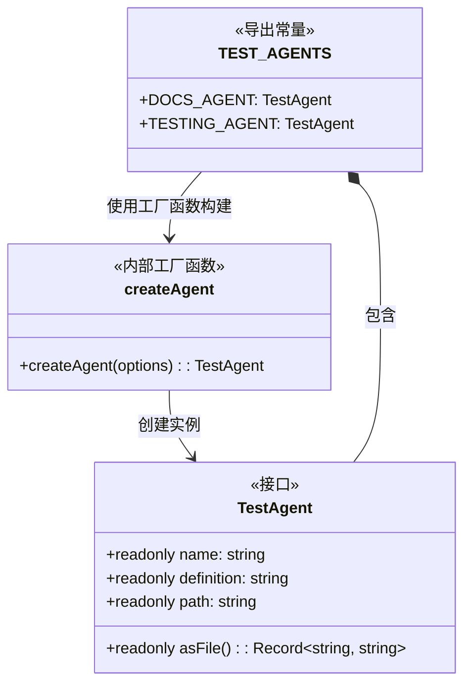
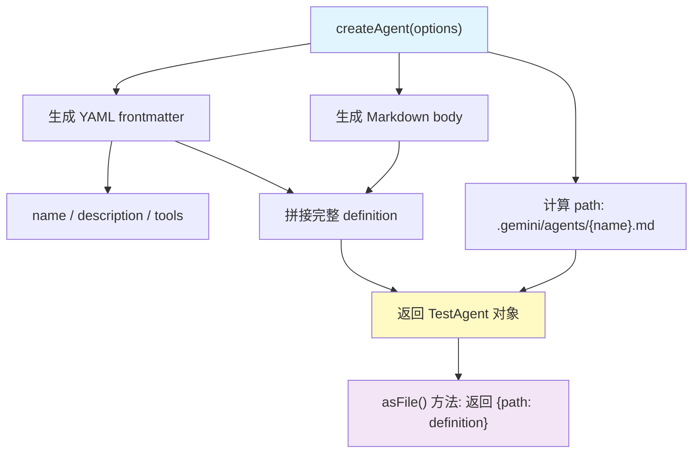

# agents.ts

## 概述

该文件是 `test-utils` 包中的**测试代理（Agent）固定数据（Fixtures）模块**，提供预定义的测试代理定义，用于评估测试和集成测试场景。

**核心职责：**
- 定义 `TestAgent` 接口，规范测试代理的数据结构
- 提供工厂函数 `createAgent`，以统一格式生成代理定义（YAML frontmatter + Markdown body）
- 导出预构建的测试代理集合 `TEST_AGENTS`，包含文档代理和测试代理

这些测试代理模拟了 Gemini CLI 中 `.gemini/agents/` 目录下的代理定义文件格式，便于在测试中快速构造代理配置。

## 架构图





## 核心组件

### 接口: `TestAgent`

```typescript
export interface TestAgent {
  readonly name: string;
  readonly definition: string;
  readonly path: string;
  readonly asFile: () => Record<string, string>;
}
```

**职责：** 定义测试代理的统一数据结构。

| 属性 | 类型 | 说明 |
|------|------|------|
| `name` | `string` | 代理的唯一名称 |
| `definition` | `string` | 代理的完整 YAML/Markdown 定义内容（包含 frontmatter 和 body） |
| `path` | `string` | 代理在测试项目中的标准存储路径 |
| `asFile` | `() => Record<string, string>` | 辅助方法，将代理转为 `{ [path]: definition }` 格式的对象，可直接展开到 `evalTest` 的 `files` 参数中 |

### 内部函数: `createAgent`

```typescript
function createAgent(options: {
  name: string;
  description: string;
  tools: string[];
  body: string;
}): TestAgent
```

**职责：** 工厂函数，根据传入的选项创建格式一致的 `TestAgent` 对象。

**参数：**
| 参数 | 类型 | 说明 |
|------|------|------|
| `name` | `string` | 代理名称，也用于生成文件路径 |
| `description` | `string` | 代理描述，写入 YAML frontmatter |
| `tools` | `string[]` | 代理可使用的工具列表 |
| `body` | `string` | 代理的 Markdown 正文内容（系统提示词） |

**生成的 `definition` 格式示例：**
```yaml
---
name: docs-agent
description: An agent with expertise in updating documentation.
tools:
  - read_file
  - write_file
---
You are the docs agent. Update documentation clearly and accurately.
```

**生成的 `path` 格式：** `.gemini/agents/{name}.md`

### 导出常量: `TEST_AGENTS`

```typescript
export const TEST_AGENTS = {
  DOCS_AGENT: TestAgent,
  TESTING_AGENT: TestAgent,
} as const;
```

**职责：** 预定义的测试代理集合，使用 `as const` 确保类型为只读且不可修改。

| 代理 | 名称 | 描述 | 工具 | 系统提示词 |
|------|------|------|------|-----------|
| `DOCS_AGENT` | `docs-agent` | 擅长更新文档的代理 | `read_file`, `write_file` | "You are the docs agent. Update documentation clearly and accurately." |
| `TESTING_AGENT` | `testing-agent` | 擅长编写和更新测试的代理 | `read_file`, `write_file` | "You are the test agent. Add or update tests." |

## 依赖关系

### 内部依赖

无。该文件是一个独立的固定数据模块，不依赖项目内其他模块。

### 外部依赖

无。该文件仅使用 TypeScript 原生语法，不依赖任何外部包。

## 关键实现细节

1. **YAML frontmatter 格式**：`createAgent` 生成的 `definition` 遵循 Gemini CLI 的代理定义文件格式——以 `---` 分隔的 YAML frontmatter 包含元数据（name、description、tools），后面跟随 Markdown 格式的正文内容。

2. **路径约定**：所有测试代理的路径统一为 `.gemini/agents/{name}.md`，与 Gemini CLI 项目中代理文件的实际存储位置保持一致。

3. **`asFile()` 便捷方法**：返回 `{ [path]: definition }` 形式的对象，设计意图是便于在测试中使用展开运算符（spread operator）直接合并到测试用例的文件系统定义中，例如：
   ```typescript
   const files = {
     'main.ts': '...',
     ...TEST_AGENTS.DOCS_AGENT.asFile(),
   };
   ```

4. **`as const` 断言**：`TEST_AGENTS` 使用 `as const` 确保对象及其所有属性在类型层面为深度只读，防止测试代码意外修改固定数据。

5. **工具列表的 YAML 格式化**：`tools` 数组通过 `map` + `join('\n')` 转换为 YAML 列表格式，每个工具前缀 `  - `（两个空格缩进加连字符）。
