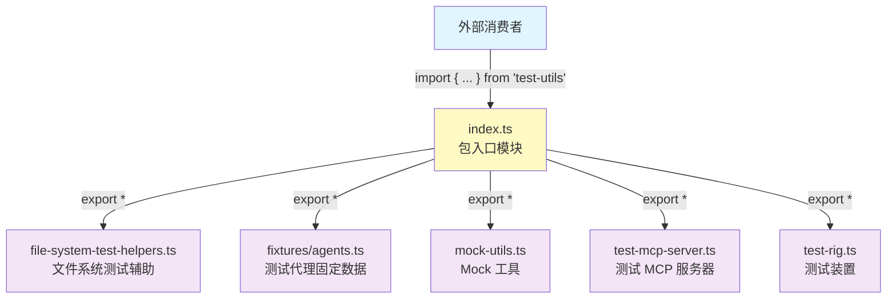
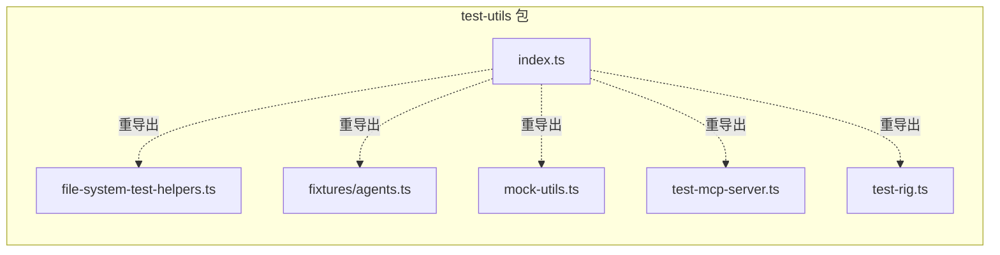

# index.ts

## 概述

该文件是 `test-utils` 包的**入口模块（barrel file）**，负责统一导出包内所有子模块的公共 API。外部消费者只需从该包的入口引入，即可访问所有测试工具函数、类型、固定数据和测试基础设施。

**核心职责：**
- 作为 `@anthropic/test-utils`（或项目内 `test-utils` 包）的唯一公共入口
- 通过 `export *` 语法聚合并重导出所有子模块的导出内容
- 提供统一的导入路径，简化使用方式

## 架构图





## 核心组件

### 重导出语句

| 导出语句 | 源模块 | 导出内容 |
|----------|--------|----------|
| `export * from './file-system-test-helpers.js'` | `file-system-test-helpers.ts` | `FileSystemStructure` 类型、`createTmpDir` 函数、`cleanupTmpDir` 函数 |
| `export * from './fixtures/agents.js'` | `fixtures/agents.ts` | `TestAgent` 接口、`TEST_AGENTS` 常量 |
| `export * from './mock-utils.js'` | `mock-utils.ts` | Mock 相关工具函数和类型 |
| `export * from './test-mcp-server.js'` | `test-mcp-server.ts` | 测试用 MCP 服务器相关类和函数 |
| `export * from './test-rig.js'` | `test-rig.ts` | 测试装置（Test Rig）相关类和工具 |

## 依赖关系

### 内部依赖

| 模块路径 | 说明 |
|----------|------|
| `./file-system-test-helpers.js` | 文件系统测试辅助工具 |
| `./fixtures/agents.js` | 测试代理固定数据 |
| `./mock-utils.js` | Mock 工具函数 |
| `./test-mcp-server.js` | 测试 MCP 服务器 |
| `./test-rig.js` | 测试装置 |

### 外部依赖

无。入口模块仅做重导出，不引入任何外部依赖。

## 关键实现细节

1. **Barrel 模式**：该文件采用经典的 TypeScript barrel 模式（桶文件），使用 `export *` 将所有子模块的导出内容汇聚到一个入口，外部使用者无需了解包的内部文件结构。

2. **`.js` 扩展名**：导入路径使用 `.js` 扩展名而非 `.ts`，这是 TypeScript 在 ESM（ECMAScript Modules）模式下的标准做法。TypeScript 编译时会解析对应的 `.ts` 文件，而运行时则寻找编译后的 `.js` 文件。

3. **完整性**：该入口文件覆盖了 `src/` 下所有五个子模块，确保包的所有公共 API 均可通过入口访问。包的消费者可以使用如下方式导入：
   ```typescript
   import { createTmpDir, cleanupTmpDir, TEST_AGENTS, TestRig } from '@gemini/test-utils';
   ```

4. **无逻辑代码**：入口模块不包含任何业务逻辑或副作用代码，仅作为导出的聚合点，保持关注点分离。
