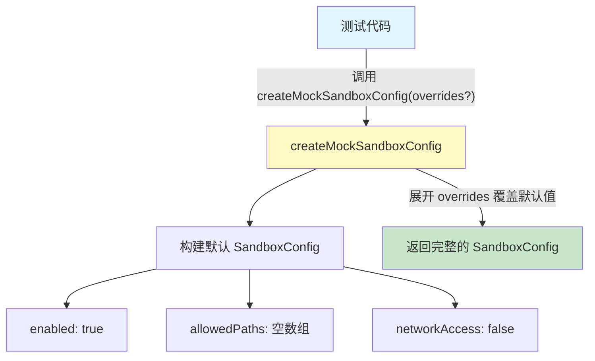
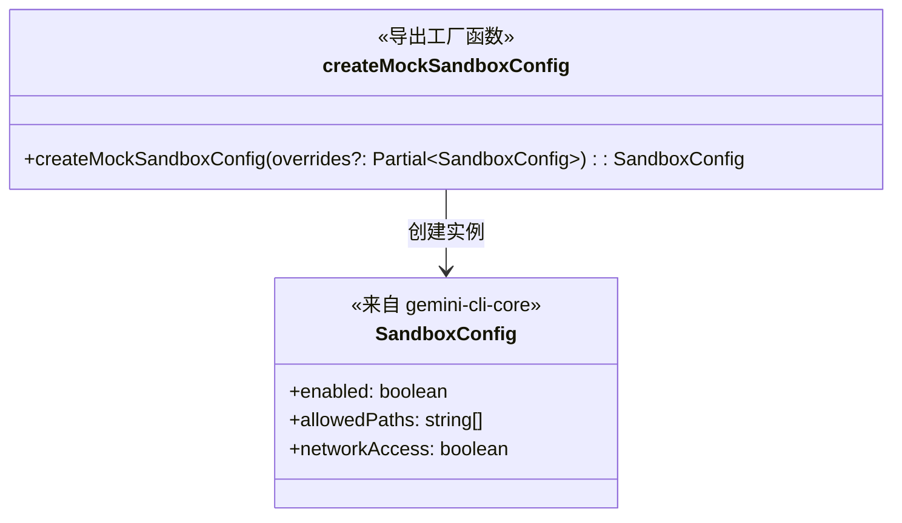

# mock-utils.ts

## 概述

该文件是 `test-utils` 包中的 **Mock 工具模块**，提供创建模拟（mock）配置对象的工厂函数。目前该模块专注于沙箱配置（`SandboxConfig`）的模拟构建，便于测试代码快速创建具有合理默认值的沙箱配置对象，并支持部分属性覆盖。

**核心职责：**
- 提供 `SandboxConfig` 的模拟工厂函数
- 设定安全的默认配置值（沙箱启用、无允许路径、无网络访问）
- 支持通过 `Partial<SandboxConfig>` 灵活覆盖默认值

## 架构图





## 核心组件

### 导出函数: `createMockSandboxConfig`

```typescript
export function createMockSandboxConfig(
  overrides?: Partial<SandboxConfig>,
): SandboxConfig
```

**职责：** 创建一个具有合理默认值的 `SandboxConfig` 模拟对象，可通过 `overrides` 参数部分覆盖默认配置。

**参数：**

| 参数 | 类型 | 必填 | 说明 |
|------|------|------|------|
| `overrides` | `Partial<SandboxConfig>` | 否 | 要覆盖的配置属性，未指定的属性使用默认值 |

**返回值：** `SandboxConfig` — 完整的沙箱配置对象

**默认值：**

| 属性 | 默认值 | 说明 |
|------|--------|------|
| `enabled` | `true` | 沙箱默认启用 |
| `allowedPaths` | `[]` | 默认不允许任何路径 |
| `networkAccess` | `false` | 默认禁止网络访问 |

**使用示例：**

```typescript
// 使用全部默认值
const config1 = createMockSandboxConfig();
// { enabled: true, allowedPaths: [], networkAccess: false }

// 覆盖部分属性
const config2 = createMockSandboxConfig({
  networkAccess: true,
  allowedPaths: ['/tmp'],
});
// { enabled: true, allowedPaths: ['/tmp'], networkAccess: true }

// 禁用沙箱
const config3 = createMockSandboxConfig({ enabled: false });
// { enabled: false, allowedPaths: [], networkAccess: false }
```

## 依赖关系

### 内部依赖

| 模块 | 导入内容 | 说明 |
|------|----------|------|
| `@google/gemini-cli-core` | `SandboxConfig` (type) | 沙箱配置的类型定义 |

### 外部依赖

| 模块 | 用途 |
|------|------|
| `@google/gemini-cli-core` | 项目核心包，提供 `SandboxConfig` 类型定义 |

## 关键实现细节

1. **展开运算符覆盖模式**：函数使用 `{ ...defaults, ...overrides }` 模式，先设置默认值再用传入的 `overrides` 覆盖。这是 TypeScript 测试工具中创建 mock 对象的经典模式。

2. **安全优先的默认值**：默认配置采用最严格的安全策略——沙箱启用（`enabled: true`）、不允许任何路径访问（`allowedPaths: []`）、禁止网络访问（`networkAccess: false`）。这确保测试默认运行在受限环境中，需要显式放宽权限。

3. **仅类型导入**：使用 `import type` 语法导入 `SandboxConfig`，表明这是一个纯类型导入，不会在运行时产生任何代码。这是 TypeScript 的最佳实践，有助于 tree-shaking 和避免循环依赖问题。

4. **可扩展设计**：虽然当前模块只有一个工厂函数，但文件命名为 `mock-utils`（复数），预留了未来添加更多 mock 工厂函数的空间，例如为其他核心配置类型提供类似的工厂函数。
