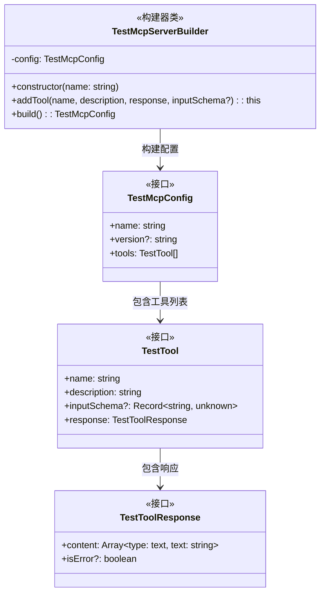
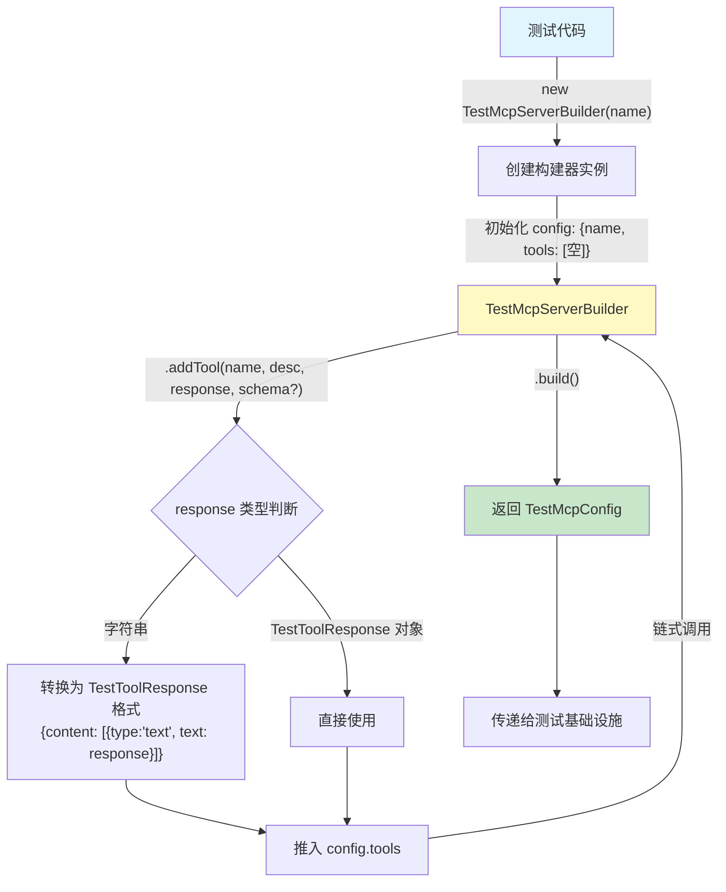

# test-mcp-server.ts

## 概述

该文件是 `test-utils` 包中的**测试 MCP 服务器配置构建模块**，提供用于在测试场景下定义和构建模拟 MCP（Model Context Protocol）服务器配置的接口和构建器类。

**核心职责：**
- 定义测试工具响应结构 (`TestToolResponse`)
- 定义测试工具定义结构 (`TestTool`)
- 定义测试 MCP 服务器配置结构 (`TestMcpConfig`)
- 提供建造者模式 (`TestMcpServerBuilder`) 便捷构建测试 MCP 服务器配置

该模块不直接启动 MCP 服务器，而是构建配置对象，配置对象可被其他测试基础设施（如 `TestRig`）用于创建模拟的 MCP 服务端。

## 架构图





## 核心组件

### 接口: `TestToolResponse`

```typescript
export interface TestToolResponse {
  content: { type: 'text'; text: string }[];
  isError?: boolean;
}
```

**职责：** 定义测试工具调用的响应结构。

| 属性 | 类型 | 必填 | 说明 |
|------|------|------|------|
| `content` | `{ type: 'text'; text: string }[]` | 是 | 响应内容数组，每项包含类型标识和文本内容 |
| `isError` | `boolean` | 否 | 标记该响应是否为错误响应 |

**说明：** 该结构与 MCP 协议中工具调用响应的标准格式一致，`content` 数组中的每个元素目前仅支持 `text` 类型。

### 接口: `TestTool`

```typescript
export interface TestTool {
  name: string;
  description: string;
  inputSchema?: Record<string, unknown>;
  response: TestToolResponse;
}
```

**职责：** 定义测试工具的完整结构。

| 属性 | 类型 | 必填 | 说明 |
|------|------|------|------|
| `name` | `string` | 是 | 工具名称 |
| `description` | `string` | 是 | 工具描述 |
| `inputSchema` | `Record<string, unknown>` | 否 | 工具输入参数的 JSON Schema 定义 |
| `response` | `TestToolResponse` | 是 | 工具被调用时返回的固定响应 |

### 接口: `TestMcpConfig`

```typescript
export interface TestMcpConfig {
  name: string;
  version?: string;
  tools: TestTool[];
}
```

**职责：** 定义测试 MCP 服务器的完整配置。

| 属性 | 类型 | 必填 | 说明 |
|------|------|------|------|
| `name` | `string` | 是 | MCP 服务器名称 |
| `version` | `string` | 否 | 服务器版本号 |
| `tools` | `TestTool[]` | 是 | 服务器提供的工具列表 |

### 类: `TestMcpServerBuilder`

```typescript
export class TestMcpServerBuilder {
  private config: TestMcpConfig;
  constructor(name: string);
  addTool(name: string, description: string, response: TestToolResponse | string, inputSchema?: Record<string, unknown>): this;
  build(): TestMcpConfig;
}
```

**职责：** 使用建造者模式（Builder Pattern）便捷地构建 `TestMcpConfig` 配置对象。

#### 构造函数

```typescript
constructor(name: string)
```

初始化构建器，设置服务器名称并创建空工具列表。

#### 方法: `addTool`

```typescript
addTool(
  name: string,
  description: string,
  response: TestToolResponse | string,
  inputSchema?: Record<string, unknown>,
): this
```

向配置中添加一个测试工具定义。

| 参数 | 类型 | 说明 |
|------|------|------|
| `name` | `string` | 工具名称 |
| `description` | `string` | 工具描述 |
| `response` | `TestToolResponse \| string` | 响应内容。传字符串时自动包装为 `TestToolResponse` |
| `inputSchema` | `Record<string, unknown>` | 可选的 JSON Schema |

**返回值：** `this` — 返回构建器自身，支持链式调用。

**智能响应转换：** 当 `response` 参数为字符串时，自动将其包装为标准的 `TestToolResponse` 格式：
```typescript
{ content: [{ type: 'text', text: responseString }] }
```

#### 方法: `build`

```typescript
build(): TestMcpConfig
```

构建并返回最终的 `TestMcpConfig` 配置对象。

**使用示例：**

```typescript
const config = new TestMcpServerBuilder('test-server')
  .addTool('greet', 'Greets the user', 'Hello!')
  .addTool('calculate', 'Performs calculation', {
    content: [{ type: 'text', text: '42' }],
  }, {
    type: 'object',
    properties: { expression: { type: 'string' } },
  })
  .build();
```

## 依赖关系

### 内部依赖

无。该文件是一个独立模块，不依赖项目内其他模块。

### 外部依赖

无。该文件仅使用 TypeScript 原生语法，不依赖任何外部包。

## 关键实现细节

1. **建造者模式（Builder Pattern）**：`TestMcpServerBuilder` 实现了经典的建造者模式，通过 `addTool` 方法返回 `this` 实现链式调用，最终通过 `build` 方法输出配置对象。这使得测试代码中 MCP 服务器配置的构建既简洁又可读。

2. **字符串到响应对象的自动转换**：`addTool` 方法的 `response` 参数接受 `string | TestToolResponse` 联合类型。当传入字符串时，自动包装为 `{ content: [{ type: 'text', text }] }` 格式。这是一个便利设计——大多数测试场景中工具只需返回简单文本，无需每次手动构建完整的响应对象。

3. **MCP 协议对齐**：`TestToolResponse` 的 `content` 数组结构与 MCP 协议规范中的工具调用响应格式保持一致，确保测试模拟的行为与真实 MCP 服务器一致。

4. **`as const` 断言**：在字符串转响应对象时使用 `'text' as const`，确保类型系统将 `type` 字段推导为字面量类型 `'text'` 而非宽泛的 `string`，满足 `TestToolResponse` 接口的类型约束。

5. **直接引用共享**：`build()` 方法直接返回内部的 `config` 对象引用而非深拷贝。这意味着在调用 `build()` 后继续操作构建器可能影响已返回的配置。但在测试场景下，通常构建器在调用 `build()` 后不再使用，因此这种设计简洁且足够。

6. **配置驱动而非实例化**：该模块仅负责构建配置数据结构，不包含任何 MCP 服务器的启动或运行逻辑。实际的服务器实例化由其他测试基础设施模块（如通用的测试 MCP 服务器模板脚本）根据此配置完成。
