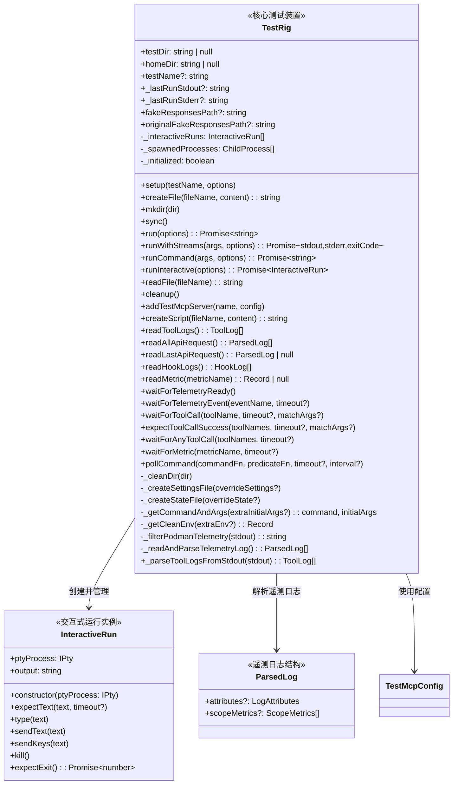
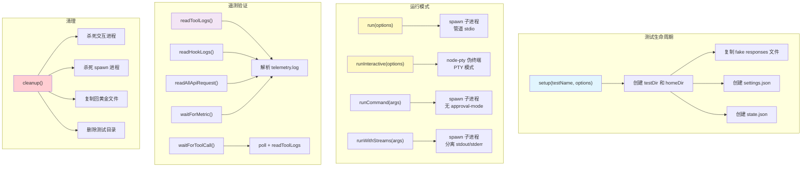
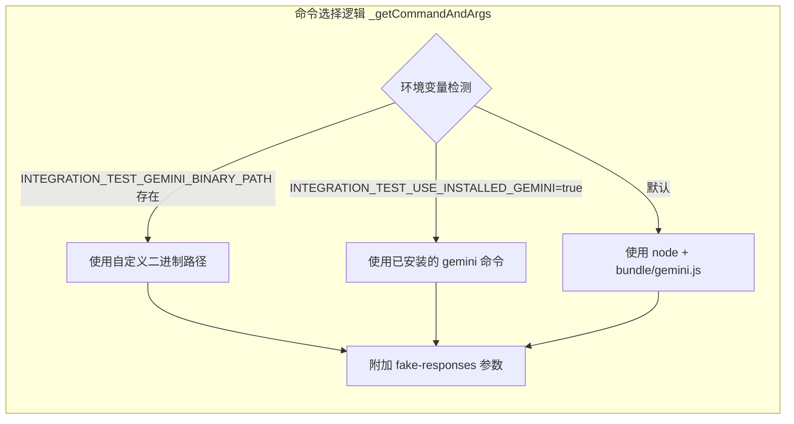

# test-rig.ts

## 概述

该文件是 `test-utils` 包中的**核心测试装置（Test Rig）模块**，是整个集成测试基础设施中最关键、最复杂的文件。它提供了一个完整的端到端测试框架，用于启动、控制和验证 Gemini CLI 的运行行为。

**核心职责：**
- 管理测试目录和 HOME 目录的生命周期（创建、初始化、清理）
- 自动生成 Gemini CLI 所需的配置文件（settings.json、state.json）
- 启动 CLI 进程（非交互模式和交互式 PTY 模式）
- 管理模拟响应（fake responses）和黄金文件（golden files）的录制/回放
- 集成 MCP 测试服务器
- 解析遥测日志（telemetry logs）以验证工具调用、API 请求、Hook 执行等
- 提供轮询（poll）机制等待异步事件
- 多种辅助断言函数

## 架构图







## 核心组件

### 导出函数: `getDefaultTimeout`

```typescript
export function getDefaultTimeout(): number
```

**职责：** 根据运行环境返回合适的默认超时时间。

| 环境 | 超时时间 | 说明 |
|------|----------|------|
| `CI` 环境 | 60000ms (1分钟) | CI 环境较慢 |
| `GEMINI_SANDBOX` 容器环境 | 30000ms (30秒) | 容器有额外开销 |
| 本地开发环境 | 15000ms (15秒) | 本地最快 |

### 导出函数: `poll`

```typescript
export async function poll(
  predicate: () => boolean,
  timeout: number,
  interval: number,
): Promise<boolean>
```

**职责：** 通用轮询工具，在超时前反复调用 `predicate` 函数，直到返回 `true`。

| 参数 | 类型 | 说明 |
|------|------|------|
| `predicate` | `() => boolean` | 条件判断函数 |
| `timeout` | `number` | 总超时时间（毫秒） |
| `interval` | `number` | 轮询间隔（毫秒） |

**返回值：** `Promise<boolean>` — 条件满足返回 `true`，超时返回 `false`

**特性：** 当 `VERBOSE=true` 时每 5 次尝试输出一次日志，超时时也输出日志。

### 导出函数: `sanitizeTestName`

```typescript
export function sanitizeTestName(name: string): string
```

**职责：** 将测试名称转换为安全的目录名——小写化、非字母数字字符替换为连字符、合并连续连字符。

### 导出函数: `createToolCallErrorMessage`

```typescript
export function createToolCallErrorMessage(
  expectedTools: string | string[],
  foundTools: string[],
  result: string,
): string
```

**职责：** 生成工具调用断言失败时的详细错误信息，包含期望工具名、实际找到的工具名和输出预览（前 200 字符）。

### 导出函数: `printDebugInfo`

```typescript
export function printDebugInfo(
  rig: TestRig,
  result: string,
  context: Record<string, unknown> = {},
): ToolLog[]
```

**职责：** 测试失败时输出调试信息，包含结果长度、前后 500 字符片段、额外上下文和所有工具调用日志。

### 导出函数: `assertModelHasOutput`

```typescript
export function assertModelHasOutput(result: string): void
```

**职责：** 断言 LLM 返回了非空输出，否则抛出错误。

### 内部函数: `contentExists`

```typescript
function contentExists(result: string, content: string | RegExp): boolean
```

**职责：** 检查结果字符串中是否包含指定内容。字符串匹配不区分大小写，也支持正则表达式匹配。

### 内部函数: `findMismatchedContent`

```typescript
function findMismatchedContent(
  result: string,
  content: string | (string | RegExp)[],
  shouldExist: boolean,
): (string | RegExp)[]
```

**职责：** 查找结果中不符合预期的内容项——当 `shouldExist=true` 时返回缺失的内容，当 `shouldExist=false` 时返回不应存在但存在的内容。

### 内部函数: `logContentWarning`

```typescript
function logContentWarning(
  problematicContent: (string | RegExp)[],
  isMissing: boolean,
  originalContent: string | (string | RegExp)[] | null | undefined,
  result: string,
): void
```

**职责：** 输出内容检查的警告日志，区分"缺失期望内容"和"包含禁止内容"两种情况。注意这里使用 `console.warn` 而非抛出异常——这是非致命性的检查。

### 导出函数: `checkModelOutputContent`

```typescript
export function checkModelOutputContent(
  result: string,
  options?: {
    expectedContent?: string | (string | RegExp)[] | null;
    testName?: string;
    forbiddenContent?: string | (string | RegExp)[] | null;
  },
): boolean
```

**职责：** 综合检查模型输出内容，验证期望内容存在且禁止内容不存在。不抛异常，只发警告并返回布尔值。

### 接口: `ParsedLog`

```typescript
export interface ParsedLog {
  attributes?: {
    'event.name'?: string;
    function_name?: string;
    function_args?: string;
    success?: boolean;
    duration_ms?: number;
    request_text?: string;
    hook_event_name?: string;
    hook_name?: string;
    hook_input?: Record<string, unknown>;
    hook_output?: Record<string, unknown>;
    exit_code?: number;
    stdout?: string;
    stderr?: string;
    error?: string;
    error_type?: string;
    prompt_id?: string;
  };
  scopeMetrics?: {
    metrics: {
      descriptor: { name: string };
    }[];
  }[];
}
```

**职责：** 定义遥测日志的解析结构，涵盖事件属性（工具调用、Hook 调用、API 请求等）和指标数据。

### 类: `InteractiveRun`

```typescript
export class InteractiveRun {
  ptyProcess: pty.IPty;
  output: string;
  constructor(ptyProcess: pty.IPty);
  expectText(text: string, timeout?: number): Promise<void>;
  type(text: string): Promise<void>;
  sendText(text: string): Promise<void>;
  sendKeys(text: string): Promise<void>;
  kill(): Promise<void>;
  expectExit(): Promise<number>;
}
```

**职责：** 封装伪终端（PTY）交互式运行会话，提供输入/输出控制和断言能力。

#### 方法详解

| 方法 | 说明 |
|------|------|
| `constructor(ptyProcess)` | 初始化并注册 `onData` 监听器，累积输出到 `output` 属性 |
| `expectText(text, timeout?)` | 轮询等待输出中出现指定文本（ANSI 去色后不区分大小写），超时则断言失败 |
| `type(text)` | 逐字符慢速输入，每个字符输入后等待回显确认。回车前额外等待 50ms 避免快速回车转换 |
| `sendText(text)` | 一次性写入整个字符串，适用于命令输入 |
| `sendKeys(text)` | 逐字符输入（每字符间隔 5ms），避免粘贴检测 |
| `kill()` | 终止 PTY 进程 |
| `expectExit()` | 等待进程退出，60 秒超时，返回退出码 |

### 内部函数: `isObject` 和 `deepMerge`

```typescript
function isObject(item: any): item is Record<string, any>
function deepMerge(target: any, source: any): any
```

**职责：** 提供深度合并对象的能力，用于配置文件的默认值与覆盖值合并。

### 类: `TestRig`（核心类）

```typescript
export class TestRig {
  // ... (详见上方类图)
}
```

**职责：** 完整的集成测试装置，管理测试的全生命周期。

#### 属性

| 属性 | 类型 | 可见性 | 说明 |
|------|------|--------|------|
| `testDir` | `string \| null` | public | 测试工作目录路径 |
| `homeDir` | `string \| null` | public | 模拟的 HOME 目录路径 |
| `testName` | `string` | public | 测试名称 |
| `_lastRunStdout` | `string` | public | 上次运行的 stdout 原始输出 |
| `_lastRunStderr` | `string` | public | 上次运行的 stderr 输出 |
| `fakeResponsesPath` | `string` | public | 复制到测试目录的模拟响应文件路径 |
| `originalFakeResponsesPath` | `string` | public | 原始模拟响应文件路径（录制模式用） |
| `_interactiveRuns` | `InteractiveRun[]` | private | 所有交互式运行实例 |
| `_spawnedProcesses` | `ChildProcess[]` | private | 所有 spawn 的子进程 |
| `_initialized` | `boolean` | private | 是否已初始化（防止重复清理） |

#### 方法: `setup`

```typescript
setup(testName: string, options?: {
  settings?: Record<string, unknown>;
  state?: Record<string, unknown>;
  fakeResponsesPath?: string;
}): void
```

初始化测试环境：
1. 根据测试名称创建 `testDir` 和 `homeDir`
2. 清理之前残留的目录
3. 复制模拟响应文件（如有）
4. 创建 `settings.json`（含遥测、安全、沙箱等配置）
5. 创建 `state.json`（默认标记终端设置提示已显示）

**默认 settings.json 配置包含：**
- `general.enableAutoUpdate: false` — 禁用自动更新
- `telemetry.enabled: true, target: 'local'` — 启用本地遥测
- `security.auth.selectedType: 'gemini-api-key'` — API Key 认证
- `security.folderTrust.enabled: false` — 禁用文件夹信任
- `ui.useAlternateBuffer: true` — 使用备用终端缓冲区
- `ide.enabled: false` — 禁用 IDE 连接

#### 方法: `run`

```typescript
run(options: {
  args?: string | string[];
  stdin?: string;
  stdinDoesNotEnd?: boolean;
  approvalMode?: 'default' | 'auto_edit' | 'yolo' | 'plan';
  timeout?: number;
  env?: Record<string, string | undefined>;
}): Promise<string>
```

非交互模式运行 CLI，通过 `spawn` 创建子进程，默认 `approvalMode` 为 `yolo`，超时默认 300 秒。返回过滤后的 stdout（Podman 环境会过滤遥测 JSON）。

#### 方法: `runWithStreams`

```typescript
runWithStreams(
  args: string[],
  options?: { signal?: AbortSignal },
): Promise<{ stdout: string; stderr: string; exitCode: number | null }>
```

分离 stdout/stderr 的运行模式，返回三者的详细信息。支持 AbortSignal 取消。

#### 方法: `runCommand`

```typescript
runCommand(
  args: string[],
  options?: { stdin?: string; timeout?: number; env?: Record<string, string | undefined> },
): Promise<string>
```

不附加 `--approval-mode` 参数的运行方式，用于测试子命令。

#### 方法: `runInteractive`

```typescript
runInteractive(options?: {
  args?: string | string[];
  approvalMode?: 'default' | 'auto_edit' | 'yolo' | 'plan';
  env?: Record<string, string | undefined>;
}): Promise<InteractiveRun>
```

使用 `node-pty` 创建伪终端的交互模式运行。等待 CLI 显示 "Type your message or @path/to/file" 提示后返回 `InteractiveRun` 实例。

#### 方法: `addTestMcpServer`

```typescript
addTestMcpServer(name: string, config: TestMcpConfig | string): void
```

向测试工作区添加 MCP 测试服务器：
1. 接受 `TestMcpConfig` 对象或预定义配置名（从 `assets/test-servers/` 加载 JSON）
2. 写入配置文件和模板脚本到 testDir
3. 创建 `node_modules` 符号链接用于 ESM 解析
4. 更新 `settings.json` 中的 `mcpServers` 配置

#### 遥测读取方法

| 方法 | 说明 |
|------|------|
| `readToolLogs()` | 读取所有工具调用日志。Podman 环境先尝试文件，失败则解析 stdout |
| `readAllApiRequest()` | 读取所有 API 请求日志 |
| `readLastApiRequest()` | 读取最近一次 API 请求日志 |
| `readHookLogs()` | 读取所有 Hook 调用日志 |
| `readMetric(metricName)` | 读取指定名称的遥测指标 |

#### 遥测等待方法

| 方法 | 说明 |
|------|------|
| `waitForTelemetryReady()` | 等待遥测文件就绪（含 `scopeMetrics`），最多 2 秒 |
| `waitForTelemetryEvent(eventName, timeout?)` | 等待指定遥测事件出现 |
| `waitForToolCall(toolName, timeout?, matchArgs?)` | 等待指定工具调用出现，可选参数匹配 |
| `expectToolCallSuccess(toolNames, timeout?, matchArgs?)` | 断言工具调用成功完成 |
| `waitForAnyToolCall(toolNames, timeout?)` | 等待任一工具被调用 |
| `waitForMetric(metricName, timeout?)` | 等待指定遥测指标出现 |

#### 方法: `cleanup`

```typescript
cleanup(): Promise<void>
```

完整的清理流程：
1. 杀死所有交互式运行（Windows 使用 `taskkill`）
2. 杀死所有 spawn 的子进程
3. 若在录制模式，将模拟响应文件复制回原始位置
4. 删除 `testDir` 和 `homeDir`（除非 `KEEP_OUTPUT` 已设置）

#### 方法: `pollCommand`

```typescript
pollCommand(
  commandFn: () => Promise<void>,
  predicateFn: () => boolean,
  timeout?: number,
  interval?: number,
): Promise<void>
```

反复执行命令直到条件满足的高级轮询，适用于需要持续发送输入并等待响应的场景。

### 导出函数: `normalizePath`

```typescript
export function normalizePath(p: string | undefined): string | undefined
```

**职责：** 跨平台路径标准化，将反斜杠 `\` 替换为正斜杠 `/`。

## 依赖关系

### 内部依赖

| 模块 | 导入内容 | 说明 |
|------|----------|------|
| `@google/gemini-cli-core` | `DEFAULT_GEMINI_MODEL`, `GEMINI_DIR` | 默认模型名称和 `.gemini` 目录常量 |
| `./test-mcp-server.js` | `TestMcpConfig` (type) | MCP 服务器配置类型 |

### 外部依赖

| 模块 | 用途 |
|------|------|
| `vitest` | 测试断言（`expect`） |
| `node:child_process` | 进程管理（`execSync`, `spawn`, `ChildProcess`） |
| `node:fs` | 同步文件系统操作（创建/读取/删除/复制文件和目录） |
| `node:path` | 路径处理（`join`, `dirname`） |
| `node:url` | URL 转路径（`fileURLToPath`） |
| `node:process` | 环境变量（`env`） |
| `node:timers/promises` | 异步延时（`setTimeout` as `sleep`） |
| `node:os` | 操作系统信息（平台、临时目录、行分隔符） |
| `@lydell/node-pty` | 伪终端创建（交互式测试） |
| `strip-ansi` | ANSI 转义序列去除（清理终端输出） |

## 关键实现细节

1. **Bundle 路径计算**：`BUNDLE_PATH` 通过 `__dirname` 相对路径计算为 `../../bundle/gemini.js`，指向编译打包后的 CLI 入口。这意味着测试直接运行打包后的产物，而非源码。

2. **环境变量隔离**：`_getCleanEnv` 方法清理所有 `GEMINI_*` 和 `GOOGLE_GEMINI_*` 环境变量（保留少数白名单），然后设置 `GEMINI_CLI_HOME` 为测试专用 HOME 目录，确保测试之间完全隔离。

3. **目录清理重试机制**：`_cleanDir` 方法实现了最多 10 次指数退避重试（延迟从 1s 增长到 10s），使用 `Atomics.wait` 实现同步等待（回退方案为 busy wait），应对 Windows 等平台上文件锁问题。

4. **Podman 遥测过滤**：在 Podman 沙箱环境中，遥测 JSON 可能混入 stdout。`_filterPodmanTelemetry` 通过大括号配对追踪移除这些 JSON 对象。`readToolLogs` 在 Podman 环境中有双重策略：优先读文件，失败则解析 stdout。

5. **模拟响应录制/回放**：当 `REGENERATE_MODEL_GOLDENS=true` 时使用 `--record-responses` 录制 API 响应；否则使用 `--fake-responses` 回放。清理时将录制结果复制回原始路径。

6. **交互式输入策略**：`InteractiveRun` 提供三种输入方式：
   - `type()` — 逐字符输入并等待回显，最可靠但最慢
   - `sendKeys()` — 逐字符输入（5ms 间隔），避免粘贴检测
   - `sendText()` — 一次性写入，最快但可能触发粘贴检测

7. **跨平台适配**：
   - Windows 使用 `gemini.cmd` 命令和 `taskkill` 强杀进程
   - Windows PTY 需要额外的关键环境变量（`SystemRoot`, `COMSPEC` 等）
   - `sync()` 在非 Windows 平台执行 `sync` 命令确保文件系统刷新
   - `normalizePath` 统一路径分隔符

8. **三种 CLI 执行模式**：
   - **默认**：`node bundle/gemini.js` — 使用本地打包产物
   - **自定义二进制**：`INTEGRATION_TEST_GEMINI_BINARY_PATH` 指定的二进制
   - **已安装版本**：`INTEGRATION_TEST_USE_INSTALLED_GEMINI=true` 使用系统 `gemini` 命令

9. **MCP 服务器集成**：`addTestMcpServer` 通过复制模板脚本 + 写入配置 JSON + 创建 node_modules 符号链接的方式，在测试工作区中搭建完整的 MCP 服务器环境。

10. **遥测日志解析**：`_readAndParseTelemetryLog` 将以 `}\n{` 分隔的多个 JSON 对象拆分并逐个解析，容错处理无效 JSON。`_parseToolLogsFromStdout` 使用正则和 JSON 双重解析策略从 stdout 提取工具调用信息。

11. **`GEMINI_DIR` 重导出**：该文件从 `@google/gemini-cli-core` 导入 `GEMINI_DIR` 后又 `export { GEMINI_DIR }`，使外部测试代码可以从 `test-utils` 直接获取此常量而无需依赖 core 包。
