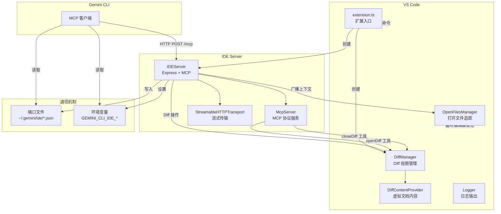
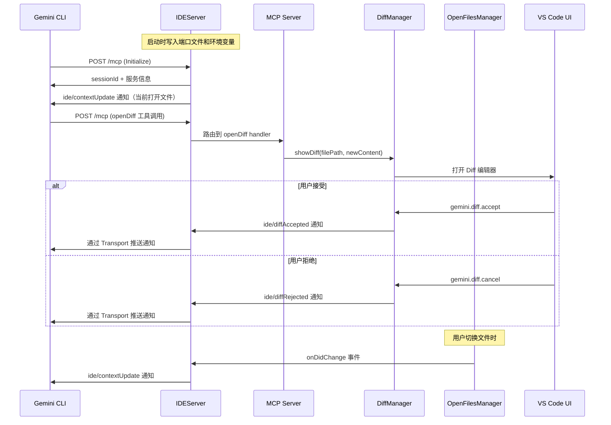

# packages/vscode-ide-companion

## 概述

`gemini-cli-vscode-ide-companion` 是 Gemini CLI 的 VS Code 伴侣扩展，使 Gemini CLI 能够直接访问 IDE 工作区。它通过内嵌的 MCP (Model Context Protocol) 服务器与 CLI 通信，提供 Diff 视图管理、打开文件追踪、IDE 上下文同步等功能。该扩展在 VS Code、Firebase Studio 和 Cloud Shell 中均可使用。

## 目录结构

```
packages/vscode-ide-companion/
├── package.json                  # VS Code 扩展清单
├── src/
│   ├── extension.ts              # 扩展入口（activate/deactivate）
│   ├── ide-server.ts             # IDEServer - MCP HTTP 服务器
│   ├── diff-manager.ts           # DiffManager - Diff 视图管理
│   ├── open-files-manager.ts     # OpenFilesManager - 打开文件追踪
│   ├── extension.test.ts         # 扩展测试
│   ├── ide-server.test.ts        # IDE 服务器测试
│   ├── open-files-manager.test.ts# 打开文件管理器测试
│   └── utils/
│       └── logger.ts             # 日志工具
```

## 架构图



## 核心组件

### Extension (`src/extension.ts`)

扩展入口，负责：
- 创建并启动 IDEServer
- 注册 Diff 相关命令（accept / cancel）
- 注册 `gemini-cli.runGeminiCLI` 命令（在终端中启动 CLI）
- 注册 `gemini-cli.showNotices` 命令（查看第三方许可）
- 检查扩展更新（从 VS Code Marketplace 获取最新版本）
- 管理扩展表面检测（Firebase Studio / Cloud Shell 为托管扩展）

### IDEServer (`src/ide-server.ts`)

基于 Express 的 MCP 服务器：

- **安全机制**：
  - CORS 策略：仅允许无 Origin 的请求（非浏览器请求）
  - Host 验证：仅允许 localhost/127.0.0.1
  - Bearer Token 认证
- **MCP 工具**：
  - `openDiff` - 打开 Diff 视图（创建或修改文件）
  - `closeDiff` - 关闭 Diff 视图并返回修改后内容
- **会话管理**：支持多个 MCP 会话，每个会话有独立的 StreamableHTTPServerTransport
- **Keep-alive**：每 60 秒发送 ping，3 次失败后清理会话
- **上下文同步**：新会话连接时发送 IDE 上下文通知

### DiffManager (`src/diff-manager.ts`)

管理 Diff 视图的完整生命周期：

- `showDiff(filePath, newContent)` - 创建 Diff 视图（原文件 vs 修改后内容）
- `acceptDiff(uri)` - 用户接受更改（触发 `ide/diffAccepted` 通知）
- `cancelDiff(uri)` - 用户取消更改（触发 `ide/diffRejected` 通知）
- `closeDiff(filePath)` - 程序化关闭 Diff 视图
- 使用 `gemini-diff` URI scheme 和 `DiffContentProvider` 管理虚拟文档内容

### OpenFilesManager (`src/open-files-manager.ts`)

追踪 IDE 工作区状态：

- 监听编辑器切换、选区变化、文件关闭/删除/重命名事件
- 维护最近打开的文件列表（最多 10 个，LRU 策略）
- 追踪活动文件的光标位置和选中文本（最大 16KB）
- 通过 `onDidChange` 事件通知外部（50ms 防抖）
- `state` 属性返回 `IdeContext`（包含 openFiles 和 isTrusted）

### Logger (`src/utils/logger.ts`)

条件日志工具：仅在开发模式或 `gemini-cli.debug.logging.enabled` 设置开启时输出日志。

## 依赖关系

### 内部依赖
- `@google/gemini-cli-core` - IDE 类型定义、tmpdir 工具函数

### 外部依赖
- `@modelcontextprotocol/sdk` (^1.23.0) - MCP 协议 SDK
- `express` (^5.1.0) - HTTP 框架
- `cors` (^2.8.5) - CORS 中间件
- `zod` (^3.25.76) - 运行时类型校验

### VS Code API
- `vscode` (^1.99.0) - VS Code 扩展 API

## 数据流

### CLI 与 IDE 通信流程



### 端口发现机制

1. 扩展启动时在随机端口启动 HTTP 服务器
2. 将端口号、工作区路径和认证 Token 写入：
   - 环境变量：`GEMINI_CLI_IDE_SERVER_PORT`、`GEMINI_CLI_IDE_WORKSPACE_PATH`、`GEMINI_CLI_IDE_AUTH_TOKEN`
   - 端口文件：`~/.gemini/ide/gemini-ide-server-{ppid}-{port}.json`
3. CLI 启动时读取环境变量或扫描端口文件来发现 IDE 服务器
