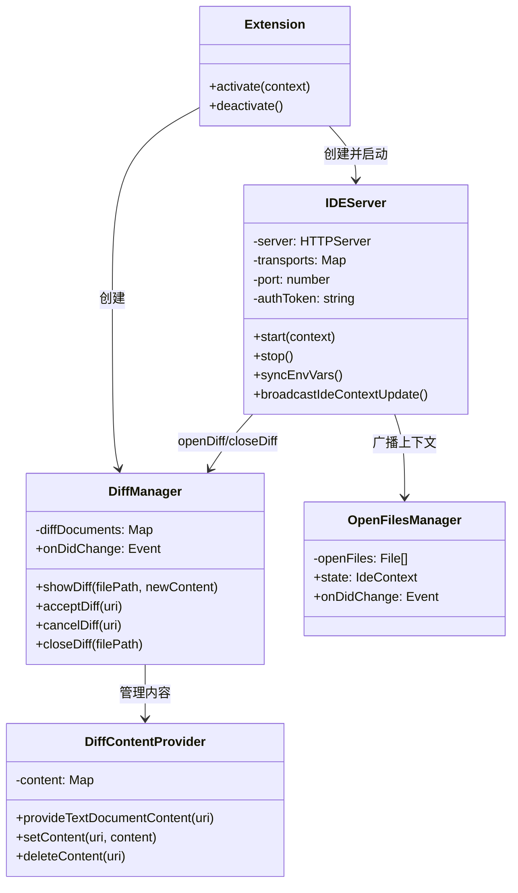

# packages/vscode-ide-companion/src

## 概述

VS Code 伴侣扩展的核心源码目录，包含扩展入口、MCP IDE 服务器、Diff 视图管理器和打开文件追踪器。

## 目录结构

```
src/
├── extension.ts              # 扩展入口（activate/deactivate）
├── ide-server.ts             # IDEServer - Express MCP HTTP 服务器
├── diff-manager.ts           # DiffManager/DiffContentProvider - Diff 视图管理
├── open-files-manager.ts     # OpenFilesManager - 打开文件追踪
├── extension.test.ts
├── ide-server.test.ts
├── open-files-manager.test.ts
└── utils/
    └── logger.ts             # 条件日志工具
```

## 架构图



## 核心组件

### extension.ts

| 注册的命令 | 快捷键 | 说明 |
|-----------|--------|------|
| `gemini.diff.accept` | Ctrl/Cmd+S (Diff 可见时) | 接受 Diff 更改 |
| `gemini.diff.cancel` | - | 关闭 Diff 编辑器 |
| `gemini-cli.runGeminiCLI` | - | 在终端运行 Gemini CLI |
| `gemini-cli.showNotices` | - | 查看第三方许可 |

### ide-server.ts

MCP 工具注册：

| 工具名 | 说明 | 参数 |
|--------|------|------|
| `openDiff` | 打开 Diff 视图创建/修改文件 | filePath, newContent |
| `closeDiff` | 关闭指定文件的 Diff 视图 | filePath |

安全层级：
1. CORS - 仅允许非浏览器请求
2. Host 头验证 - 仅允许 localhost
3. Bearer Token 认证 - 随机生成的 UUID

### diff-manager.ts

使用 `gemini-diff` URI scheme 管理虚拟文档。`DiffContentProvider` 实现 `TextDocumentContentProvider` 接口，通过 Map 存储虚拟文档内容。Diff 操作结果通过 `onDidChange` 事件以 JSON-RPC 通知形式广播。

### open-files-manager.ts

监听 5 种 VS Code 事件：
1. `onDidChangeActiveTextEditor` - 编辑器切换
2. `onDidChangeTextEditorSelection` - 选区变化
3. `onDidCloseTextDocument` - 文件关闭
4. `onDidDeleteFiles` - 文件删除
5. `onDidRenameFiles` - 文件重命名

## 依赖关系

### 内部依赖
- `@google/gemini-cli-core/src/ide/types.js` - IDE 类型定义
- `@google/gemini-cli-core/src/ide/detect-ide.js` - IDE 检测

### 外部依赖
- `@modelcontextprotocol/sdk` - MCP 服务端
- `express` - HTTP 框架
- `cors` - CORS 中间件
- `vscode` - VS Code API
