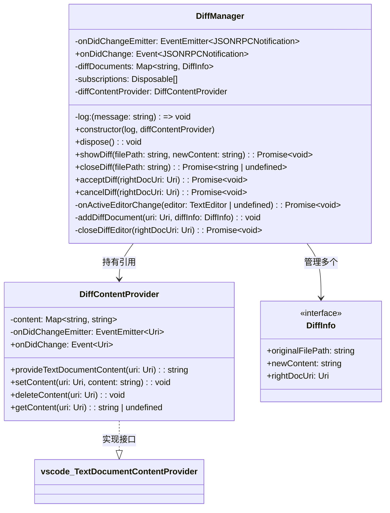
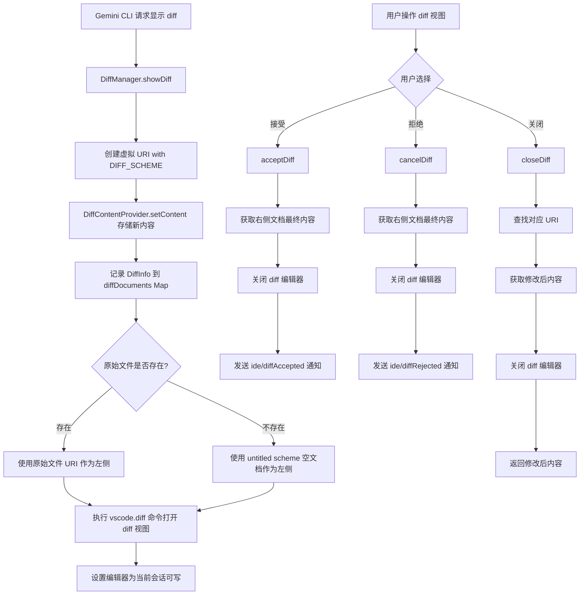

# diff-manager.ts

## 概述

`diff-manager.ts` 是 VSCode IDE Companion 扩展中负责**差异视图（Diff View）管理**的核心模块。它提供了两个主要导出类：

- **`DiffContentProvider`**：实现 VSCode 的 `TextDocumentContentProvider` 接口，作为虚拟文档内容提供者，为 diff 视图的右侧（修改后内容）提供文本内容。
- **`DiffManager`**：管理 diff 视图的完整生命周期，包括创建、显示、接受、拒绝和关闭 diff 视图，并通过 JSON-RPC 通知将用户的操作结果传递给 Gemini CLI Core。

该模块的核心职责是：当 Gemini CLI 建议对文件进行修改时，在 VSCode 中以 diff 视图的方式呈现原始文件与修改内容的对比，让用户可以审查、编辑、接受或拒绝这些修改。

## 架构图





## 核心组件

### `DiffContentProvider` 类

实现 `vscode.TextDocumentContentProvider` 接口的虚拟文档内容提供者。

| 成员 | 类型 | 说明 |
|------|------|------|
| `content` | `Map<string, string>` | 以 URI 字符串为键，存储虚拟文档的文本内容 |
| `onDidChangeEmitter` | `EventEmitter<Uri>` | 内容变更事件发射器 |
| `onDidChange` | `Event<Uri>` | 外部可订阅的内容变更事件（只读属性） |

**方法：**

- **`provideTextDocumentContent(uri: Uri): string`**
  - VSCode 框架调用的接口方法，根据 URI 返回对应的虚拟文档内容。
  - 若 URI 未找到对应内容，返回空字符串。

- **`setContent(uri: Uri, content: string): void`**
  - 设置指定 URI 的虚拟文档内容，并触发 `onDidChange` 事件通知 VSCode 刷新。

- **`deleteContent(uri: Uri): void`**
  - 删除指定 URI 对应的虚拟文档内容。

- **`getContent(uri: Uri): string | undefined`**
  - 获取指定 URI 对应的虚拟文档内容，不存在时返回 `undefined`。

### `DiffInfo` 接口

描述一个当前打开的 diff 视图的信息。

| 字段 | 类型 | 说明 |
|------|------|------|
| `originalFilePath` | `string` | 原始文件的文件系统路径 |
| `newContent` | `string` | 修改后的新内容 |
| `rightDocUri` | `vscode.Uri` | diff 视图右侧文档的虚拟 URI |

### `DiffManager` 类

管理 diff 视图的状态和生命周期的核心管理器。

**构造函数：**

```typescript
constructor(
  log: (message: string) => void,
  diffContentProvider: DiffContentProvider
)
```

- `log`：日志输出函数，用于记录调试信息。
- `diffContentProvider`：`DiffContentProvider` 实例，用于管理虚拟文档内容。
- 构造时会订阅 `onDidChangeActiveTextEditor` 事件，根据活动编辑器是否为 diff 文档来设置 `gemini.diff.isVisible` 上下文。

**公共方法：**

- **`dispose(): void`**
  - 释放所有事件订阅资源。

- **`showDiff(filePath: string, newContent: string): Promise<void>`**
  - 创建并显示一个新的 diff 视图。
  - 使用 `DIFF_SCHEME` 创建右侧虚拟文档 URI（带随机查询参数防缓存）。
  - 若原始文件不存在，使用 `untitled` scheme 的空文档作为左侧。
  - 调用 `vscode.diff` 命令打开对比视图，标题格式为 `文件名 <-> Modified`。
  - 设置 `gemini.diff.isVisible` 上下文为 `true`。
  - 执行 `setActiveEditorWriteableInSession` 使 diff 右侧可编辑。

- **`closeDiff(filePath: string): Promise<string | undefined>`**
  - 根据原始文件路径关闭对应的 diff 视图。
  - 返回关闭时右侧文档的最终内容（用户可能已在 diff 视图中编辑），找不到则返回 `undefined`。

- **`acceptDiff(rightDocUri: Uri): Promise<void>`**
  - 用户接受 diff 变更时调用。
  - 获取右侧文档的最终文本内容，关闭 diff 编辑器。
  - 通过 `onDidChangeEmitter` 发送 `ide/diffAccepted` JSON-RPC 通知，携带文件路径和最终内容。

- **`cancelDiff(rightDocUri: Uri): Promise<void>`**
  - 用户拒绝 diff 变更时调用。
  - 获取右侧文档的最终文本内容，关闭 diff 编辑器。
  - 通过 `onDidChangeEmitter` 发送 `ide/diffRejected` JSON-RPC 通知，携带文件路径和最终内容。

**私有方法：**

- **`onActiveEditorChange(editor: TextEditor | undefined): Promise<void>`**
  - 活动编辑器变化时的回调。检查当前编辑器是否是 diff 文档（右侧或左侧），据此设置 `gemini.diff.isVisible` 上下文变量，控制 UI 中接受/拒绝按钮的可见性。

- **`addDiffDocument(uri: Uri, diffInfo: DiffInfo): void`**
  - 将 diff 文档信息添加到 `diffDocuments` Map 中。

- **`closeDiffEditor(rightDocUri: Uri): Promise<void>`**
  - 关闭 diff 编辑器的底层实现。
  - 设置 `gemini.diff.isVisible` 为 `false`。
  - 从 `diffDocuments` Map 和 `diffContentProvider` 中清理数据。
  - 遍历所有标签页组，找到匹配的 `TabInputTextDiff` 标签页并关闭。

### 事件机制

`DiffManager` 通过 `onDidChange` 事件向外部传递 JSON-RPC 通知：

- **`ide/diffAccepted`**：用户接受 diff 时触发，参数包含 `filePath` 和 `content`。
- **`ide/diffRejected`**：用户拒绝 diff 时触发，参数包含 `filePath` 和 `content`。

## 依赖关系

### 内部依赖

| 模块 | 导入内容 | 用途 |
|------|---------|------|
| `@google/gemini-cli-core/src/ide/types.js` | `IdeDiffAcceptedNotificationSchema`, `IdeDiffRejectedNotificationSchema` | Zod schema，用于构建和验证 diff 接受/拒绝的 JSON-RPC 通知消息 |
| `./extension.js` | `DIFF_SCHEME` | diff 虚拟文档的 URI scheme 常量 |

### 外部依赖

| 模块 | 导入内容 | 用途 |
|------|---------|------|
| `@modelcontextprotocol/sdk/types.js` | `JSONRPCNotification` 类型 | JSON-RPC 通知消息的类型定义 |
| `node:path` | `path` | 文件路径操作（提取文件名 `path.basename`） |
| `vscode` | 多个 API | VSCode 扩展 API：URI、命令、编辑器、标签页等 |

## 关键实现细节

1. **虚拟文档 scheme 机制**：使用自定义的 `DIFF_SCHEME` 注册虚拟文档提供者（`DiffContentProvider`），使得 diff 视图的右侧可以展示非文件系统的内容。这是 VSCode 扩展 API 的标准模式。

2. **缓存破坏（Cache Busting）**：创建右侧文档 URI 时使用 `query: rand=${Math.random()}` 防止 VSCode 缓存旧内容，确保每次 `showDiff` 都使用最新内容。

3. **新文件支持**：当原始文件不存在时（新建文件的场景），使用 `untitled` scheme 创建空文档作为 diff 左侧，避免文件不存在的错误。

4. **用户可编辑 diff**：调用 `workbench.action.files.setActiveEditorWriteableInSession` 使 diff 视图右侧可编辑，用户可以在接受前进一步修改内容。

5. **上下文变量控制 UI**：通过 `setContext` 命令设置 `gemini.diff.isVisible` 上下文变量，配合 `package.json` 中的 `when` 条件控制接受/拒绝按钮在 UI 中的可见性。

6. **标签页关闭策略**：`closeDiffEditor` 方法遍历所有标签页组（`tabGroups.all`），通过 `TabInputTextDiff` 类型检查和 URI 匹配找到目标 diff 标签页并关闭。这是因为 VSCode 没有直接通过 URI 关闭 diff 编辑器的 API。

7. **内容获取时机**：在关闭 diff 编辑器之前，先通过 `openTextDocument` 和 `getText()` 获取用户可能已编辑的最终内容，确保不丢失用户的编辑。

8. **JSON-RPC 消息验证**：使用 Zod schema（`IdeDiffAcceptedNotificationSchema.parse` / `IdeDiffRejectedNotificationSchema.parse`）对发出的通知消息进行运行时类型验证，保证消息格式正确。
