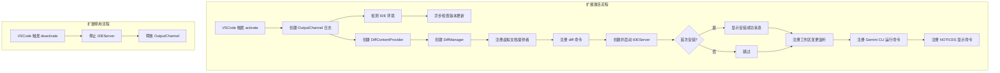
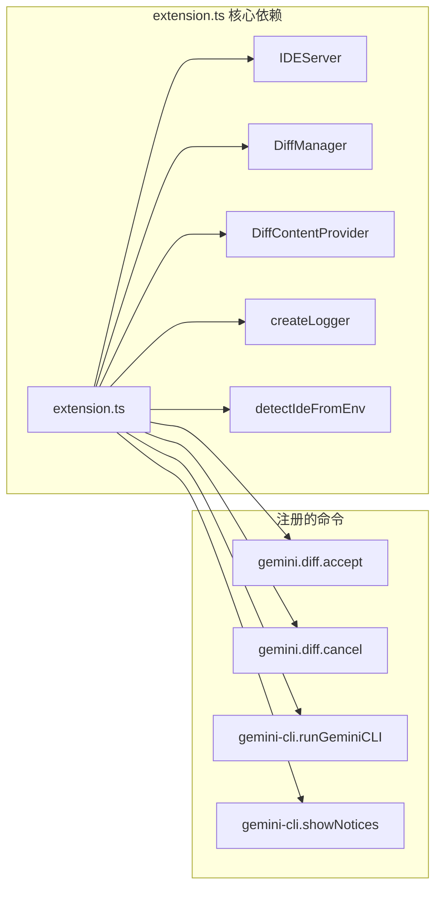

# extension.ts

## 概述

`extension.ts` 是 VSCode IDE Companion 扩展的**入口文件**，定义了扩展的激活（`activate`）和停用（`deactivate`）生命周期函数。它是整个扩展的"胶水层"，负责：

1. **初始化日志系统**：创建 OutputChannel 和 logger。
2. **版本更新检查**：从 VSCode Marketplace 查询最新版本并提示用户更新。
3. **初始化 Diff 系统**：创建 `DiffContentProvider` 和 `DiffManager`，注册虚拟文档提供者和 diff 相关命令。
4. **启动 IDE Server**：创建并启动 `IDEServer`，提供与 Gemini CLI 的通信能力。
5. **注册 VSCode 命令**：包括运行 Gemini CLI、显示通知文件、接受/拒绝 diff 等命令。
6. **首次安装提示**：首次安装时向用户显示安装成功消息。
7. **工作区变更监听**：监听工作区文件夹变化和信任授权变化，同步环境变量。

## 架构图





## 核心组件

### 常量

| 常量名 | 值 | 说明 |
|--------|-----|------|
| `CLI_IDE_COMPANION_IDENTIFIER` | `'Google.gemini-cli-vscode-ide-companion'` | 扩展在 VSCode Marketplace 上的唯一标识符 |
| `INFO_MESSAGE_SHOWN_KEY` | `'geminiCliInfoMessageShown'` | 用于 `globalState` 中记录首次安装消息是否已显示的键名 |
| `DIFF_SCHEME` | `'gemini-diff'` | diff 虚拟文档的 URI scheme，被 `diff-manager.ts` 引用（导出常量） |
| `MANAGED_EXTENSION_SURFACES` | `Set(['Firebase Studio', 'Cloud Shell'])` | 托管环境集合，在这些环境中扩展由 IDE 自动管理安装/更新，无需提示用户 |

### 模块级变量

| 变量名 | 类型 | 说明 |
|--------|------|------|
| `ideServer` | `IDEServer` | IDE 服务器实例，在 `activate` 中创建，`deactivate` 中停止 |
| `logger` | `vscode.OutputChannel` | VSCode 输出频道，用于日志输出 |
| `log` | `(message: string) => void` | 日志函数，初始为空操作，在 `activate` 中通过 `createLogger` 初始化 |

### `checkForUpdates` 函数

```typescript
async function checkForUpdates(
  context: vscode.ExtensionContext,
  log: (message: string) => void,
  isManagedExtensionSurface: boolean
): Promise<void>
```

**功能**：检查扩展是否有新版本可用。

**详细流程**：
1. 获取当前扩展版本号（从 `packageJSON.version`）。
2. 向 VSCode Marketplace API（`https://marketplace.visualstudio.com/_apis/public/gallery/extensionquery`）发送 POST 请求查询最新版本。
3. 使用 `semver.gt` 比较版本号。
4. 若非托管环境且存在更新，弹出信息消息提示用户，用户点击"Update to latest version"后执行 `workbench.extensions.installExtension` 命令。
5. 错误被捕获并记录日志，不会影响扩展正常运行。

### `activate` 函数（导出）

```typescript
export async function activate(context: vscode.ExtensionContext): Promise<void>
```

**功能**：扩展激活入口，VSCode 在满足激活条件时调用。

**详细步骤**：
1. 创建 `OutputChannel`（名称 "Gemini CLI IDE Companion"）。
2. 使用 `createLogger` 初始化 `log` 函数。
3. 检测当前 IDE 环境（`detectIdeFromEnv`），判断是否为托管环境。
4. 异步启动版本更新检查（不阻塞后续逻辑）。
5. 创建 `DiffContentProvider` 和 `DiffManager` 实例。
6. 注册事件和命令到 `context.subscriptions`：
   - `onDidCloseTextDocument`：当 diff scheme 文档关闭时自动取消 diff。
   - `registerTextDocumentContentProvider`：注册 `gemini-diff` scheme 的虚拟文档提供者。
   - `gemini.diff.accept` 命令：接受 diff 变更。
   - `gemini.diff.cancel` 命令：拒绝/取消 diff 变更。
7. 创建并启动 `IDEServer`。
8. 首次安装时显示安装成功的提示消息（通过 `globalState` 记录状态）。
9. 注册工作区变更和信任变更的监听器，触发 `ideServer.syncEnvVars()`。
10. 注册 `gemini-cli.runGeminiCLI` 命令：在终端中打开 Gemini CLI。
11. 注册 `gemini-cli.showNotices` 命令：显示 NOTICES.txt 开源许可文件。

### `deactivate` 函数（导出）

```typescript
export async function deactivate(): Promise<void>
```

**功能**：扩展停用时的清理函数。

**详细步骤**：
1. 记录停用日志。
2. 尝试停止 `IDEServer`。
3. 无论成功与否，在 `finally` 中释放 `OutputChannel`。

### 注册的 VSCode 命令

| 命令 ID | 功能 | 说明 |
|---------|------|------|
| `gemini.diff.accept` | 接受当前 diff | 获取当前活动编辑器或传入的 URI，若为 `gemini-diff` scheme 则调用 `diffManager.acceptDiff` |
| `gemini.diff.cancel` | 拒绝当前 diff | 同上，调用 `diffManager.cancelDiff` |
| `gemini-cli.runGeminiCLI` | 在终端运行 Gemini CLI | 选择工作区文件夹后创建终端并执行 `gemini` 命令 |
| `gemini-cli.showNotices` | 显示开源许可 | 打开扩展目录下的 `NOTICES.txt` 文件 |

## 依赖关系

### 内部依赖

| 模块 | 导入内容 | 用途 |
|------|---------|------|
| `./ide-server.js` | `IDEServer` | IDE 服务器，提供与 Gemini CLI 的通信 |
| `./diff-manager.js` | `DiffContentProvider`, `DiffManager` | diff 视图的内容提供和生命周期管理 |
| `./utils/logger.js` | `createLogger` | 创建带有日志级别控制的日志函数 |
| `@google/gemini-cli-core/src/ide/detect-ide.js` | `detectIdeFromEnv`, `IDE_DEFINITIONS`, `IdeInfo` | 检测当前 IDE 环境（Firebase Studio、Cloud Shell 等） |

### 外部依赖

| 模块 | 导入内容 | 用途 |
|------|---------|------|
| `vscode` | 多个 API | VSCode 扩展框架 API |
| `semver` | 默认导入 | 语义化版本号比较，用于更新检查 |

## 关键实现细节

1. **托管环境检测**：通过 `detectIdeFromEnv()` 检测当前运行环境。对于 Firebase Studio 和 Cloud Shell 等托管环境，扩展的安装和更新由 IDE 本身管理，因此跳过更新提示和首次安装消息。

2. **Marketplace API 调用**：更新检查使用 VSCode Marketplace 的公开 Gallery API，通过 `filterType: 7`（ExtensionName 过滤器）和 `flags: 946`（包含版本、文件、分类、描述、发布者、统计信息）查询扩展信息。返回的版本按日期排序，取第一个即为最新版本。

3. **diff 命令的 URI 解析策略**：`gemini.diff.accept` 和 `gemini.diff.cancel` 命令接受可选的 `Uri` 参数。若未传入（如通过命令面板调用），则回退到当前活动编辑器的文档 URI。同时会校验 URI scheme 是否为 `gemini-diff`，防止对非 diff 文档误操作。

4. **文档关闭时自动取消**：监听 `onDidCloseTextDocument` 事件，当关闭的是 `gemini-diff` scheme 的文档时自动调用 `cancelDiff`，确保用户通过关闭标签页操作也能正确发送拒绝通知。

5. **Gemini CLI 终端集成**：`runGeminiCLI` 命令支持多工作区，当有多个工作区文件夹时弹出选择器让用户选择。创建的终端名称包含文件夹名称以便区分。

6. **环境变量同步**：监听 `onDidChangeWorkspaceFolders`（工作区文件夹增减）和 `onDidGrantWorkspaceTrust`（信任授权变化），触发 `ideServer.syncEnvVars()` 保持环境变量与工作区状态一致。

7. **异步启动模式**：`checkForUpdates` 以 fire-and-forget 模式异步执行，不阻塞扩展的主要初始化流程。IDE Server 的启动失败也只记录日志不中断扩展。

8. **资源清理**：所有注册的命令、事件监听器和文档提供者都通过 `context.subscriptions.push` 注册到 VSCode 的生命周期管理中，确保扩展停用时自动释放。
