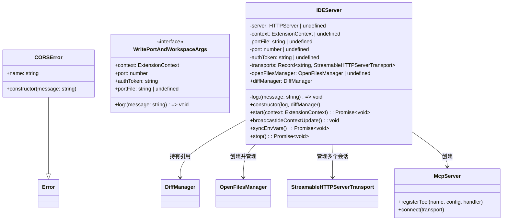
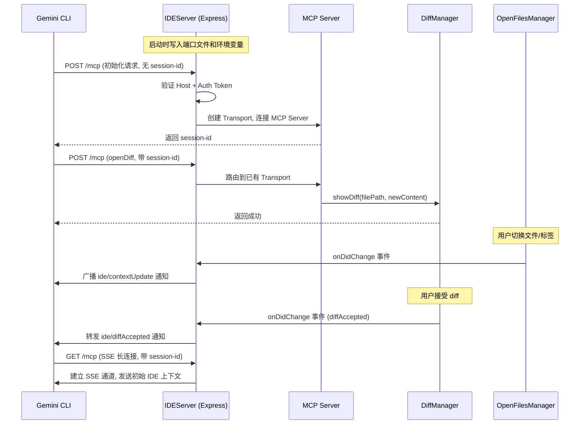

# ide-server.ts

## 概述

`ide-server.ts` 是 VSCode IDE Companion 扩展中的**核心通信服务器模块**。它实现了一个基于 HTTP 的 MCP（Model Context Protocol）服务器，使 Gemini CLI 命令行工具能够与 VSCode IDE 进行双向通信。

该模块的主要职责包括：

1. **启动本地 HTTP 服务器**：在 `127.0.0.1` 上随机端口监听，仅接受本地请求。
2. **MCP 协议支持**：通过 `StreamableHTTPServerTransport` 实现 MCP 会话管理，支持多个并发客户端连接。
3. **安全防护**：实现 CORS 策略（仅允许非浏览器请求）、Host 头验证和 Bearer Token 认证。
4. **端口发现机制**：将服务器端口、工作区路径和认证令牌写入环境变量和临时文件，供 Gemini CLI 发现和连接。
5. **IDE 上下文广播**：将 IDE 中打开的文件信息广播给所有连接的 CLI 客户端。
6. **Diff 工具注册**：通过 MCP 注册 `openDiff` 和 `closeDiff` 工具，允许 CLI 在 IDE 中打开和关闭 diff 视图。

## 架构图

```mermaid
flowchart TB
    subgraph 服务器启动流程
        A[IDEServer.start] --> B[生成认证令牌 UUID]
        B --> C[创建 Express 应用]
        C --> D[配置中间件]
        D --> D1[JSON 解析 - 10MB 限制]
        D --> D2[CORS 策略 - 仅非浏览器请求]
        D --> D3[Host 头验证]
        D --> D4[Bearer Token 认证]
        D --> E[创建 MCP Server]
        E --> F[创建 OpenFilesManager]
        F --> G[订阅文件变更和 diff 变更事件]
        G --> H[注册 POST /mcp 路由]
        H --> I[注册 GET /mcp 路由]
        I --> J[注册错误处理中间件]
        J --> K[监听随机端口 127.0.0.1]
        K --> L[写入端口文件和环境变量]
    end

    subgraph 请求处理流程
        M[POST /mcp 请求] --> N{有 session-id?}
        N -->|有且已存在| O[复用已有 transport]
        N -->|无 + 是初始化请求| P[创建新 transport]
        N -->|无 + 非初始化请求| Q[返回 400 错误]
        P --> R[设置 keep-alive 定时器 60秒]
        P --> S[注册 onclose 清理回调]
        P --> T[连接到 MCP Server]
        O --> U[transport.handleRequest]
        T --> U
    end

    subgraph MCP 工具
        V[openDiff 工具] --> W[调用 diffManager.showDiff]
        X[closeDiff 工具] --> Y[调用 diffManager.closeDiff]
    end

    subgraph 上下文广播
        Z[文件变更事件] --> AA[broadcastIdeContextUpdate]
        AA --> AB[向所有 transport 发送 ide/contextUpdate]
    end
```







## 核心组件

### 常量

| 常量名 | 值 | 说明 |
|--------|-----|------|
| `MCP_SESSION_ID_HEADER` | `'mcp-session-id'` | HTTP 请求头中携带 MCP 会话 ID 的头名称 |
| `IDE_SERVER_PORT_ENV_VAR` | `'GEMINI_CLI_IDE_SERVER_PORT'` | 传递服务器端口号的环境变量名 |
| `IDE_WORKSPACE_PATH_ENV_VAR` | `'GEMINI_CLI_IDE_WORKSPACE_PATH'` | 传递工作区路径的环境变量名 |
| `IDE_AUTH_TOKEN_ENV_VAR` | `'GEMINI_CLI_IDE_AUTH_TOKEN'` | 传递认证令牌的环境变量名 |

### `CORSError` 类

继承自 `Error` 的自定义错误类，用于在 CORS 验证失败时抛出，由错误处理中间件捕获并返回 403 状态码。

### `WritePortAndWorkspaceArgs` 接口

`writePortAndWorkspace` 函数的参数类型定义。

| 字段 | 类型 | 说明 |
|------|------|------|
| `context` | `vscode.ExtensionContext` | 扩展上下文 |
| `port` | `number` | 服务器端口号 |
| `authToken` | `string` | 认证令牌 |
| `portFile` | `string \| undefined` | 端口文件路径 |
| `log` | `(message: string) => void` | 日志函数 |

### `writePortAndWorkspace` 函数

```typescript
async function writePortAndWorkspace(args: WritePortAndWorkspaceArgs): Promise<void>
```

**功能**：将服务器连接信息持久化到两个位置：
1. **VSCode 环境变量集合**（`environmentVariableCollection`）：设置 `GEMINI_CLI_IDE_SERVER_PORT`、`GEMINI_CLI_IDE_WORKSPACE_PATH`、`GEMINI_CLI_IDE_AUTH_TOKEN`，使得从 VSCode 终端启动的 CLI 进程自动继承这些变量。
2. **临时端口文件**：将 `{ port, workspacePath, authToken }` 写为 JSON 到临时目录，文件权限设为 `0o600`（仅所有者可读写），供独立启动的 CLI 进程发现。

工作区路径通过 `path.delimiter` 连接多个工作区文件夹路径。

### `sendIdeContextUpdateNotification` 函数

```typescript
function sendIdeContextUpdateNotification(
  transport: StreamableHTTPServerTransport,
  log: (message: string) => void,
  openFilesManager: OpenFilesManager
): void
```

**功能**：获取 `OpenFilesManager` 的当前状态，构建 `ide/contextUpdate` JSON-RPC 通知并通过指定的 transport 发送给客户端。使用 `IdeContextNotificationSchema.parse` 进行 Zod 运行时验证。

### `getSessionId` 函数

```typescript
function getSessionId(req: Request): string | undefined
```

**功能**：从 HTTP 请求头中提取 `mcp-session-id`，处理头值可能是数组的情况。

### `IDEServer` 类

IDE 通信服务器的核心类。

**构造函数：**

```typescript
constructor(log: (message: string) => void, diffManager: DiffManager)
```

**公共方法：**

- **`start(context: ExtensionContext): Promise<void>`**
  - 启动服务器的主方法，返回一个在服务器开始监听时 resolve 的 Promise。
  - 详细流程：
    1. 生成 UUID 认证令牌。
    2. 创建 Express 应用并配置 4 层中间件（JSON 解析、CORS、Host 验证、Token 认证）。
    3. 调用 `createMcpServer` 创建 MCP 服务器实例，注册 diff 工具。
    4. 创建 `OpenFilesManager`，订阅文件变更事件以广播 IDE 上下文。
    5. 订阅 `DiffManager.onDidChange` 事件，将 diff 接受/拒绝通知转发给所有连接的客户端。
    6. 注册 `POST /mcp` 路由处理 MCP 请求（初始化和后续请求）。
    7. 注册 `GET /mcp` 路由处理 SSE 长连接请求，首次连接时发送初始 IDE 上下文。
    8. 注册 Express 错误处理中间件。
    9. 在 `127.0.0.1` 上监听随机端口（端口 0），启动后写入端口文件和环境变量。

- **`broadcastIdeContextUpdate(): void`**
  - 向所有已连接的 MCP 客户端广播当前 IDE 上下文信息（打开的文件等）。

- **`syncEnvVars(): Promise<void>`**
  - 重新写入端口文件和环境变量（用于工作区文件夹变更时），并广播 IDE 上下文更新。

- **`stop(): Promise<void>`**
  - 停止 HTTP 服务器，清除环境变量集合，删除端口文件。

**会话管理：**

`transports` 字典以 `sessionId` 为键存储每个客户端的 `StreamableHTTPServerTransport`。新会话的创建流程：
1. 检测到 `POST /mcp` 请求无 `session-id` 且请求体为 MCP 初始化请求。
2. 创建新的 `StreamableHTTPServerTransport`，生成 UUID 作为会话 ID。
3. 设置 60 秒间隔的 keep-alive ping，连续 3 次失败则清理。
4. 注册 `onclose` 回调清理会话数据。
5. 连接到 MCP Server。

### `createMcpServer` 函数

```typescript
const createMcpServer = (
  diffManager: DiffManager,
  log: (message: string) => void
) => McpServer
```

**功能**：创建并配置 MCP 服务器实例，注册两个工具：

| 工具名 | 描述 | 输入 Schema | 行为 |
|--------|------|-------------|------|
| `openDiff` | 在 IDE 中打开 diff 视图以创建或修改文件 | `OpenDiffRequestSchema.shape` | 调用 `diffManager.showDiff(filePath, newContent)`，返回空内容 |
| `closeDiff` | 关闭指定文件的 diff 视图 | `CloseDiffRequestSchema.shape` | 调用 `diffManager.closeDiff(filePath)`，返回关闭时的文件内容 |

MCP 服务器配置：
- 名称：`gemini-cli-companion-mcp-server`
- 版本：`1.0.0`
- 能力：`logging`

## 依赖关系

### 内部依赖

| 模块 | 导入内容 | 用途 |
|------|---------|------|
| `@google/gemini-cli-core/src/ide/types.js` | `CloseDiffRequestSchema`, `IdeContextNotificationSchema`, `OpenDiffRequestSchema` | Zod schema，用于验证 diff 请求和 IDE 上下文通知 |
| `@google/gemini-cli-core` | `tmpdir` | 获取跨平台临时目录路径 |
| `./diff-manager.js` | `DiffManager` 类型 | diff 视图管理器的类型引用 |
| `./open-files-manager.js` | `OpenFilesManager` | 管理 IDE 中打开的文件状态 |

### 外部依赖

| 模块 | 导入内容 | 用途 |
|------|---------|------|
| `vscode` | 多个 API | VSCode 扩展 API（环境变量、工作区等） |
| `@modelcontextprotocol/sdk/types.js` | `isInitializeRequest` | 判断请求是否为 MCP 初始化请求 |
| `@modelcontextprotocol/sdk/server/mcp.js` | `McpServer` | MCP 协议服务器实现 |
| `@modelcontextprotocol/sdk/server/streamableHttp.js` | `StreamableHTTPServerTransport` | 基于 HTTP 的 MCP 传输层（支持 SSE） |
| `express` | `express`, `Request`, `Response`, `NextFunction` | HTTP 服务器框架 |
| `cors` | `cors` | Express CORS 中间件 |
| `node:crypto` | `randomUUID` | 生成认证令牌和会话 ID |
| `node:http` | `Server` 类型 | HTTP 服务器类型 |
| `node:path` | `path` | 文件路径操作 |
| `node:fs/promises` | `fs` | 异步文件操作（端口文件读写） |
| `zod` | `z` 类型 | Zod 类型推导 |

## 关键实现细节

1. **随机端口监听**：使用 `app.listen(0, '127.0.0.1')` 在本地回环地址上监听随机可用端口，避免端口冲突。端口号在服务器启动后从 `server.address()` 获取。

2. **三层安全防护**：
   - **CORS 策略**：`cors` 中间件配置为仅允许无 `origin` 头的请求（即非浏览器请求），浏览器发起的请求会被 `CORSError` 拒绝。
   - **Host 头验证**：中间件检查 `Host` 头必须是 `localhost:{port}` 或 `127.0.0.1:{port}`，防止 DNS rebinding 攻击。
   - **Bearer Token 认证**：每个请求必须携带 `Authorization: Bearer {token}` 头，token 在服务器启动时随机生成。

3. **端口发现机制**：服务器启动后通过两种方式让 Gemini CLI 发现连接信息：
   - **环境变量**：通过 `environmentVariableCollection.replace` 设置三个环境变量，VSCode 终端中启动的 CLI 进程自动继承。
   - **端口文件**：写入 `{tmpdir}/gemini/ide/gemini-ide-server-{ppid}-{port}.json`，文件权限 `0o600`，供外部 CLI 进程通过扫描临时目录发现。

4. **MCP 会话管理**：每个 CLI 客户端连接建立独立的 `StreamableHTTPServerTransport` 会话。初始化请求创建新 transport，后续请求通过 `mcp-session-id` 头路由到对应 transport。

5. **Keep-Alive 机制**：每个会话设置 60 秒间隔的 ping 发送。若连续 3 次 ping 失败（`missedPings >= 3`），则清理定时器。会话关闭时自动清理定时器和 transport 记录。

6. **初始上下文推送**：`GET /mcp` 路由处理 SSE 长连接时，通过 `sessionsWithInitialNotification` Set 跟踪每个会话是否已接收过初始 IDE 上下文通知。首次 GET 请求后立即发送一次 `ide/contextUpdate`。

7. **Diff 事件转发**：订阅 `DiffManager.onDidChange` 事件（包含 `ide/diffAccepted` 和 `ide/diffRejected` 通知），并将通知广播给所有连接的 transport。

8. **JSON 体大小限制**：Express JSON 解析中间件设置 `limit: '10mb'`，支持较大的文件内容传输（如 diff 的新内容）。

9. **优雅停止**：`stop` 方法按顺序关闭 HTTP 服务器、清除环境变量集合、删除端口文件，确保资源完全释放。端口文件删除失败时静默忽略（文件可能已不存在）。
