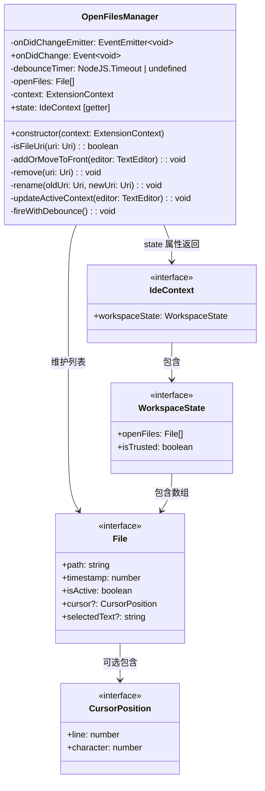
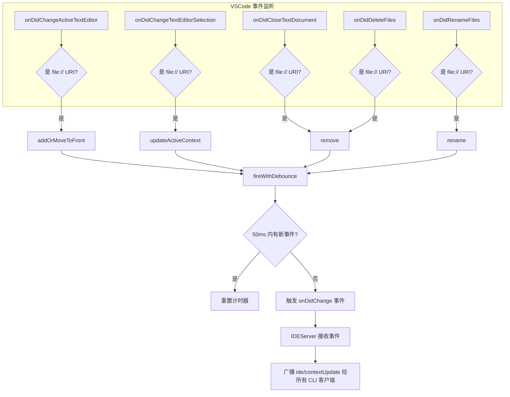

# open-files-manager.ts

## 概述

`open-files-manager.ts` 是 VSCode IDE Companion 扩展中负责**跟踪工作区文件状态**的模块。它维护一个最近访问的打开文件列表（LRU 风格），记录每个文件的路径、时间戳、活跃状态、光标位置和选中文本等上下文信息。

该模块的核心职责是：

1. **跟踪打开的文件**：监听编辑器激活、文档关闭、文件删除和重命名事件，实时维护打开文件列表。
2. **记录光标和选区**：监听文本选择变更事件，更新当前活跃文件的光标位置和选中文本。
3. **提供 IDE 上下文状态**：将工作区状态（打开文件列表、工作区信任状态）封装为 `IdeContext` 对象，供 `IDEServer` 广播给 Gemini CLI。
4. **防抖通知**：通过 50ms 防抖机制避免频繁触发状态更新事件。

## 架构图






## 核心组件

### 导出常量

| 常量名 | 值 | 说明 |
|--------|-----|------|
| `MAX_FILES` | `10` | 打开文件列表的最大容量，超出时移除最旧的文件 |

### 私有常量

| 常量名 | 值 | 说明 |
|--------|-----|------|
| `MAX_SELECTED_TEXT_LENGTH` | `16384` (16 KiB) | 选中文本的最大长度限制，超出时截断 |

### `OpenFilesManager` 类

跟踪工作区打开文件状态的核心管理器。

**构造函数：**

```typescript
constructor(context: vscode.ExtensionContext)
```

构造时注册 5 个 VSCode 事件监听器：

| 监听器 | VSCode 事件 | 行为 |
|--------|------------|------|
| `editorWatcher` | `onDidChangeActiveTextEditor` | 编辑器激活时，将文件添加/移到列表最前，并触发防抖通知 |
| `selectionWatcher` | `onDidChangeTextEditorSelection` | 选区变化时，更新活跃文件的光标和选中文本 |
| `closeWatcher` | `onDidCloseTextDocument` | 文档关闭时，从列表中移除 |
| `deleteWatcher` | `onDidDeleteFiles` | 文件删除时，从列表中移除 |
| `renameWatcher` | `onDidRenameFiles` | 文件重命名时，更新列表中的路径 |

所有监听器都通过 `context.subscriptions.push` 注册，确保扩展停用时自动释放。

初始化时会检查当前活跃编辑器，若存在且为 `file://` URI，则添加到列表。

**公共属性：**

- **`onDidChange: Event<void>`**
  - 外部可订阅的状态变更事件，在打开文件列表或上下文信息发生变化时触发（经过 50ms 防抖）。

- **`state: IdeContext`**（只读 getter）
  - 返回当前 IDE 上下文的快照，包含：
    - `workspaceState.openFiles`：打开文件列表的浅拷贝（`[...this.openFiles]`）。
    - `workspaceState.isTrusted`：当前工作区是否受信任（`vscode.workspace.isTrusted`）。

**私有方法：**

- **`isFileUri(uri: Uri): boolean`**
  - 检查 URI 的 scheme 是否为 `'file'`，过滤掉虚拟文档（如 `untitled`、`gemini-diff` 等 scheme）。

- **`addOrMoveToFront(editor: TextEditor): void`**
  - LRU 核心逻辑。
  - 步骤：
    1. 将当前活跃文件标记为非活跃，清除其光标和选中文本。
    2. 从列表中移除目标文件（如果已存在）。
    3. 将文件以活跃状态插入列表最前方，包含当前时间戳。
    4. 若列表超过 `MAX_FILES`，移除末尾最旧的文件。
    5. 调用 `updateActiveContext` 更新光标和选区信息。

- **`remove(uri: Uri): void`**
  - 根据文件路径从 `openFiles` 列表中移除对应文件。

- **`rename(oldUri: Uri, newUri: Uri): void`**
  - 在列表中找到旧路径的文件，将其路径更新为新路径。若新 URI 不是 `file://` scheme，则改为移除。

- **`updateActiveContext(editor: TextEditor): void`**
  - 更新活跃文件的光标位置和选中文本。
  - 光标位置转换为从 1 开始的行号和列号（VSCode API 使用从 0 开始）。
  - 选中文本超过 `MAX_SELECTED_TEXT_LENGTH` 时截断为前 16KiB。
  - 空选中文本转为 `undefined`。

- **`fireWithDebounce(): void`**
  - 50ms 防抖触发 `onDidChange` 事件。每次调用先清除上一次的定时器，然后设置新的 50ms 延迟定时器。

## 依赖关系

### 内部依赖

| 模块 | 导入内容 | 用途 |
|------|---------|------|
| `@google/gemini-cli-core/src/ide/types.js` | `File`, `IdeContext` 类型 | 打开文件信息和 IDE 上下文的类型定义 |

### 外部依赖

| 模块 | 导入内容 | 用途 |
|------|---------|------|
| `vscode` | 多个 API | VSCode 扩展 API：编辑器事件、工作区事件、URI 等 |

## 关键实现细节

1. **LRU（最近最少使用）策略**：`openFiles` 数组以最近访问的顺序排列，最新激活的文件总是在最前方。列表最大长度为 10（`MAX_FILES`），超出时移除末尾（最久未访问）的文件。这确保 Gemini CLI 始终获得最相关的文件上下文。

2. **单活跃文件原则**：列表中同时只有一个文件的 `isActive` 为 `true`。切换编辑器时，先将之前的活跃文件设为非活跃并清除其上下文信息（光标、选中文本），再将新文件设为活跃。

3. **URI scheme 过滤**：所有事件处理器都通过 `isFileUri` 检查只处理 `file://` URI，忽略虚拟文档（如 diff 视图、untitled 文档等），避免虚拟文件污染上下文。

4. **光标位置转换**：VSCode 的 `Position` 使用 0-based 的行号和字符位置，但传递给 CLI 时转换为 1-based（`line + 1`, `character + 1`），更符合用户和编辑器显示的习惯。

5. **选中文本截断**：选中文本最大 16KiB（`MAX_SELECTED_TEXT_LENGTH = 16384`），防止用户选中大量文本时导致传输数据过大。截断使用 `substring` 简单截取前 N 个字符。

6. **50ms 防抖机制**：使用 `setTimeout` 实现防抖，避免快速连续的编辑器切换或选区变化导致过多的上下文广播。50ms 的延迟足够短以保持响应性，又能合并短时间内的多次变化。

7. **状态快照**：`state` getter 返回 `openFiles` 的浅拷贝（`[...this.openFiles]`），防止外部代码修改内部状态。同时包含 `vscode.workspace.isTrusted` 的实时值。

8. **文件重命名处理**：区分了重命名为文件 URI 和非文件 URI 两种情况。若新 URI 是文件则更新路径，否则从列表中移除，处理了边缘情况。

9. **启动时初始化**：构造函数中立即检查当前活跃编辑器并添加到列表，确保扩展激活时已有初始上下文可用，不需要用户切换编辑器才能开始跟踪。
