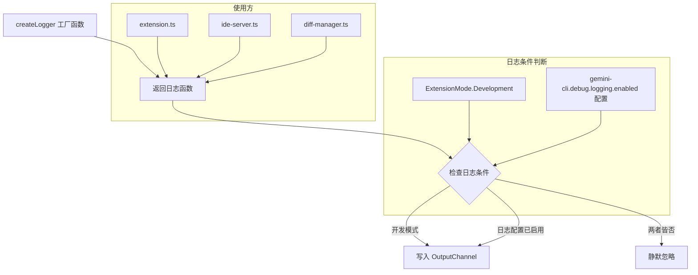
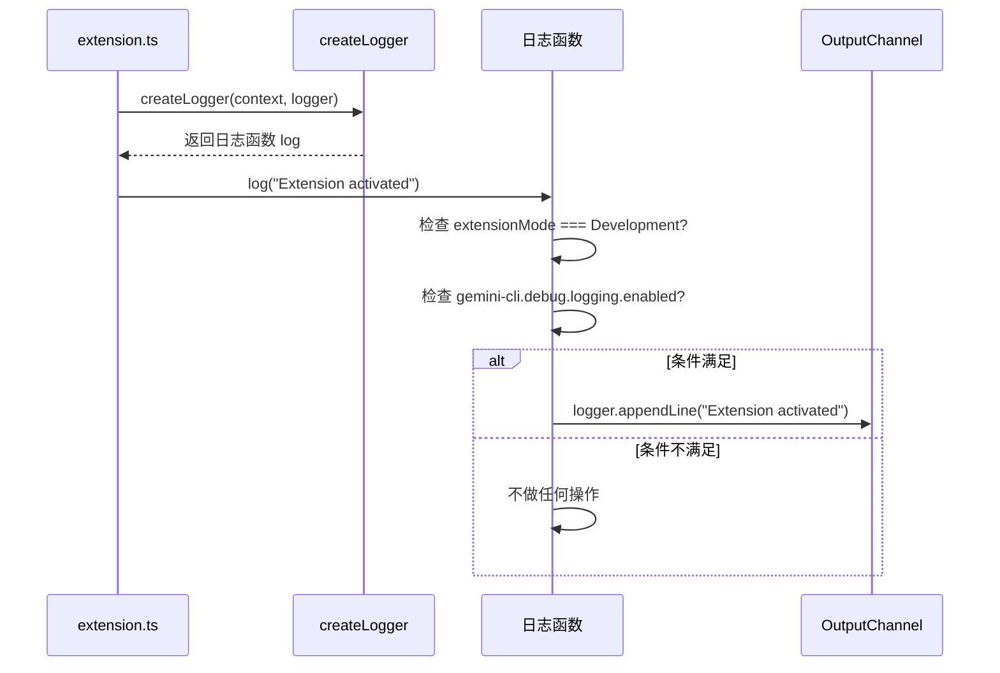

# logger.ts

## 概述

`logger.ts` 是 VSCode IDE Companion 扩展中的**日志工具模块**，位于 `utils` 子目录下。它导出一个工厂函数 `createLogger`，用于创建一个带有条件控制的日志输出函数。

该模块的核心职责是：

1. **条件日志输出**：日志只在开发模式或用户显式启用日志配置时才写入 OutputChannel，避免生产环境下产生不必要的日志开销。
2. **统一日志接口**：提供一个简洁的 `(message: string) => void` 函数签名，作为整个扩展的统一日志方法，被 `extension.ts`、`ide-server.ts`、`diff-manager.ts` 等模块广泛使用。

## 架构图





## 核心组件

### `createLogger` 函数（导出）

```typescript
export function createLogger(
  context: vscode.ExtensionContext,
  logger: vscode.OutputChannel,
): (message: string) => void
```

**参数：**

| 参数 | 类型 | 说明 |
|------|------|------|
| `context` | `vscode.ExtensionContext` | 扩展上下文，用于检测扩展运行模式 |
| `logger` | `vscode.OutputChannel` | VSCode 输出频道实例，日志实际写入的目标 |

**返回值：**

返回一个 `(message: string) => void` 类型的闭包函数。

**日志输出条件（满足任一即输出）：**

1. **开发模式**：`context.extensionMode === vscode.ExtensionMode.Development` -- 当扩展以开发模式运行时（如通过 F5 启动调试），始终输出日志。
2. **用户配置启用**：VSCode 设置 `gemini-cli.debug.logging.enabled` 为 `true` -- 用户可以在 settings.json 中手动开启日志。

当两个条件都不满足时（即生产模式且用户未启用日志），日志调用会被静默忽略，不产生任何 I/O 操作。

**实现特点：**

- 每次调用日志函数时**实时检查**配置值（不是在创建时缓存），这意味着用户可以在运行时通过修改 VSCode 设置动态开启/关闭日志，无需重启扩展。
- `context` 和 `logger` 通过闭包捕获，调用方只需要持有一个简单的函数引用。

## 依赖关系

### 内部依赖

无。

### 外部依赖

| 模块 | 导入内容 | 用途 |
|------|---------|------|
| `vscode` | `ExtensionContext`, `OutputChannel`, `ExtensionMode`, `workspace` | VSCode 扩展 API：扩展模式检测、输出频道、工作区配置读取 |

## 关键实现细节

1. **工厂模式**：使用工厂函数而非类，返回一个轻量级的闭包函数。这使得日志函数可以作为简单的函数引用传递给其他模块（如 `DiffManager` 的构造函数参数 `log: (message: string) => void`），实现了依赖注入，同时不引入类的复杂性。

2. **实时配置检查**：日志条件在每次调用时动态检查 `vscode.workspace.getConfiguration('gemini-cli.debug').get('logging.enabled')`，而不是在创建日志函数时缓存。这意味着：
   - 用户修改 `settings.json` 中的 `gemini-cli.debug.logging.enabled` 后，日志行为立即生效。
   - 不需要监听配置变更事件或重新创建日志函数。
   - 代价是每次日志调用都有一次配置读取，但 VSCode 的配置 API 实现了内部缓存，性能影响可忽略。

3. **两种启用路径**：
   - **开发模式自动启用**：开发者在调试扩展时无需额外配置即可看到日志。`ExtensionMode.Development` 在扩展通过 `F5` 启动调试或使用 `--extensionDevelopmentPath` 参数时为 `true`。
   - **生产模式手动启用**：终端用户在遇到问题时，可以在 settings.json 中设置 `"gemini-cli.debug.logging.enabled": true` 开启日志辅助排查。

4. **OutputChannel 输出**：使用 `logger.appendLine(message)` 写入日志，每条日志独占一行。日志内容会显示在 VSCode 的"输出"面板中，用户可以选择"Gemini CLI IDE Companion"频道查看。

5. **无日志级别**：该模块设计简洁，只提供单一日志级别（所有消息等同），没有 debug/info/warn/error 的区分。这简化了使用，适合扩展当前的规模和需求。
